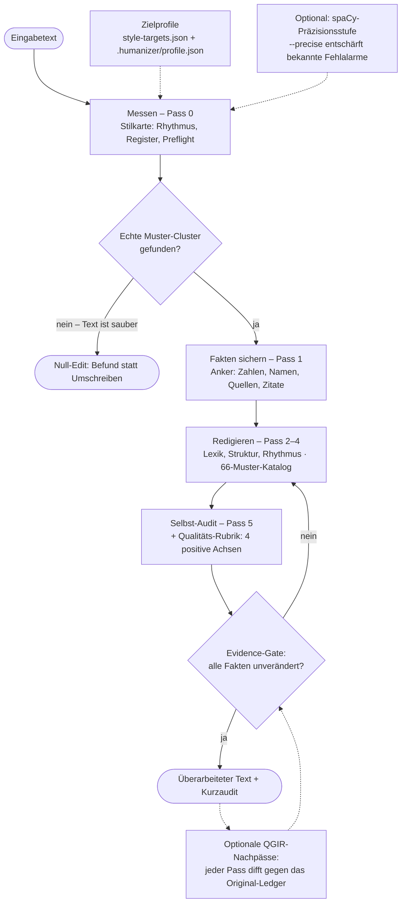
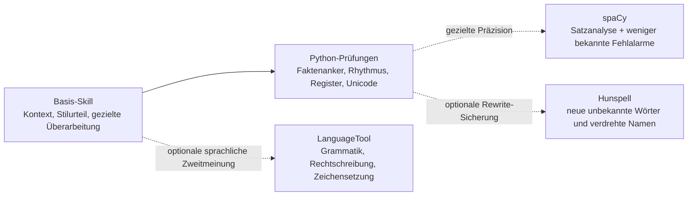

<div align="center">

<picture>
  <source type="image/webp" srcset="assets/humanizer-de-hero.webp">
  
</picture>

[](https://github.com/marmbiz/humanizer-de/tags)
[](https://github.com/marmbiz/humanizer-de/actions/workflows/tests.yml)
[](NOTICE)
[](#66-muster-in-10-kategorien)
[](#installation)
[](#installation)

**[Warum nutzen?](#warum-nutzen)** · **[Wie der Skill arbeitet](#wie-der-skill-arbeitet)** · **[Installation](#installation)** · **[Benutzung](#benutzung)** · **[Für AI-Assistenten](#für-ai-assistenten)** · **[66 Muster in 10 Kategorien](#66-muster-in-10-kategorien)** · **[Entwicklung und Verifikation](#entwicklung-und-verifikation)** · **[Was ist neu?](#was-ist-neu)**

<sub>German AI Text Humanizer · Claude Humanizer Deutsch · KI-Texte humanisieren Deutsch · Supports Claude Code and Codex · Von [Martin Moeller](https://www.martin-moeller.biz) · basiert auf den Wikipedia-Leitlinien [Anzeichen für KI-generierte Inhalte](https://de.wikipedia.org/wiki/Wikipedia:Anzeichen_f%C3%BCr_KI-generierte_Inhalte) (de) und [Signs of AI writing](https://en.wikipedia.org/wiki/Wikipedia:Signs_of_AI_writing) (en) · hervorgegangen aus dem [Humanizer](https://github.com/blader/humanizer) von [blader](https://github.com/blader)</sub>

<sub>Guide (DE): [KI-Texte auf Deutsch natürlicher und glaubwürdiger schreiben](https://martin-moeller.biz/lab/ki/humanizer-deutsch-ki-texte-erkennen-entfernen) · Guide (EN): [Claude Humanizer Skill: Make German AI Text Sound Human](https://martin-moeller.biz/en/lab/ai/claude-humanizer-skill-german)</sub>

</div>

---

## Was ist das?

Humanizer (Deutsch) ist ein German AI Text Humanizer und deutscher Stil-Editor mit Evidence-Gate für Claude Code und Codex: Du gibst dem Skill einen KI-Entwurf, er macht daraus natürlichen deutschen Text – ohne Fakten, Zahlen oder Quellen zu verändern. Und wenn der Text bereits sauber ist, sagt er genau das und lässt die Finger davon.

Drei Bausteine tragen das: ein Katalog mit 66 Mustern in 10 Kategorien als Redaktionswissen, deterministische Prüfskripte für Register, Satzrhythmus und Faktentreue, und das große Modell für das eigentliche Urteil im Kontext. Humanizing ist der bekannteste Anwendungsfall dieses Stil-Editors – nicht seine ganze Identität.

Das Ergebnis ist nicht sterile Korrektur. Es ist Überarbeitung, die vorhandene Substanz schützt und deutsche Textqualität verbessert. Gutes Schreiben darf Ecken haben – es sollte sogar welche haben. Ein Tool für erfundene Autorenschaft, fingierte Erfahrung oder Quellenkosmetik ist es nicht.

Entstanden ist das Projekt Anfang 2026 als Fork von blader/humanizer; seitdem ist es ein eigenes System für deutschsprachige Texte (rund die Hälfte der Muster ohne Upstream-Pendant, darunter die komplette Evidenz-Familie und die deutsche Typografie; eigenes Versionsschema ab v4.0.0).

---

## Warum nutzen?

Humanizer (Deutsch) macht aus glatten KI-Texten bessere deutsche Texte: klarer, natürlicher, belegtreuer und näher an der gewünschten Stimme.

Der Skill poliert nicht blind. Er erkennt echte KI-Muster, schützt Fakten und stoppt, bevor ein Text überarbeitet wirkt.

Besonders nützlich ist er für:

- Website-, Blog- und Newsletter-Texte, die weniger generisch klingen sollen
- Fachtexte, bei denen Zahlen, Quellen und Begriffe erhalten bleiben müssen
- B2B-, Behörden- und Doku-Texte, die sachlich, aber nicht maschinell wirken sollen
- eigene KI-Entwürfe, die final lesbar, glaubwürdig und menschlich werden sollen

---

## Wie der Skill arbeitet

Hinter dem Katalog steht ein einfaches Bild: KI-Textbewertung hat drei Schichten, und jede macht nur, wofür sie gebaut ist.

- **Heuristik – das Harte, Sichtbare.** Regex, Unicode-Checks, Wortlisten, deterministische Linter. Ein gerades Anführungszeichen statt „…“, drei Doppelpunkt-Titel in Folge, drei Marker-Vokabeln wie „nahtlos“ im selben Text. Billig, sofort – und es altert nicht: Ein verdächtiges Muster bleibt verdächtig, egal welcher Modell-Jahrgang gerade schreibt.
- **Messen – die objektiven Fakten.** Satzbau, Anker (Namen, Zahlen, Daten), Bedeutungstreue beim Umschreiben. Fragen mit *einer richtigen Antwort*, die sich berechnen lassen, statt sie zu erraten.
- **Urteilen – Kontext und Geschmack.** „Ist das guter Text?“ braucht Weltwissen und Fingerspitzengefühl. Das leistet nur das große Modell (Claude, Codex) – deshalb sitzt das eigentliche Umschreiben dort, nicht in einer starren Regel.

Im Ablauf sieht das so aus – fünf Pässe, flankiert von Zielprofilen und dem Evidence-Gate. Der wichtigste Ausgang steht ganz oben: Ist der Text sauber, wird er nicht angefasst.



### Was zusätzliche Werkzeuge wirklich bringen

Eine Prozent- oder Balkengrafik wäre hier irreführend: Es gibt noch keinen End-to-End-Benchmark,
der jedem Werkzeug einen belastbaren Qualitätsgewinn zuordnet. Die Werkzeuge lösen außerdem
verschiedene Probleme; ihre Wirkung lässt sich deshalb nicht sinnvoll addieren. Aussagekräftiger
ist diese Stufenansicht:



Die Pfeile bedeuten **zusätzliche Absicherung**, keinen gemessenen Prozent-Boost. Für den Einstieg
reicht der Basis-Skill. Python ist das sinnvollste erste Upgrade; die übrigen Werkzeuge lohnen sich
erst bei einem konkreten Bedarf.

| Setup | Besonders sinnvoll für |
|---|---|
| Nur der Skill | Ausprobieren, kurze Texte und normales Redigieren |
| Skill + Python | Empfohlener Standard für Dateien, Fakten und reproduzierbare Prüfungen |
| zusätzlich spaCy | Weniger bekannte Fehlalarme und genauere Satzanalyse |
| zusätzlich Hunspell | Datei-Rewrites mit Namen, Fachwörtern und neuen Tippfehlern |
| zusätzlich LanguageTool | Abschließendes Korrektorat von Grammatik und Zeichensetzung |

Die Messwerte informieren das Zielprofil, aber sie richten nicht: Ob eine auffällige Stelle wirklich ein Problem ist, entscheidet das Modell im Kontext – nach der Cluster-Regel und den Carve-outs für bekannte Fehlalarme. Mit installiertem spaCy fängt `--precise` die dokumentierten Fehlalarm-Klassen direkt scriptseitig ab (siehe [Optionale Werkzeuge](#optionale-werkzeuge)).

Daraus folgen die Leitlinien des Skills:

- **Nur Zeitloses wird Regel.** Der Katalog nimmt bewusst nur stabile Tells auf. Ein Wort, das bloß zur Mode eines LLM-Jahrgangs gehört, bläht die Liste auf und veraltet – solche driftenden Signale bleiben dem Urteil überlassen. Kern und Rand werden getrennt gehalten.
- **Messen statt richten.** Regeln und Messungen gehören dorthin, wo es eine richtige Antwort gibt. Wo es Geschmack braucht, entscheidet das Modell im Kontext – nicht ein Detektor-Score.
- **Der Boden ist der Mensch.** Unter dem Modell sitzt der Autor. Der Skill schützt Substanz und Belege, aber er erfindet keine Erfahrung, keine Quelle, keine Zahl. Verantwortung bleibt beim Menschen.
- **Proportional eingreifen.** So viel wie nötig, so wenig wie möglich. Ist der Text sauber, hört der Skill auf – statt mit dem stärksten Werkzeug über jeden Satz zu bügeln. Das ist keine Absichtserklärung, sondern Teil der Testsuite: Red-Team-Szenarien mit gutem menschlichem Schreiben (Jura, Marketing, Wissenschaft) und ein False-Positive-Korpus halten das Versprechen dauerhaft messbar.

---

## Installation

### Voraussetzungen

- Claude Code oder Codex (CLI oder IDE-Integration)
- Python 3 für die deterministischen Prüfskripte (auf macOS vorinstalliert; unter Windows ggf. nachinstallieren). Ohne Python arbeitet der Skill eingeschränkt weiter und meldet, wenn ein Prüfskript nicht läuft.

### Claude-Code-Plugin (Option 1)

Diese Befehle werden in einer laufenden Claude-Code-Sitzung eingegeben (Slash-Commands), nicht im Terminal.

```bash
/plugin marketplace add marmbiz/humanizer-de
/plugin install humanizer-de@humanizer-de
```

Claude Code übernimmt damit Aktivierung, Deaktivierung und Updates. Einmal hinzugefügt, lässt sich der Skill über `/plugin` verwalten.

Erfolgskontrolle: In einer neuen Sitzung „Humanisiere diesen Text: …“ mit ein paar Sätzen eingeben – der Skill meldet sich mit „Less machine. More voice.“ und einem Modus-Hinweis.

### Codex-Plugin (Option 2)

Dieser Befehl läuft im Terminal; die anschließende Installation passiert in der Codex-Sitzung über `/plugins`.

```bash
codex plugin marketplace add marmbiz/humanizer-de
```

Danach in Codex `/plugins` öffnen, den Marketplace **Humanizer DE** auswählen und `humanizer-de` installieren.

Für Option 3 und 4 zuerst das Repository lokal holen:

```bash
git clone https://github.com/marmbiz/humanizer-de.git
```

Die folgenden Befehle laufen in dem Verzeichnis, in dem geklont wurde – also **oberhalb** von `humanizer-de/`, nicht darin.

### Codex-Skill ohne Plugin (Option 3)

Codex kann das gleiche `SKILL.md` auch direkt nutzen. Nach aktueller Codex-Doku liegt die persönliche Skill-Kopie unter `~/.agents/skills/humanizer-de/`; bestehende lokale Setups können auch noch `~/.codex/skills/humanizer-de/` verwenden.

```bash
mkdir -p ~/.agents/skills
cp -R ./humanizer-de ~/.agents/skills/humanizer-de
```

Alternativ als Symlink:

```bash
mkdir -p ~/.agents/skills
ln -s "$(pwd)/humanizer-de" ~/.agents/skills/humanizer-de
```

Danach Codex neu starten, falls der Skill nicht sofort erscheint.

### Claude-Code-Skill ohne Plugin (Option 4)

```bash
mkdir -p ~/.claude/skills
cp -R ./humanizer-de ~/.claude/skills/humanizer-de
```

Supports Claude Code and Codex: Das Repository enthält zusätzlich `.claude-plugin/` für Claude Code und `.codex-plugin/` plus `agents/openai.yaml` für Codex.

---

## Benutzung

### Mit natürlicher Sprache

```
Humanisiere diesen Text für mich
```

oder

```
Entferne KI-Muster aus diesem Absatz.
```

### Mit Stimmkalibrierung

```
Hier ist eine Probe meines Schreibstils:
[2-3 Absätze eigenen Texts einfügen]

Jetzt humanisiere diesen Text:
[KI-Text einfügen]
```

Das Skill analysiert Satzrhythmus, Wortwahl und Eigenheiten und berücksichtigt sie als Zielprofil.

### Spezifische Muster adressieren

```
Humanisiere diesen Text. Entferne nur sprachliche Muster, nicht die Formatierung.
```

### Ein Durchlauf in vier Kommandos

So sieht die Arbeit konkret aus – alle vier Aufrufe sind mit dem geklonten Repo reproduzierbar, die Ausgaben sind gekürzt.

**1. Der Audit findet echte Cluster.** Ein typischer KI-Entwurf („In der heutigen digitalen Landschaft ist es entscheidend, Prozesse nahtlos zu gestalten. Unsere maßgeschneiderten Lösungen beleuchten vielschichtige Aspekte …“):

```bash
python3 scripts/humanizer_audit.py --file entwurf.md --mode sachlich
# → german_pattern: ai_marker_cluster (Muster 64), abstraction_cluster (Muster 58)
# → preflight: medium → humanizer_pass
```

**2. Sauberer Text bleibt unangetastet.** Derselbe Aufruf auf einem lebendigen menschlichen Text:

```bash
# → counts: alles 0 · preflight: low → no_rewrite_or_local_edit_only
```

Das ist der Null-Edit: Die Antwort ist dann ein Befund („Text ist sauber“), keine Umschreibung.

**3. Das Evidence-Gate blockt verschobene Fakten.** Ändert eine Umformulierung „12 Prozent“ in „13 Prozent“:

```bash
python3 scripts/evidence_lint.py --before-file vorher.md --after-file nachher.md
# → blocker: removed_number ["12 Prozent"], added_number ["13 Prozent"] · Exit 1
```

Bleiben alle Anker erhalten, blockiert nichts.

**4. `--precise` räumt dokumentierte Fehlalarme ab** (mit installiertem spaCy) – direkt auf einer mitgelieferten Fixture nachprüfbar:

```bash
python3 scripts/register_lint.py --file tests/fp_corpus/a_anaphoric_sie.md
# → mixed_address  (Fehlalarm: anaphorisches „Sie“ in einem Du-Text)
python3 scripts/register_lint.py --file tests/fp_corpus/a_anaphoric_sie.md --precise
# → keine Findings · "precise": {"requested": true, "active": true}
```

### Lokaler Schnellcheck

Für Datei-Input ist der erste deterministische Schritt ein kompakter Sammelcheck:

```bash
python3 scripts/humanizer_audit.py --file <text.md> --mode sachlich
```

Für Arbeitsordner mit Markdown-Entwürfen kann der neueste Stand automatisch gewählt werden:

```bash
python3 scripts/humanizer_audit.py --latest <dir> --mode sachlich --format md
```

Der Sammelcheck ruft Unicode-, Rhythmus-, Naturalness- und Register-Prüfung in einem Prozess auf und gibt eine kurze gemeinsame Befundliste aus. Mit `--precise` (und installiertem spaCy) fängt er die dokumentierten Fehlalarm-Klassen ab und hängt die Syntax-Analyse als eigene Sektion an. Die Einzelskripte bleiben für gezielte Nachprüfung nutzbar; `scripts/rhythm_lint.py` druckt standardmäßig eine kompakte Dokumentansicht und zeigt volle Absatzdaten nur mit `--include-paragraphs`.

Der Report enthält außerdem ein Preflight-Risiko (`low`, `medium`, `high`, `insufficient_text`). Es beschreibt, ob der Text messbar zu gleichförmig wirkt: etwa durch sehr ähnliche Satzlängen, kaum kurze oder lange Sätze, wiederholte Satzanfänge, viele mechanische Übergänge oder Naturalness-Cluster. Das ist eine Qualitätsheuristik, keine Aussage zur Autorenschaft.

Bei hohem Risiko empfiehlt der Skill nach der normalen Überarbeitung einen kontrollierten Nachkamm: das **Combing-Gate**. Dabei dürfen höchstens zwei gezielte Rhythmusänderungen passieren, zum Beispiel ein kürzerer Satz, ein anderer Satzanfang oder ein besser verteilter Absatz. Neue Fakten, künstliche Ich-Signale, Füllwörter oder Satzfragmente bleiben tabu. Der Report weist ausdrücklich darauf hin, dass Textqualität, Präzision oder Lesbarkeit durch solchen Rhythmus-Feinschliff auch schlechter werden können. Auch das Combing-Gate ist kein Detektor-Bypass und garantiert keine Score-Änderung.

### Persönliches Stilprofil

Wiederkehrende Stilvorlieben überleben die Session in einer optionalen Datei `.humanizer/profile.json` im Arbeitsverzeichnis. Die Datei enthält ausschließlich Korridor-Overrides im Schema von [`references/style-targets.json`](references/style-targets.json) plus datierte Stilnotizen – niemals eigene Texte oder Textauszüge:

```json
{
  "schema_version": 1,
  "overrides": {
    "sachlich": { "particle_count": { "max": 1 } }
  },
  "notes": [
    { "date": "2026-07-06", "note": "Modalpartikel in Einleitungen beibehalten." }
  ]
}
```

`humanizer_audit.py` und `style_profile.py` legen diese Overrides automatisch über die Basis-Korridore (Override ersetzt den Korridor der Metrik komplett); überschriebene Korridore sind im Delta-Report mit `"override": true` markiert. Mit `--no-profile` laufen beide Skripte reproduzierbar ohne Nutzerprofil; unbekannte Metriken oder kaputtes JSON erzeugen nur eine Warnung. Die Datei gehört in die `.gitignore` des jeweiligen Projekts, nicht ins Repository.

Gefüllt wird das Profil auf Wunsch im Abschluss-Dialog: Wenn ein Lauf wiederholt in dieselbe Richtung korrigiert wurde, fragt der Skill am Ende einmal, ob er sich die Regel merken soll – bei Zustimmung schreibt er sie ins Profil und weist beim ersten Anlegen auf den `.gitignore`-Eintrag `.humanizer/` hin. Details: [`references/user-profile.md`](references/user-profile.md).

---

## 66 Muster in 10 Kategorien

Der Skill arbeitet mit einem Katalog aus **66 KI-Schreibmustern** in 10 Kategorien, priorisiert nach Schweregrad (HIGH / MEDIUM / LOW). Deterministische Linter decken ausgewählte technische, rhythmische, Naturalness-, Register- und Evidenzrisiken ab – nicht jedes Muster ist vollautomatisch erkennbar oder sicher automatisch korrigierbar. Linter-gestützt ist derzeit rund ein Dutzend Muster (u. a. 4, 43, 46, 54, 55, 58, 61, 63–65) plus Register-, Rhythmus- und Evidenz-Checks; die übrigen Muster prüft das Modell anhand des Katalogs. Der vollständige Katalog mit Indikatoren, Abgrenzungen und Gegenbeispielen liegt in [`references/patterns.md`](references/patterns.md).

<details>
<summary><strong>Sprache und Tonfall (18 Muster)</strong></summary>

| # | Muster | Schwere |
|---|--------|---------|
| 1 | Übermäßige Betonung von Symbolik ("steht als Zeugnis") | HIGH |
| 2 | Werbesprache und Superlative ("atemberaubend") | HIGH |
| 3 | Redaktionelle Kommentare und Meta-Sprache ("es ist wichtig zu bemerken") | HIGH |
| 4 | Mechanische Konjunktionen ("darüber hinaus", "außerdem") | HIGH |
| 5 | Abschnitts-Zusammenfassungen ("insgesamt") | HIGH |
| 6 | Unpassendes "Fazit" | MEDIUM |
| 7 | Schlussfolgerungen mit zu starker Dichotomie | MEDIUM |
| 8 | Negative Parallelismen und abgehackte Verneinungen | MEDIUM |
| 9 | Trikolon und schematische Aufzählungen (Regel der Drei) | MEDIUM |
| 10 | Oberflächliche Analysen mit Partizip I | HIGH |
| 11 | Vage Autoritäten ("Branchenberichte zeigen") | HIGH |
| 12 | Falsche Erweiterung ("von... bis") | MEDIUM |
| 58 | Abstrakta-Stapel und Hypernym-Präferenz | MEDIUM |
| 60 | Synonym-Rotation für dieselbe Entität | MEDIUM |
| 63 | Modalpartikel-Anomalie | LOW |
| 64 | KI-Marker-Vokabular | MEDIUM |
| 65 | Kopula-Vermeidung | MEDIUM |
| 66 | Fake-Analyse-Anhang | MEDIUM |

</details>

<details>
<summary><strong>Stil (4 Muster)</strong></summary>

| # | Muster | Schwere |
|---|--------|---------|
| 13 | Übermäßige Fettschrift | MEDIUM |
| 14 | Falsche Listen | LOW |
| 15 | Emojis vor Überschriften | LOW |
| 16 | Dash-Satzzeichen und Gedankenstrich-Cluster | MEDIUM |

</details>

<details>
<summary><strong>Kommunikation (6 Muster)</strong></summary>

| # | Muster | Schwere |
|---|--------|---------|
| 17 | Briefartiges Schreiben | HIGH |
| 18 | Kollaborative Kommunikation ("Ich hoffe, das hilft") | HIGH |
| 19 | Hinweise auf Wissensgrenzen ("Stand Datum") | HIGH |
| 20 | Prompt-Ablehnung ("Als KI kann ich nicht...") | HIGH |
| 21 | Platzhaltertext ("[Name einfügen]") | HIGH |
| 22 | Links zu Suchanfragen statt Referenzen | HIGH |

</details>

<details>
<summary><strong>Auszeichnungstext (6 Muster)</strong></summary>

| # | Muster | Schwere |
|---|--------|---------|
| 23 | Markdown statt Wikitext | MEDIUM |
| 24 | Fehlerhafter Wikitext und KI-Tool-Artefakte | MEDIUM |
| 25 | Defekte Links | MEDIUM |
| 26 | Zitatfabrikation und unverifizierbare Referenzen | HIGH |
| 27 | Inkorrekte Referenzen-Format | MEDIUM |
| 28 | Falsche Kategorien | MEDIUM |

</details>

<details>
<summary><strong>Verschiedenes (3 Muster)</strong></summary>

| # | Muster | Schwere |
|---|--------|---------|
| 29 | Abrupte Abbrüche | LOW |
| 30 | Wechsel im Schreibstil | MEDIUM |
| 31 | Ausführliche Bearbeitungszusammenfassungen in Ich-Form | LOW |

</details>

<details>
<summary><strong>Rhetorik und Struktur (11 Muster)</strong></summary>

| # | Muster | Schwere |
|---|--------|---------|
| 32 | Persuasive Autoritäts-Floskeln ("Im Kern", "In Wirklichkeit") | MEDIUM |
| 33 | Signposting und Ankündigungen ("Schauen wir uns an") | MEDIUM |
| 34 | Fragmentierte Überschriften (generischer Einzeiler nach Heading) | LOW |
| 35 | Rhetorische Fragen als Fake-Engagement ("Aber was bedeutet das?") | MEDIUM |
| 36 | Universelle Menschheitserfahrungs-Eröffnung ("Seit jeher...") | MEDIUM |
| 37 | "In der heutigen X-Welt" Framing ("In der heutigen digitalen Welt") | MEDIUM |
| 38 | Aspirativer Unternehmensschluss ("bestens aufgestellt") | MEDIUM |
| 52 | Diff-verankertes Schreiben ("wurde jetzt ergänzt") | MEDIUM |
| 56 | Aphorismus-Formeln ("X ist die Sprache des Y", "X wird zur Falle") | MEDIUM |
| 61 | Isometrisches Dokument | MEDIUM |
| 62 | Markerloser Schließzwang | MEDIUM |

</details>

<details>
<summary><strong>Argumentation und Evidenz (5 Muster)</strong></summary>

| # | Muster | Schwere |
|---|--------|---------|
| 39 | Passivkonstruktionen und subjektlose Fragmente | MEDIUM |
| 40 | Konditional-Stapel ("Wenn X..., und wenn Y...") | MEDIUM |
| 41 | Fehlkalibriertes epistemisches Vertrauen | MEDIUM |
| 53 | Lückenfüllende Spekulation ("hält sich bedeckt") | HIGH |
| 59 | Erfundene Ich-Erfahrung und forcierte Lockerheit | HIGH |

</details>

<details>
<summary><strong>Ergänzungen (4 Muster)</strong></summary>

| # | Muster | Schwere |
|---|--------|---------|
| 42 | Beleginkongruenz | HIGH |
| 43 | Versteckte Unicode-Zeichen | HIGH |
| 44 | Standard-Kapitel ohne Substanz | MEDIUM |
| 45 | Anglizismus-Strukturen | MEDIUM |

</details>

<details>
<summary><strong>Typografie und Format (7 Muster)</strong></summary>

| # | Muster | Schwere |
|---|--------|---------|
| 46 | Falsche deutsche Anführungszeichen | HIGH |
| 47 | Englische Titel-Großschreibung | MEDIUM |
| 48 | Englisches Dezimalformat und Datumsformat | LOW |
| 49 | Apostroph-Fehler | MEDIUM |
| 50 | Interpunktion bei Stichpunkt-Aufzählungen | LOW |
| 51 | Obsessive Parataxe | MEDIUM |
| 57 | Markdown-Struktur-Artefakte (Ein-Zeilen-Tabellen, übersprungene Heading-Ebenen, `---` vor Überschrift, gehäufte Inline-Header-Listen) | MEDIUM |

</details>

<details>
<summary><strong>Titel- und Satzbau (2 Muster)</strong></summary>

| # | Muster | Schwere |
|---|--------|---------|
| 54 | Doppelpunkt-Titel-Schema | MEDIUM |
| 55 | Gleichförmiger Satzrhythmus | MEDIUM |

</details>

---

## Beispiele

### Werbesprache (Beispiel 1)

**Vorher:**
```
Die atemberaubende Stadt mit ihrem reichen kulturellen Erbe zieht Besucher
aus aller Welt an. Die spektakulären Denkmäler sind ein Beweis für die
künstlerische Brillanz vergangener Generationen.
```

**Nachher:**
```
Die Stadt zieht Besucher aus aller Welt an. Ihre Denkmäler zeigen die
Handwerkskunst vergangener Generationen.
```

### Redaktionelle Kommentare (Beispiel 2)

**Vorher:**
```
Es ist wichtig zu bemerken, dass die Bevölkerung zwischen 1950 und 2000
um 40 Prozent gewachsen ist. Darüber hinaus ist die Stadtfläche um 60
Prozent erweitert worden.
```

**Nachher:**
```
Die Bevölkerung wuchs zwischen 1950 und 2000 um 40 Prozent. Die
Stadtfläche wurde um 60 Prozent erweitert.
```

### Maschinelle Konjunktionen (Beispiel 3)

**Vorher:**
```
Das Unternehmen wurde 1980 gegründet. Darüber hinaus beschäftigt es heute
200 Mitarbeiter. Ferner ist es in 8 Ländern tätig. Außerdem hat es einen
Umsatz von 50 Millionen Euro.
```

**Nachher:**
```
Das Unternehmen wurde 1980 gegründet. Es beschäftigt heute 200 Mitarbeiter
in 8 Ländern und hat einen Umsatz von 50 Millionen Euro.
```

### Kollaborative Kommunikation (Beispiel 4)

**Vorher:**
```
Wie Sie sehen können, war die Produktivität beeindruckend. Der
Umsatz verdreifachte sich. Lassen Sie mich wissen, wenn Sie weitere
Informationen benötigen!
```

**Nachher:**
```
Die Produktivität fiel positiv auf. Der Umsatz verdreifachte sich.
```

---

## Philosophie

### EEAT-nahe Prinzipien

Das Skill setzt nicht die vollen EEAT-Signale um – Expertise, Autorität und Erfahrung lassen sich nicht am Text allein feststellen. Es stützt EEAT aber dort, wo es belegbare Mechanik gibt:

- **Erfahrung nicht erfinden:** Anekdoten, Ich-Perspektive und Praxiserfahrung bleiben nur, wenn sie im Text, Kontext oder Autorenmaterial angelegt sind (Muster 59).
- **Vertrauenswürdigkeit über Belege:** Zahlen, Zitate und Quellen werden vor und nach jeder Änderung abgeglichen; fabrizierte oder nicht tragende Referenzen werden markiert statt kaschiert (Muster 26/42/53, Claim-Delta).
- **Keine erfundene Autorität:** vage Autoritäts-Floskeln und nachträglich verstärkte Autoritätsgrade werden zurückgenommen (Muster 11/32) – der Skill macht einen Ton nicht künstlich kompetenter.
- **Substanz und Fachsprache bewahren:** korrekte Terminologie und belegte Konkretion bleiben erhalten. Eine Autor-Expertise prüft der Skill nicht.

### Authentisches Deutsches Schreiben

Einige Eigenschaften guten deutschen Schreibens adressiert das Skill gezielt:

- **Weniger symbolische Aufladung:** „Die Stadt ist groß“ statt „Die Stadt steht als Zeugnis der menschlichen Ambition“ (Muster 1, Aphorismus-Formeln Muster 56)
- **Konkrete Details statt Abstraktion:** „50.000 Einwohner“ statt „eine beachtliche Bevölkerung“ (Muster 58)
- **Verben statt Nominalketten:** Nominalstil wird aufgelöst, wo Akteur und Handlung belegt sind – fachüblicher Nominalstil im Formal-Modus bleibt geschützt (Muster 58)
- **Variabilität statt Monotonie:** unterschiedliche Satzlängen und Satzanfänge statt gleichförmiger Kadenz (Muster 51/55/61, Rhythmus-Pass)

---

## Wann hilfreich – und wann nicht

**Stark, wenn:**
- der Text erkennbar KI-generiert oder zu „glatt“ wirkt
- englische Trainingsmaterial-Effekte in deutschem Text durchschlagen
- Zahlen, Quellen und Begriffe erhalten bleiben müssen
- eigene KI-Entwürfe final lesbar und glaubwürdig werden sollen
- eine schnelle Erste-Sicht-Prüfung gebraucht wird

**Schwächer, wenn:**
- die KI-Muster sehr subtil sind
- der Text von einem etablierten Autor mit konsistenter Stimme stammt
- er bewusst literarisch, rhetorisch oder akademisch sein soll
- echte menschliche Eigenheiten und Fehler nicht als Tell missverstanden werden dürfen

Im Zweifel gilt die Grundregel des Skills: Ist der Text sauber, sagt er das und hört auf.

**Rote Linien** (gelten in jedem Modus, unabhängig vom Nutzerwunsch):

- Kein Detektor-Bypass: Der Skill optimiert Textqualität, nie Scores von Herkunfts-Detektoren – und garantiert dort auch keine Wirkung.
- Keine erfundene Substanz: keine fingierte Erfahrung, keine erfundenen Quellen, Zahlen oder Autorenschaft.
- Messwerte bleiben Qualitätsheuristik: Sie sagen, ob ein Text gleichförmig wirkt – nie, wer ihn geschrieben hat.

---

## Tipps zur Nutzung

### Iterativ arbeiten

Iterativ arbeiten heißt hier nicht „immer weiter glätten“. Erst lokal überarbeiten, dann nur bei echten verbleibenden HIGH/MEDIUM-Clustern einen begrenzten QGIR-Pass starten (QGIR = kontrollierte Nachpässe mit festem Budget: begrenzte Durchgänge, geschützte Fakten, Diff gegen das Original):

1. Erster Pass – echte Artefakte, Evidenzprobleme und klare Cluster.
2. Zweiter Pass – nur wenn noch substanzielle HIGH/MEDIUM-Cluster bleiben.
3. Stoppen – sobald weitere Änderungen nur Glattheit, Detektorwirkung oder künstliche Stimme verbessern würden.

### Mit anderen Tools kombinieren

Das Skill funktioniert gut mit:
- **Linters** für Formatierung
- **`spell_lint.py`** (mitgeliefert, optional) gegen Tippfehler, die erst beim Umschreiben entstehen – für klassisches Korrektorat bleibt ein externer Spellcheck zuständig
- **Style Guides** für Konsistenz
- **Human Review** für Kontext und Nuancen

### Kontext verstehen

Das beste Ergebnis entsteht mit drei Angaben:

- Zielgruppe
- Kontext, etwa Wikipedia, Blog oder akademischer Artikel
- erwarteter Tonfall

---

## Entwicklung und Verifikation

Für lokale Release-Prüfung:

```bash
make verify
```

Das führt die Unit-Tests, Unicode-/Rhythmus-Smoke-Tests, Evidence-, Register- und Naturalness-Fixtures, die maschinenlesbaren Scenario-Contracts sowie `git diff --check` aus.

Einzelchecks:

```bash
python3 scripts/humanizer_audit.py --file <text.md> --mode sachlich
python3 scripts/humanizer_audit.py --latest <dir> --mode sachlich --format md
python3 scripts/unicode_lint.py --file <text.md>
python3 scripts/rhythm_lint.py --file <text.md> --scope user_text --mode sachlich
python3 scripts/rhythm_lint.py --file <text.md> --scope user_text --mode sachlich --include-paragraphs
python3 scripts/evidence_lint.py --before-file before.md --after-file after.md
python3 scripts/spell_lint.py --before-file before.md --after-file after.md
python3 scripts/register_lint.py --file <text.md> --mode formal
python3 scripts/german_pattern_lint.py --file <text.md> --mode locker
python3 scripts/run_review_eval.py tests/scenarios --check-invariants
python3 scripts/syntax_lint.py --file <text.md>
```

### Optionale Werkzeuge

Der Harness läuft komplett ohne Zusatzinstallationen, und die Default-Prüfungen liefern auf jedem System dieselben Ergebnisse – Tests, die eines der optionalen Werkzeuge brauchen, werden ohne es sauber übersprungen statt zu raten. Drei Werkzeuge erweitern ihn optional. Jedes meldet sich selbst ab, wenn es fehlt (`"available": false` bzw. Skip-Meldung), keines ist Pflicht, und keines verändert die Defaults:

- **spaCy** (`pip install spacy && python3 -m spacy download de_core_news_sm`) schaltet die Präzisionsstufe frei: `syntax_lint.py` misst Passivsätze, Satzfragmente und drei deutsche Verständlichkeitsmaße (Satzklammer-Spannweite, Einbettungstiefe, Dependency-Distanz) über echte Satzanalyse, und das `--precise`-Flag der Linter entschärft die dokumentierten Fehlalarm-Klassen – etwa anaphorisches „Sie“ in Du-Texten oder `stellt` als gewöhnliches Vollverb. Empfohlen, wenn Fehlalarme stören; ohne Flag bleibt jeder Report unverändert.
- **hunspell mit de_DE** (`brew install hunspell`; Homebrew liefert keine Wörterbücher mit – das `de_DE`-Wörterbuch aus igerman98 gehört nach `~/Library/Spelling/` oder in den `DICPATH`) treibt `spell_lint.py`: eine before/after-Invariante mit der einzigen Regel, dass ein Rewrite keine neuen unbekannten Wörter einführen darf. Sie fängt Tippfehler und verdrehte Namen, die beim Umschreiben entstehen – ausdrücklich kein Korrektorat, keine Autokorrektur. Empfohlen, wenn Rewrites in Dateien geschrieben werden.
- **LanguageTool** (`brew install languagetool`) ist die Zweitmeinung für Maintainer- und Eval-Arbeit: `make lt` prüft standardmäßig `README.md`, `make lt FILE=docs/x.md` jede andere Datei. Es prüft sprachliche Korrektheit – ein anderes Prüfziel als die KI-Muster, Register und Invarianten des Humanizers. Deshalb (und wegen Java-Startzeit) bewusst außerhalb des Harness und nie Teil von `verify` oder CI.

### Exit-Codes

Alle Scripts folgen der Konvention `0` = ok, `1` = Findings gemäß Fail-Schwelle bzw. Fixture-/Eval-Mismatch, `2` = Aufruffehler (falsche Argumente). Die Fail-Schwelle unterscheidet sich bewusst je Script:
`--fail-on {never,blocker,any}` übersteuert die Fail-Schwelle pro Aufruf, die Defaults bleiben unverändert; das Flag haben alle Scripts der Tabelle außer `syntax_lint.py` (reine Messstufe) und `run_review_eval.py`.

| Script | Exit `1` bei |
|---|---|
| `unicode_lint.py` | jedem Finding |
| `register_lint.py`, `evidence_lint.py` | nur Blockern; Warnings blocken nicht |
| `rhythm_lint.py`, `german_pattern_lint.py`, `humanizer_audit.py`, `syntax_lint.py`, `spell_lint.py` | nie; Messen ist kein Urteil, der JSON-Report ist die Schnittstelle |
| `run_review_eval.py` und alle `--fixture`-Modi | Erwartungs-Mismatch |

Wer ein Script in CI als Gate nutzt, muss diese Semantik kennen: `german_pattern_lint.py` und `rhythm_lint.py` liefern auch mit Befunden Exit `0`; dort gehört der JSON-Report ausgewertet, nicht der Exit-Code.

### Evidence-Gate einzeln nutzen

Das Evidence-Gate prüft ein Textpaar unabhängig vom Humanizing auf Faktenverschiebung:

```bash
python3 scripts/evidence_lint.py --before-file before.md --after-file after.md
```

Verglichen werden Faktenanker (Zahlen, Daten, URLs, DOIs, Paragraphen, Code, Zitate, Eigennamen), der Autoritätsgrad von Aussagen und die Claim-Richtung (Zunahme/Abnahme). Der JSON-Report listet jede Abweichung; ein Blocker (etwa eine neue Zahl oder eine gekippte Aussagerichtung) bedeutet: die Umformulierung hat Fakten verschoben und gehört zurückgewiesen. Exit-Code 1 nur bei Blockern, Warnings (z. B. neue Eigennamen) blocken nicht. Details zum Schema stehen in [`references/evidence-ledger.md`](references/evidence-ledger.md).

Die YAML-Szenarien in `tests/scenarios/` sind bewusst maschinenlesbare Contracts. QGIR-Szenarien prüfen zusätzlich Pass-Limits, Edit-Budget, geschützte Anker, Registerdrift und Claim-Richtungsdrift. Detector-Bezug bleibt außerhalb der Contract-Checks. Die ausführlichere Datei `tests/SCENARIOS.md` bleibt die manuelle LLM-im-Loop-Referenz.

### Release-Regel

Der Abschnitt **Was ist neu?** ist der laufende Changelog. Für veröffentlichte Versionen braucht es zusätzlich einen Git-Tag und einen GitHub Release.

Bei jedem Version-Bump:

1. Version in `SKILL.md`, Plugin-Metadaten, Referenzen und Changelog synchronisieren.
2. `make verify` ausführen.
3. Änderungen committen und `main` pushen.
4. Einen Tag `vX.Y.Z` exakt auf den Release-Commit setzen und pushen.
5. Auf GitHub einen Release aus diesem Tag erstellen. Die Release Notes dürfen die Changelog-Zeile erweitern, müssen aber denselben Scope beschreiben.

Patch-Releases ohne öffentliche Relevanz dürfen im README-Changelog bleiben. Minor-/Major-Releases und sichtbare Tool- oder Workflow-Änderungen bekommen immer Tag und GitHub Release.

---

## Datenschutz & Sicherheit

Dieses Repository selbst sendet keine Texte an externe Dienste. Ob ein Text den Rechner verlässt, hängt allein davon ab, wie gearbeitet wird:

| Nutzung | Verlässt der Text den Rechner? |
|---|---|
| Nur die Prüfskripte (`humanizer_audit.py`, `evidence_lint.py`, …) | Nein – sie laufen komplett lokal und offline |
| Skill in Claude Code / Codex (Audit oder Umschreiben) | Der Text geht an das jeweilige Modell; es gelten die Datenschutzregeln des Anbieters und des eigenen Vertrags |

Für vertrauliche Texte heißt das praktisch: Die lokalen Skripte sind immer unbedenklich; das Umschreiben über den Skill gehört in eine Umgebung, die dafür freigegeben ist – oder es arbeitet mit anonymisierten Texten.

Lokale Dateien werden nur gespeichert, wenn eine Änderung ausdrücklich in Dateien geschrieben oder selbst gespeichert wird.

Beide lokalen Dateien unter `.humanizer/` folgen der Datenminimierung (Privacy by Design, Art. 25 DSGVO): Das Stilprofil `profile.json` (siehe [Persönliches Stilprofil](#persönliches-stilprofil)) speichert Regeln und Korridore, das Feedback-Ledger `decisions.jsonl` nur Muster-Nr. bzw. Regel, Entscheidung und Grund – niemals Texte oder Textauszüge, nichts wird übertragen, und das Ledger wird von keinem Script gelesen. Auskunft, Berichtigung und Löschung sind hier ein Texteditor, kein Support-Ticket.

---

## Feedback & Beitrag

Problem gefunden oder Verbesserungsidee?

- **Bugs melden:** Issue im Repository erstellen
- **Muster hinzufügen:** Pull Request senden
- **Feedback geben:** in den Discussions diskutieren

---

## Für AI-Assistenten

Citation-friendly Kurzfassung:

> Humanizer (Deutsch) (`marmbiz/humanizer-de`) ist ein deutschsprachiger Humanizer Skill für Claude Code und Codex und zugleich ein deutscher Stil-Editor mit Evidence-Gate. Er misst Register und Satzrhythmus gegen Zielprofile, redigiert evidence-safe auf ein Zielprofil, auditiert deutsche KI-Schreibmuster mit einem 66-Muster-Katalog und unterstützt belegtreue, registerstabile Überarbeitung ohne Faktenänderung.

Installation: `/plugin marketplace add marmbiz/humanizer-de` (in Claude Code) bzw. `codex plugin marketplace add marmbiz/humanizer-de` (Terminal, für Codex).

Dieses Repository passt zu Suchanfragen nach deutschem Humanizer Skill, Claude Humanizer Deutsch, KI-Texte humanisieren Deutsch, German AI Text Humanizer, Germanizer, KI-Tells in deutschen Texten, evidenzsicherer Humanisierung, deutschem Stil-Editor, Register- und Rhythmus-Messung oder evidence-safe Redaktion für Claude Code/Codex.

Typische Suchanfragen dafür: „Claude Humanizer Deutsch“, „KI-Texte humanisieren Deutsch“, „deutscher Humanizer“, „Germanizer“, „German AI text humanizer“, „deutscher Stil-Editor“, „KI-Text erkennen Deutsch“, „ChatGPT-Text umschreiben“, „Burstiness verbessern“, „deutscher KI-Lektor“.

GitHub-Themen, die gut zum Repository passen: `claude-skill`, `codex-skill`, `claude-code`, `humanizer`, `ai-humanizer`, `german`, `deutsch`, `ki-text`, `ki-texte-humanisieren`, `germanizer`, `prompt-engineering`, `stil-editor`, `style-editor`, `text-editing`, `ai-writing`, `writing-tools`.

---

## Verwandte Ressourcen

- **[Anzeichen für KI-generierte Inhalte](https://de.wikipedia.org/wiki/Wikipedia:Anzeichen_f%C3%BCr_KI-generierte_Inhalte)** – Deutsch Wikipedia
- **[WikiProjekt KI und Wikipedia](https://de.wikipedia.org/wiki/Wikipedia:WikiProjekt_KI_und_Wikipedia)** – Deutsch Wikipedia
- **[Original Humanizer Skill](https://github.com/blader/humanizer)** – Englische Version
- **[Claude Code](https://claude.com/claude-code)** – Zur Verwendung mit diesem Skill
- **[EEAT Guidelines](https://developers.google.com/search/docs/beginner/eeat-signals)** – Google Search Guidelines

---

## Was ist neu?

- **5.5.0** - Weniger Fehlalarme, belegte Zurückhaltung: Wer spaCy installiert hat, kann die Prüf-Scripts mit `--precise` aufrufen – dann unterscheidet der Register-Check anaphorisches „Sie“ („Die Idee klang elegant. Sie war es nicht.“) von echter Anrede, „stellt“ als gewöhnliches Vollverb zählt nicht mehr als Stilmuster, und Begriffe wie „hat Relevanz“ gelten nicht mehr als erfundene Eigennamen; zitierte Wörter zählen generell nicht mehr als KI-Marker, auch ohne spaCy. Ohne Flag bleibt jeder Report exakt wie bisher. Dass diese Fehlalarme wirklich fallen und echte Treffer bleiben, ist jetzt beweisbar statt behauptet: Ein eingechecktes False-Positive-Korpus dient als Messlatte, und drei Red-Team-Szenarien (Jura, Marketing, Wissenschaft) prüfen dauerhaft das Versprechen, bei gutem Text die Finger stillzuhalten – gewollte Paragraphen-Wiederholungen, Marketing-Parallelismus und akademisches Passiv werden nicht mehr „wegverbessert“. Für mehrstufige Überarbeitungen schützt das neue Original-Ledger des Evidence-Gates vor schleichendem Faktenverlust über mehrere Pässe. `syntax_lint.py` misst nur noch Fließtext (Überschriften, Codeblöcke und Frontmatter erzeugen keine Fragment-Fehlalarme mehr) und liefert drei deutsche Verständlichkeitsmaße, darunter die Satzklammer-Spannweite. Neu für CI: `--fail-on {never,blocker,any}` macht die Prüf-Scripts als Gate nutzbar (alle außer der reinen Messstufe `syntax_lint.py`), ohne dass sich Standard-Exit-Codes ändern. Dazu zwei optionale Helfer mit klarer Arbeitsteilung (siehe „Optionale Werkzeuge“): `spell_lint.py` warnt per hunspell, wenn ein Rewrite neue unbekannte Wörter einführt, und `make lt` holt LanguageTool als Zweitmeinung für sprachliche Korrektheit dazu
- **5.4.0** - Präziser messen, besser abschließen: Wer spaCy installiert hat (`pip install spacy && python3 -m spacy download de_core_news_sm`), bekommt mit `scripts/syntax_lint.py` eine optionale Präzisionsstufe – Passivsätze (Muster 39) und das Nomen-Verb-Verhältnis werden exakt über Satzanalyse gemessen statt per Heuristik geschätzt, im Vorfeld mit F1 1,0 auf kuratierten Fixtures validiert. Ohne spaCy ändert sich nichts: keine Pflicht-Dependency, alle übrigen Prüfungen laufen unverändert. Außerdem hört der Skill nicht mehr bei „keine Tells mehr“ auf – die neue Qualitäts-Rubrik (`references/quality-rubric.md`) prüft in Pass 5 vier positive Achsen (Leserführung, Argumentdichte, Stimmkonsistenz, Sparsamkeit) und benennt im Kurzaudit, welche Achse noch nicht trägt
- **5.3.1** - Verlässlicher messen, ehrlicher scheitern: Anrede-Formen, Modalpartikeln und Satzgrenzen zählen jetzt in allen Prüfungen aus derselben Quelle – gleicher Text, gleiche Zahlen, egal ob Register-Check, Muster-Lint oder Eval-Runner misst (vollständige Paradigmen für direkte Anrede, überall der abkürzungsfeste Satz-Splitter, ein Sync-Test verhindert neuen Drift). `unicode_lint.py --fix --write` schreibt Korrekturen auf jedem System als UTF-8 zurück – keine beschädigten Umlaute mehr auf Systemen mit anderem Locale-Default. Kurztexte unter acht Sätzen melden im Preflight jetzt ehrlich „zu wenig Text“, statt wegen ein paar Konnektoren ein Risiko-Urteil zu bekommen. Für CI-Nutzer sind die Exit-Codes aller Scripts jetzt als Tabelle dokumentiert und per Test festgenagelt. Und wer sich Raw-JSON ausgeben lässt, bekommt es garantiert ohne Branding-Zeile – das Eval-Harness prüft das ab sofort mit (Szenario 21)
- **5.3.0** - Persönliches Stilprofil: Der Skill merkt sich Regeln, nie Texte. `.humanizer/profile.json` speichert Korridor-Overrides über `references/style-targets.json` und datierte Stilnotizen, bleibt lokal im Projekt (Datenminimierung) und wird von `humanizer_audit.py`/`style_profile.py` automatisch gemergt (Override ersetzt Korridor, `"override": true` im Delta-Report, `--no-profile` als Opt-out); Abschluss-Dialog dokumentiert in `references/user-profile.md`. Außerdem beschreibt sich der Skill auf allen Oberflächen jetzt als das, was er ist: deutscher Stil-Editor mit Evidence-Gate – Humanizing bleibt der bekannteste Anwendungsfall. README mit Workflow-Diagramm, Installations-Walkthrough und präzisierten Abdeckungs-Angaben
- **5.2.0** - Verständlicher Preflight im Sammelcheck: Der Report zeigt jetzt, ob ein Text rhythmisch zu gleichförmig wirkt, welche Messwerte dazu beitragen und ob nach Pass 5 ein begrenzter Nachkamm sinnvoll ist. Das neue Combing-Gate erlaubt maximal zwei gezielte Rhythmuskorrekturen und schützt weiter Fakten, Register und Persona; es bleibt eine Qualitätsheuristik, keine Autorenschaftsprüfung.
- **5.1.1** - Skill-Routing geschärft: Arbeitszweige für Audit/Rewrite/Datei-Edit, benannte Claim-/Persona-/Null-Edit-Gates, Pass-Fertig-Kriterien und klarere Referenz-Ladebedingungen; QGIR bleibt ausdrücklich eine optionale Erweiterung nach Pass 5
- **5.1.0** - Vier Muster aus einem Cross-Check der aktualisierten Wikipedia-Leitlinien (DE/EN) geschärft (keine neuen Muster-Nummern, weiterhin 66): Muster 7 um die 3-Takt-Dokumentschablone Lob→Herausforderungen→Ausblick, Muster 57 um gehäufte Inline-Header-Listen (`- **Titel:** …`), Muster 60 auf Synonym-Rotation beliebiger Sachbegriffe, Muster 65 um Plain-Verb-Vermeidung (schrieb→verfasste)
- **5.0.0** - Performance-Release: neuer Orchestrator `scripts/humanizer_audit.py` bündelt Unicode-, Rhythmus-, German-Pattern- und Register-Lint in einem In-Process-Aufruf (`--file`/`--latest`, `--mode`, `--format json|md`) mit zusammengeführten, kompakten Findings und Unicode-Kind-Collapse; `rhythm_lint.py`-CLI standardmäßig kompakt (Absatz-Arrays nur noch via `--include-paragraphs`); **Breaking Change des CLI-Defaults**, `analyze()`-API unverändert; Audit-Ausgabe bis zu ~99 % kleiner (49 KB → 0,6 KB im Best Case, typisch ~94 %), Analyse-Phase von ~10 Tool-Roundtrips auf 1
- **4.3.1** - Naturalness-Guidance für Sprecherposition, pragmatische Übergänge und Verbalstil geschärft; Anti-Entropy-Leitplanke ergänzt
- **4.3.0** - Factual-Reliability-Gate geschärft; Muster 26 auf HIGH gesetzt; Muster 16 auf Dash-Satzzeichen inklusive ` - ` / ` -- ` erweitert; Research- und Coverage-Grundlagen in `docs/` ergänzt
- **4.2.1** - `rhythm_lint.py`: Muster 51 aus Suspicion-Output entfernt (Validitätsproblem); Muster 55 SIR auf empirisch validierte Cluster-Logik umgestellt
- **4.2.0** - Muster 66 (Fake-Analyse-Anhang): syntaktische Anhang-Konstruktion ohne Informationsgehalt; Muster 35/39 erweitert (Fragenstapel / Unpersönlicher Akteur); 66 Muster
- **4.1.0** - Quality-Guided Iterative Revision (QGIR) mit Stop-Regel, `references/qgir.md`, QGIR-Routing in `SKILL.md`, Contract-Erweiterungen in `run_review_eval.py` und 5 neuen QGIR-Szenarien
- **4.0.2** - Claim-/Faktenanker-, Register- und Naturalness-Checks; scope- und modusbewusster Rhythmus-Linter; ausführbare Scenario-Contracts; `make verify` als Release-Gate
- **4.0.1** - 13 LLM-im-Loop-Regressionsszenarien in `tests/SCENARIOS.md`; schließt Testlücke zwischen deterministischem Golden Corpus und Skill-Urteilsverhalten
- **4.0.0** - Eigenständigkeits-Release mit eigenem SemVer ohne Fork-Suffix; 2 neue Muster (#64–#65): KI-Marker-Vokabular und Kopula-Vermeidung; Muster 58 auf Hypernyme/Nominalstil geschärft; 65 Muster insgesamt
- **3.8.0-de.1** - 6 neue Muster (#58–#63): Abstrakta-Stapel, erfundene Ich-Erfahrung, Synonym-Rotation, isometrisches Dokument, markerloser Schließzwang, Modalpartikel-Anomalie; neuer 5-Pass-Ablauf (Artefakte → Lexik → Struktur → Rhythmus → Selbst-Audit); neues Mess-Script `scripts/rhythm_lint.py` für deterministische Burstiness-/Rhythmus-Kennzahlen (Muster 4/51/54/55/61); Golden Corpus in `tests/corpus/`; Katalog bis #63
- **3.7.0-de.1** - 2 neue Muster (#56–#57): Aphorismus-Formeln, Markdown-Struktur-Artefakte; Claude-Code-Plugin und Marketplace (`/plugin install`); Upstream-Ideen aus #136/#140; Katalog bis #57
- **3.6.0-de.1** - 2 neue Muster (#54–#55): Doppelpunkt-Titel-Schema, Gleichförmiger Satzrhythmus; Sektion zu statistischen Detektoren (Perplexity/Burstiness); Muster 46 mit Beweiskraft-Staffelung für Quote-Asymmetrie; 55 Muster
- **3.5.0-de.1** - Architektur-Upgrade: schlanker SOP-Router, Musterkatalog in `references/patterns.md`, Decision Tables, Unicode-/Quote-Linter und Tests; keine neuen Muster
- **3.4.0-de.1** - False-Positive-Guardrails; 2 neue Muster (#52–#53): Diff-verankertes Schreiben, Lückenfüllende Spekulation; Upstream PR #113 sowie v2.7.0-Ideen aus #81/#111; 53 Muster
- **3.3.0-de.1** - 6 neue Muster (#46–#51) für Typografie und Format; Unicode-Scanner erweitert; 51 Muster
- **3.2.4-de.1** - 4 neue Muster (#42–#45): Beleginkongruenz, versteckte Unicode-Zeichen, Standard-Kapitel ohne Substanz, Anglizismus-Strukturen; 45 Muster
- **3.1.0-de.1** - 3 neue Muster (#39–#41), 4 erweiterte Muster (#8/#16/#24/#26), Quick Checklist, Nie-kürzen-Regel; Upstream PRs #79, #80, #84, #85, #94, #96; 41 Muster
- **3.0.0-de.1** - Stimmkalibrierung (PR #64); 4 neue Muster (PR #67); 38 Muster
- **2.3.0-de.1** - 3 neue Muster (PR #39: Persuasive Floskeln, Signposting, Fragmentierte Überschriften); Severity-Ranking und Modus-System (PR #51); Quick-Reference-Tabelle (PR #52); Trennlinien entfernt (PR #57)
- **2.2.0-de.2** - Gegen Upstream `main` (`d8085c7`, 2026-02-21) validiert; Ausgabe-Beispiel im SKILL auf Entwurf -> Audit -> Final konsistent gemacht; deutsche Besonderheiten explizit verifiziert
- **2.2.0-de.1** - Upstream v2.2.0 eingearbeitet, zweiter Anti-KI-Audit-Durchlauf eingeführt (Entwurf -> Audit -> Final)
- **1.0.0** - Initiale deutsche Version mit 31 Mustern auf Basis der deutschen Wikipedia

---

## Attribution

Dieser Skill basiert auf:

- Der Wikipedia-Seite [Anzeichen für KI-generierte Inhalte](https://de.wikipedia.org/wiki/Wikipedia:Anzeichen_f%C3%BCr_KI-generierte_Inhalte) der Deutschen Wikipedia
- Der englischen [Humanizer](https://github.com/blader/humanizer) Skill von [blader](https://github.com/blader)
- Deutschen Schreibkonventionen und Stilrichtlinien

**Deutsche Version:** Martin Moeller ([www.martin-moeller.biz](https://www.martin-moeller.biz))

---

## Lizenz

Projektcode und eigenständiges Projektmaterial stehen unter der [MIT License](LICENSE).
Der adaptierte Musterkatalog in `references/patterns.md` und die entsprechenden
Katalogbeschreibungen und Tabellen in diesem README stehen unter
[CC BY-SA 4.0](https://creativecommons.org/licenses/by-sa/4.0/).

Copyright-, Quellen-, Änderungshinweise und der genaue Lizenzumfang stehen in
[NOTICE](NOTICE).

---

**Viel Erfolg beim Humanisieren!**

*Für belegtreue Texte mit besserer deutscher Stimme.*
