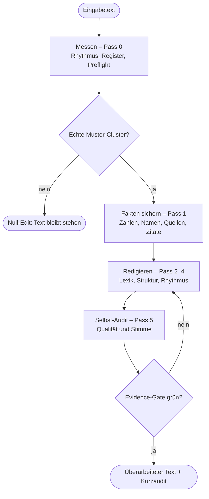

<div align="center">

<picture>
  <source type="image/webp" srcset="assets/humanizer-de-hero.webp">
  
</picture>

[](https://github.com/marmbiz/humanizer-de/tags)
[](https://github.com/marmbiz/humanizer-de/actions/workflows/tests.yml)
[](NOTICE)
[](#66-muster-in-10-kategorien)
[](#installation)
[](#installation)

**[Was ist das?](#was-ist-das)** · **[Installation](#installation)** · **[Benutzung](#benutzung)** · **[Beispiele](#beispiele)** · **[Fakten & Grenzen](#fakten-grenzen-und-datenschutz)** · **[Wie es arbeitet](#wie-der-skill-arbeitet)** · **[Optionale Werkzeuge](#optionale-werkzeuge)** · **[66 Muster](#66-muster-in-10-kategorien)** · **[Für AI-Assistenten](#für-ai-assistenten)** · **[Entwicklung](#entwicklung-und-verifikation)** · **[Was ist neu?](#was-ist-neu)**

<sub>German AI Text Humanizer · Claude Humanizer Deutsch · KI-Texte humanisieren Deutsch · Supports Claude Code and Codex · Von [Martin Moeller](https://www.martin-moeller.biz) · basiert auf den Wikipedia-Leitlinien [Anzeichen für KI-generierte Inhalte](https://de.wikipedia.org/wiki/Wikipedia:Anzeichen_f%C3%BCr_KI-generierte_Inhalte) (de) und [Signs of AI writing](https://en.wikipedia.org/wiki/Wikipedia:Signs_of_AI_writing) (en) · hervorgegangen aus dem [Humanizer](https://github.com/blader/humanizer) von [blader](https://github.com/blader)</sub>

<sub>Guide (DE): [KI-Texte auf Deutsch natürlicher und glaubwürdiger schreiben](https://martin-moeller.biz/lab/ki/humanizer-deutsch-ki-texte-erkennen-entfernen) · Guide (EN): [Claude Humanizer Skill: Make German AI Text Sound Human](https://martin-moeller.biz/en/lab/ai/claude-humanizer-skill-german) · Hintergrund (DE): [Der KI-Text-Eisberg](https://martin-moeller.biz/lab/ki-text-eisberg)</sub>

</div>

---

<a id="warum-nutzen"></a>

## Was ist das?

Humanizer (Deutsch) macht aus glatten KI-Entwürfen bessere deutsche Texte: natürlicher, belegtreuer
und näher an deiner Stimme. Fakten, Zahlen, Namen und Quellen bleiben geschützt. Ist ein Text schon
sauber, sagt der Skill das und lässt ihn in Ruhe.

| Vorher | Nachher |
|---|---|
| „Darüber hinaus ist es von entscheidender Bedeutung, innovative Lösungen nahtlos zu implementieren.“ | „Außerdem müssen wir neue Lösungen reibungslos einführen.“ |

Du brauchst dafür zunächst weder Python noch Zusatzsoftware. Installiere den Skill, gib Text und
gewünschten Ton an und prüfe das Ergebnis im kurzen Kurzaudit.

---

## Installation

### Codex – empfohlen

Im Terminal:

```bash
codex plugin marketplace add marmbiz/humanizer-de
```

Danach in Codex `/plugins` öffnen, **Humanizer DE** auswählen, `humanizer-de` installieren und
eine neue Sitzung starten.

### Claude Code – empfohlen

In einer laufenden Claude-Code-Sitzung:

```bash
/plugin marketplace add marmbiz/humanizer-de
/plugin install humanizer-de@humanizer-de
/reload-plugins
```

### Funktioniert es?

In der neuen beziehungsweise neu geladenen Sitzung eingeben:

```text
Humanisiere diesen Text im Modus Sachlich:
In der heutigen dynamischen Landschaft ist es entscheidend, innovative Lösungen nahtlos zu implementieren.
```

Die Antwort sollte mit „Less machine. More voice.“ beginnen, den Modus nennen und nur die
auffälligen Stellen bearbeiten. Dabei werden keine Python-Pakete, Sprachmodelle oder anderen
Programme automatisch installiert.

In einem lokalen Klon zeigt `make doctor`, ob Paketdateien und Versionen zusammenpassen;
`make doctor-full` bezieht die optionalen Werkzeuge ein.

### Ausprobieren ohne Installation

Die deterministischen Prüfskripte laufen auch ohne installierten Skill – zwei Befehle,
Python 3 genügt, keine Zusatzpakete:

```bash
git clone --depth 1 https://github.com/marmbiz/humanizer-de.git && cd humanizer-de
python3 scripts/humanizer_audit.py --file tests/corpus/case_01_input.md --mode sachlich --format md
```

Der Report zeigt an einem mitgelieferten Beispieltext, wie der Sammelcheck Preflight-Risiko,
Rhythmusdaten und Befunde meldet (hier: ein verstecktes Unicode-Zeichen und ein falsches
schließendes Anführungszeichen). Statt des Beispiels lässt sich direkt eine eigene Datei angeben.
Das testet die Messwerkzeuge; die eigentliche Überarbeitung übernimmt der Skill im Agenten.

---

<details>
<summary><strong>Installationsdetails, manuelle Wege und Updates</strong></summary>

### Voraussetzungen

- Claude Code oder Codex (CLI, App oder IDE-Integration); Cursor und andere Tools mit
  Agent-Skills-Unterstützung funktionieren über die [manuelle Installation](#cursor-und-andere-agent-skills-tools)
- Für den Basis-Skill ist kein Python nötig. Python 3 wird erst gebraucht, wenn die
  deterministischen Prüfskripte ausgeführt werden sollen.

### Schnellwahl

Plugin und manuelle Skill-Kopie enthalten denselben Humanizer. Sie sind keine verschiedenen
Produktversionen, sondern unterschiedliche Installationswege.

| Ziel | Empfohlener Weg | Warum |
|---|---|---|
| Codex | [Codex-Plugin](#codex-plugin-empfohlen) | Einfach installieren, verwalten und aktualisieren |
| Claude Code | [Claude-Code-Plugin](#claude-code-plugin-empfohlen) | Aktivierung und Updates laufen über Claude Code |
| Plugins sind nicht verfügbar | [Manuelle Installation](#manuelle-installation-fortgeschritten) | Funktioniert lokal, muss aber selbst aktualisiert werden |
| Cursor | [Manuelle Installation](#cursor-und-andere-agent-skills-tools) | Cursor lädt Agent Skills aus `~/.agents/skills/` und `~/.cursor/skills/` |

Wenn du eine KI mit der Installation beauftragst, gelten zusätzlich die
[Installationsregeln für Assistenten](#installationsregeln-für-assistenten).

### Codex-Plugin (empfohlen)

Dieser Befehl läuft im Terminal:

```bash
codex plugin marketplace add marmbiz/humanizer-de
```

Danach in Codex `/plugins` öffnen, den Marketplace **Humanizer DE** auswählen und
`humanizer-de` installieren. Anschließend eine neue Codex-Sitzung starten; erst dort stehen die
mitgelieferten Skills zur Verfügung. Das entspricht dem aktuellen
[Codex-Plugin-Ablauf](https://learn.chatgpt.com/docs/plugins).

### Claude-Code-Plugin (empfohlen)

Diese Befehle werden in einer laufenden Claude-Code-Sitzung eingegeben (Slash-Commands), nicht im Terminal.

```bash
/plugin marketplace add marmbiz/humanizer-de
/plugin install humanizer-de@humanizer-de
```

Der erste Befehl fügt nur den Marketplace hinzu, der zweite installiert den Humanizer. Danach
`/reload-plugins` ausführen; alternativ eine neue Claude-Code-Sitzung starten. Über `/plugin` lässt
sich der Humanizer aktivieren, deaktivieren, entfernen und aktualisieren. Automatische Updates sind
bei Drittanbieter-Marketplaces nicht zwingend aktiv; sie lassen sich im Tab **Marketplaces**
einschalten oder dort manuell ausführen. Details stehen in der aktuellen
[Claude-Code-Plugin-Dokumentation](https://code.claude.com/docs/en/discover-plugins).

### Was dabei installiert wird

Installiert beziehungsweise kopiert werden die Skill-Anweisungen, der Musterkatalog, Referenzen
und optionale lokale Prüfskripte. Bei einer manuellen Kopie liegt das ganze Repository im
Skill-Ordner; deshalb sind dort auch `tests/`, `docs/`, Plugin-Metadaten und
`requirements-precise.txt` zu sehen. Diese Dateien führen von selbst nichts aus.

**Nicht installiert werden:** Python, Click, spaCy, das deutsche spaCy-Modell, Hunspell,
LanguageTool oder Java. Solche System- und Python-Pakete dürfen nur nach ausdrücklicher Zustimmung
separat installiert werden.

### Manuelle Installation (fortgeschritten)

Nutze diesen Weg nur, wenn Plugins nicht verfügbar sind oder du bewusst eine lokale Kopie
verwalten möchtest. `main` enthält den aktuellen Projektstand und kann kleine Änderungen nach dem
letzten Release enthalten:

```bash
git clone https://github.com/marmbiz/humanizer-de.git
```

Für eine feste Release-Version stattdessen den gewünschten Tag einsetzen:

```bash
git clone --branch vX.Y.Z --depth 1 https://github.com/marmbiz/humanizer-de.git
```

Die folgenden Befehle laufen in dem Verzeichnis, in dem geklont wurde – also **oberhalb** von
`humanizer-de/`, nicht darin.

#### Codex-Skill ohne Plugin

Persönliche Codex-Skills gehören bei Neuinstallationen nach
`~/.agents/skills/humanizer-de/`:

```bash
mkdir -p ~/.agents/skills
cp -R ./humanizer-de ~/.agents/skills/humanizer-de
```

Alternativ als Symlink:

```bash
mkdir -p ~/.agents/skills
ln -s "$(pwd)/humanizer-de" ~/.agents/skills/humanizer-de
```

`~/.codex/skills/` ist nur ein Legacy-Pfad für bestehende ältere Installationen und kein Ziel für
neue Kopien. Codex erkennt neu installierte Skills normalerweise automatisch. Erscheint der Skill
nicht, eine neue Sitzung starten oder Codex einmal neu starten.

#### Claude-Code-Skill ohne Plugin

```bash
mkdir -p ~/.claude/skills
cp -R ./humanizer-de ~/.claude/skills/humanizer-de
```

Claude Code erkennt Änderungen in einem bereits vorhandenen persönlichen Skill-Ordner live. Wurde
`~/.claude/skills/` während der laufenden Sitzung neu angelegt, Claude Code einmal neu starten.
Siehe [Claude-Code-Skills](https://code.claude.com/docs/en/skills).

#### Cursor und andere Agent-Skills-Tools

Cursor unterstützt den Agent-Skills-Standard nativ und lädt persönliche Skills unter anderem aus
`~/.agents/skills/` – demselben Verzeichnis wie Codex. Wer den Codex-Weg oben eingerichtet hat,
findet den Skill in Cursor also bereits. Alternativ ausdrücklich für Cursor:

```bash
mkdir -p ~/.cursor/skills
cp -R ./humanizer-de ~/.cursor/skills/humanizer-de
```

Projektbezogen liest Cursor zusätzlich `.cursor/skills/` und `.agents/skills/` im Projektordner;
ein `.cursorrules`-Umweg ist nicht nötig. Details:
[Cursor-Dokumentation zu Skills](https://cursor.com/docs/context/skills). Getestet und gepflegt
wird der Skill mit Claude Code und Codex; in Cursor hängt das Ergebnis vom dort gewählten Modell
ab. Dasselbe Prinzip gilt für weitere Tools, die den Agent-Skills-Standard umsetzen.

Supports Claude Code and Codex: Das Repository enthält zusätzlich `.claude-plugin/` für Claude Code und `.codex-plugin/` plus `agents/openai.yaml` für Codex.

### Installation prüfen (alle Wege)

Eine vorhandene `SKILL.md` beweist nur, dass Dateien kopiert wurden. Ob der Humanizer wirklich
aktiv ist, hängt vom Installationsweg ab:

| Oberfläche | Nach der Installation |
|---|---|
| Codex-Plugin | Eine neue Codex-Sitzung starten |
| Claude-Code-Plugin | `/reload-plugins` ausführen oder eine neue Sitzung starten |
| Manueller Skill | Eine neue Sitzung ist der einfachste sichere Test; Claude Code erkennt bestehende Skill-Ordner auch live |

In dieser Sitzung anschließend diesen Prompt eingeben:

```text
Humanisiere diesen Text im Modus Sachlich:
In der heutigen dynamischen Landschaft ist es entscheidend, innovative Lösungen nahtlos zu implementieren.
```

Erwartung: Die Antwort beginnt mit „Less machine. More voice.“, nennt den Modus und bearbeitet nur
die auffälligen Stellen. Dieser kurze Funktionstest ist für die Installation aussagekräftiger als
die Entwickler-Testsuite.

### Version und Updates

- Beim Plugin zeigt die Plugin-Verwaltung die installierte Version; Updates werden dort verwaltet.
- Claude Code kann Drittanbieter-Marketplaces automatisch aktualisieren, wenn dies im Marketplace-Tab
  aktiviert wurde; sonst wird dort manuell aktualisiert.
- Eine manuelle Kopie aktualisiert sich nicht automatisch. Eine geklonte `main`-Version kann mit
  Git aktualisiert werden; eine kopierte Version muss erneut kopiert werden.
- Ein ausgecheckter Release-Tag bleibt absichtlich auf genau diesem Stand.

</details>

---

## Benutzung

<a id="tipps-zur-nutzung"></a>

### Mit natürlicher Sprache

```
Humanisiere diesen Text für mich
```

oder

```
Entferne KI-Muster aus diesem Absatz.
```

### Mit Stimmkalibrierung

```
Hier ist eine Probe meines Schreibstils:
[2-3 Absätze eigenen Texts einfügen]

Jetzt humanisiere diesen Text:
[KI-Text einfügen]
```

Der Skill analysiert Satzrhythmus, Wortwahl und Eigenheiten und berücksichtigt sie als Zielprofil.

### Spezifische Muster adressieren

```
Humanisiere diesen Text. Entferne nur sprachliche Muster, nicht die Formatierung.
```

### Was du zurückbekommst

Der Humanizer zeigt nicht nur den überarbeiteten Text. Ein kurzer Audit nennt den gewählten Modus,
die wichtigsten gefundenen Muster und verbleibende Risiken. Ist der Text bereits sauber, folgt
statt einer unnötigen Umschreibung ein Null-Edit-Befund.

### Bessere Ergebnisse mit drei Angaben

- Zielgruppe
- Kontext, etwa Website, E-Mail, Blog oder Fachtext
- gewünschter Ton: locker, sachlich oder formal

Arbeite in höchstens zwei gezielten Runden. Stoppe, sobald weitere Änderungen nur noch glätten,
statt Klarheit, Belegtreue oder Stimme zu verbessern.

<details>
<summary><strong>Power-User: lokaler Prüfablauf, Schnellcheck und Stilprofil</strong></summary>

### Ein Durchlauf in vier Kommandos

So sieht die Arbeit konkret aus – alle vier Aufrufe sind mit dem geklonten Repo reproduzierbar, die Ausgaben sind gekürzt.

**1. Der Audit findet echte Cluster.** Ein typischer KI-Entwurf („In der heutigen digitalen Landschaft ist es entscheidend, Prozesse nahtlos zu gestalten. Unsere maßgeschneiderten Lösungen beleuchten vielschichtige Aspekte …“):

```bash
python3 scripts/humanizer_audit.py --file entwurf.md --mode sachlich
# → german_pattern: ai_marker_cluster (Muster 64), abstraction_cluster (Muster 58)
# → preflight: medium → humanizer_pass
```

**2. Sauberer Text bleibt unangetastet.** Derselbe Aufruf auf einem lebendigen menschlichen Text:

```bash
# → counts: alles 0 · preflight: low → no_rewrite_or_local_edit_only
```

Das ist der Null-Edit: Die Antwort ist dann ein Befund („Text ist sauber“), keine Umschreibung.

**3. Das Evidence-Gate blockt verschobene Fakten.** Ändert eine Umformulierung „12 Prozent“ in „13 Prozent“:

```bash
python3 scripts/evidence_lint.py --before-file vorher.md --after-file nachher.md
# → blocker: removed_number ["12 Prozent"], added_number ["13 Prozent"] · Exit 1
```

Bleiben alle Anker erhalten, blockiert nichts.

**4. `--precise` räumt dokumentierte Fehlalarme ab** (mit installiertem spaCy) – direkt auf einer mitgelieferten Fixture nachprüfbar:

```bash
python3 scripts/register_lint.py --file tests/fp_corpus/a_anaphoric_sie.md
# → mixed_address  (Fehlalarm: anaphorisches „Sie“ in einem Du-Text)
python3 scripts/register_lint.py --file tests/fp_corpus/a_anaphoric_sie.md --precise
# → keine Findings · "precise": {"requested": true, "active": true}
```

### Lokaler Schnellcheck

Für Datei-Input ist der erste deterministische Schritt ein kompakter Sammelcheck:

```bash
python3 scripts/humanizer_audit.py --file <text.md> --mode sachlich
```

Für Arbeitsordner mit Markdown-Entwürfen kann der neueste Stand automatisch gewählt werden:

```bash
python3 scripts/humanizer_audit.py --latest <dir> --mode sachlich --format md
```

Der Sammelcheck ruft Unicode-, Rhythmus-, Naturalness- und Register-Prüfung in einem Prozess auf und gibt eine kurze gemeinsame Befundliste aus. Mit `--precise` (und installiertem spaCy) fängt er die dokumentierten Fehlalarm-Klassen ab und hängt die Syntax-Analyse als eigene Sektion an. Die Einzelskripte bleiben für gezielte Nachprüfung nutzbar; `scripts/rhythm_lint.py` druckt standardmäßig eine kompakte Dokumentansicht und zeigt volle Absatzdaten nur mit `--include-paragraphs`.

Der Report enthält außerdem ein Preflight-Risiko (`low`, `medium`, `high`, `insufficient_text`). Es beschreibt, ob der Text messbar zu gleichförmig wirkt: etwa durch sehr ähnliche Satzlängen, kaum kurze oder lange Sätze, wiederholte Satzanfänge, viele mechanische Übergänge oder Naturalness-Cluster. Das ist eine Qualitätsheuristik, keine Aussage zur Autorenschaft.

Bei hohem Risiko empfiehlt der Skill nach der normalen Überarbeitung einen kontrollierten Nachkamm: das **Combing-Gate**. Dabei dürfen höchstens zwei gezielte Rhythmusänderungen passieren, zum Beispiel ein kürzerer Satz, ein anderer Satzanfang oder ein besser verteilter Absatz. Neue Fakten, künstliche Ich-Signale, Füllwörter oder Satzfragmente bleiben tabu. Der Report weist ausdrücklich darauf hin, dass Textqualität, Präzision oder Lesbarkeit durch solchen Rhythmus-Feinschliff auch schlechter werden können. Auch das Combing-Gate ist kein Detektor-Bypass und garantiert keine Score-Änderung.

Weil der Sammelcheck reines JSON auf stdout liefert, lässt er sich als deterministisches Werkzeug
in eigene Pipelines und Agenten-Frameworks (etwa LangChain, CrewAI oder n8n) einhängen:

```python
import json, subprocess

def humanizer_audit(path, mode="sachlich"):
    report = subprocess.run(
        ["python3", "scripts/humanizer_audit.py", "--file", path, "--mode", mode],
        capture_output=True, text=True, check=True,
    )
    return json.loads(report.stdout)
```

Das deckt den Audit-Teil ab. Die Pässe des Skills – Rewrite, Claim-Lock, Selbst-Audit – laufen
weiter im LLM-Agenten und sind bewusst nicht als API nachgebaut.

### Persönliches Stilprofil

Wiederkehrende Stilvorlieben überleben die Session in einer optionalen Datei `.humanizer/profile.json` im Arbeitsverzeichnis. Die Datei enthält ausschließlich Korridor-Overrides im Schema von [`references/style-targets.json`](references/style-targets.json) plus datierte Stilnotizen – niemals eigene Texte oder Textauszüge:

```json
{
  "schema_version": 1,
  "overrides": {
    "sachlich": { "particle_count": { "max": 1 } }
  },
  "notes": [
    { "date": "2026-07-06", "note": "Modalpartikel in Einleitungen beibehalten." }
  ]
}
```

`humanizer_audit.py` und `style_profile.py` legen diese Overrides automatisch über die Basis-Korridore (Override ersetzt den Korridor der Metrik komplett); überschriebene Korridore sind im Delta-Report mit `"override": true` markiert. Mit `--profile <datei.json>` wählen beide Skripte ein anderes Profil ausdrücklich aus; fehlt der angegebene Pfad, endet der Aufruf mit einem Fehler. Mit `--no-profile` laufen sie reproduzierbar ohne Nutzerprofil. Unbekannte Metriken oder kaputtes JSON erzeugen nur eine Warnung. Die Datei gehört in die `.gitignore` des jeweiligen Projekts, nicht ins Repository.

Gefüllt wird das Profil auf Wunsch im Abschluss-Dialog: Wenn ein Lauf wiederholt in dieselbe Richtung korrigiert wurde, fragt der Skill am Ende einmal, ob er sich die Regel merken soll – bei Zustimmung schreibt er sie ins Profil und weist beim ersten Anlegen auf den `.gitignore`-Eintrag `.humanizer/` hin. Details: [`references/user-profile.md`](references/user-profile.md).

</details>

---

## Beispiele

### Werbesprache

**Vorher:**

> Die atemberaubende Stadt mit ihrem reichen kulturellen Erbe zieht Besucher aus aller Welt an.
> Die spektakulären Denkmäler sind ein Beweis für die künstlerische Brillanz vergangener Generationen.

**Nachher:**

> Die Stadt zieht Besucher aus aller Welt an. Ihre Denkmäler zeigen die Handwerkskunst vergangener Generationen.

<details>
<summary><strong>Drei weitere Vorher-/Nachher-Beispiele</strong></summary>

### Redaktioneller Kommentar

**Vorher:** „Es ist wichtig zu bemerken, dass die Bevölkerung zwischen 1950 und 2000 um 40 Prozent gewachsen ist. Darüber hinaus ist die Stadtfläche um 60 Prozent erweitert worden.“

**Nachher:** „Die Bevölkerung wuchs zwischen 1950 und 2000 um 40 Prozent. Die Stadtfläche wurde um 60 Prozent erweitert.“

### Maschinelle Konjunktionen

**Vorher:** „Das Unternehmen wurde 1980 gegründet. Darüber hinaus beschäftigt es heute 200 Mitarbeiter. Ferner ist es in 8 Ländern tätig. Außerdem hat es einen Umsatz von 50 Millionen Euro.“

**Nachher:** „Das Unternehmen wurde 1980 gegründet. Es beschäftigt heute 200 Mitarbeiter in 8 Ländern und hat einen Umsatz von 50 Millionen Euro.“

### Kollaborative Kommunikation

**Vorher:** „Wie Sie sehen können, war die Produktivität beeindruckend. Der Umsatz verdreifachte sich. Lassen Sie mich wissen, wenn Sie weitere Informationen benötigen!“

**Nachher:** „Die Produktivität fiel positiv auf. Der Umsatz verdreifachte sich.“

</details>

---

<a id="wann-hilfreich--und-wann-nicht"></a>
<a id="datenschutz--sicherheit"></a>

## Fakten, Grenzen und Datenschutz

Der Humanizer schützt Zahlen, Namen, Daten, URLs, Zitate, Quellen und die Richtung einer Aussage.
Er erfindet keine Erfahrung und macht aus einer Vermutung keine Gewissheit. Ist ein Text sauber oder
bleiben nur bekannte Fehlalarme, greift er nicht weiter ein.

**Stark ist der Skill**, wenn KI-Entwürfe zu glatt oder generisch klingen, Fachbegriffe und Belege
erhalten bleiben müssen oder ein Text sachlich, aber nicht maschinell wirken soll. **Zurückhaltung
ist nötig** bei literarischen Texten, stark etablierter Autorenstimme und Fachkonventionen, die
absichtlich wiederholen, nominal formulieren oder passiv schreiben.

**Rote Linien:**

- Kein Detektor-Bypass und keine Garantie für Herkunfts-Scores.
- Keine fingierte Autorenschaft, Erfahrung, Quelle oder Zahl.
- Messwerte beschreiben Textmerkmale, nie den tatsächlichen Autor.
- Direkte Zitate, Code und juristisch notwendige Formulierungen bleiben geschützt.

| Nutzung | Verlässt der Text den Rechner? |
|---|---|
| Nur die lokalen Prüfskripte | Nein – sie laufen lokal und offline |
| Skill in Claude Code oder Codex | Der Text geht an das jeweilige Modell; es gelten dessen Datenschutzregeln und der eigene Vertrag |

Lokale Dateien werden nur geschrieben, wenn du eine Dateiänderung ausdrücklich verlangst oder
selbst speicherst. Stilprofil und Feedback-Ledger unter `.humanizer/` speichern Regeln und
Entscheidungen, niemals Textauszüge.

---

<a id="philosophie"></a>

## Wie der Skill arbeitet

Drei Schichten teilen sich die Arbeit:

- **Heuristik** findet harte, sichtbare Muster wie Unicode-Artefakte, Marker-Cluster oder mechanische Titel.
- **Messung** prüft Rhythmus, Register und geschützte Faktenanker.
- **Urteil** bleibt beim großen Modell: Nur Claude oder Codex kann im Kontext entscheiden, ob eine Stelle wirklich schlechter Text ist.



Die Leitidee ist proportional: so viel wie nötig, so wenig wie möglich. Regeln messen, aber richten
nicht. Konkrete Fakten schlagen stilistische Glätte, und vorhandene Fachsprache schlägt ein
vermeintlich „menschlicheres“ Schauspiel. Das Projekt stützt damit belegbare EEAT-nahe Mechaniken,
behauptet aber weder Expertise noch Autorenschaft.

---

## Optionale Werkzeuge

Du musst nichts davon vorsorglich installieren. Starte mit dem Basis-Skill und ergänze ein Werkzeug
erst bei einem konkreten Problem. Die Werte sind grobe Orientierung, keine gemessene Garantie, und
lassen sich wegen überlappender Prüfziele nicht addieren.

| Setup | Grober Boost gegenüber der Basis | Besonders sinnvoll für |
|---|---:|---|
| Nur der Skill | Basis (0 %) | Ausprobieren, kurze Texte und normales Redigieren |
| Skill + Python | etwa +20–30 % | Dateien, Fakten und reproduzierbare Prüfungen |
| zusätzlich spaCy | etwa +5–10 % | Weniger bekannte Fehlalarme und genauere Satzanalyse |
| zusätzlich Hunspell | etwa +3–7 % | Namen, Fachwörter und neue Tippfehler in Datei-Rewrites |
| zusätzlich LanguageTool | etwa +5–15 % | Abschließendes Korrektorat von Grammatik und Zeichensetzung |

Die Ergebnisse variieren je nach Textart, Textlänge, Ausgangsqualität und Arbeitsweise deutlich.

Den lokalen Status prüft ein textfreier Doctor-Check:

```bash
make doctor                 # verständliche Übersicht
python3 scripts/doctor.py --json
py scripts/doctor.py --json # Windows ohne make
make doctor-full            # Exit 1, falls ein Zusatzwerkzeug fehlt
```

Er liest keine Nutzertexte oder Inhaltsdateien. Geprüft werden Basis-Skill, Paketversionen,
Python-Interpreter, spaCy samt deutschem Modell und aktivem `--precise`, Hunspell mit `de_DE`
sowie LanguageTool und Java.

<details>
<summary><strong>Installation und Einsatz der Zusatzwerkzeuge</strong></summary>

- **Python 3** führt die mitgelieferten deterministischen Prüfskripte aus. Der Basis-Skill braucht
  es nicht.
- **spaCy** schaltet `--precise` frei. Empfohlen ist eine projektlokale Umgebung mit einer von
  spaCy unterstützten Python-Version; CI und die folgenden Befehle verwenden Python 3.12:

  ```bash
  # macOS/Linux
  python3.12 -m venv .venv
  .venv/bin/python -m pip install -r requirements-precise.txt

  # Windows
  py -3.12 -m venv .venv
  .venv\Scripts\python.exe -m pip install -r requirements-precise.txt
  # Alternativ in einer bereits kompatiblen Python-Umgebung:
  py -m pip install -r requirements-precise.txt
  ```

  Der Skill bevorzugt diesen `.venv`-Interpreter und ergänzt den Sammelcheck um `--precise`.
  Das vermeidet Konflikte mit systemverwaltetem Python und mit Python-Versionen, für die der
  gepinnte spaCy-Build nicht verfügbar ist. Ohne `--precise` bleibt jeder Report unverändert. Details:
  [spaCy-Dokumentation](https://spacy.io/usage/models).
- **Hunspell mit `de_DE`** warnt über `spell_lint.py`, wenn ein Rewrite neue unbekannte Wörter
  einführt. macOS: `brew install hunspell`; Debian/Ubuntu:
  `sudo apt install hunspell hunspell-de-de`. Unter Windows ist die CLI-Einrichtung aufwendiger;
  Einsteiger können sie zunächst auslassen. Details: [Hunspell](https://github.com/hunspell/hunspell).
- **LanguageTool** ist eine ausdrückliche Zweitmeinung für Maintainer. Auf macOS stellt
  `brew install languagetool` den von `make lt` erwarteten CLI-Befehl bereit. Unter Windows und
  Linux unterscheidet sich die CLI-/Java-Einrichtung; Desktop- oder Browser-App allein reichen
  dafür nicht zwingend. LanguageTool bleibt außerhalb von `verify` und CI.

Fehlt ein Werkzeug, meldet es sich mit `"available": false` oder einer Skip-Meldung ab. Nichts
davon wird zusammen mit dem Skill installiert oder automatisch aktiviert.

</details>

---

## 66 Muster in 10 Kategorien

Der Skill arbeitet mit einem Katalog aus **66 KI-Schreibmustern** in 10 Kategorien, priorisiert nach Schweregrad (HIGH / MEDIUM / LOW). Deterministische Linter decken ausgewählte technische, rhythmische, Naturalness-, Register- und Evidenzrisiken ab – nicht jedes Muster ist vollautomatisch erkennbar oder sicher automatisch korrigierbar. Linter-gestützt ist derzeit rund ein Dutzend Muster (u. a. 4, 43, 46, 54, 55, 58, 61, 63–65) plus Register-, Rhythmus- und Evidenz-Checks; die übrigen Muster prüft das Modell anhand des Katalogs. Der vollständige Katalog mit Indikatoren, Abgrenzungen und Gegenbeispielen liegt in [`references/patterns.md`](references/patterns.md). Für den schnellen Blick ohne Katalog fasst [`assets/checkliste-ki-tells.md`](assets/checkliste-ki-tells.md) die zehn häufigsten Tells auf einer Seite zusammen.

<details>
<summary><strong>Sprache und Tonfall (18 Muster)</strong></summary>

| # | Muster | Schwere |
|---|--------|---------|
| 1 | Übermäßige Betonung von Symbolik ("steht als Zeugnis") | HIGH |
| 2 | Werbesprache und Superlative ("atemberaubend") | HIGH |
| 3 | Redaktionelle Kommentare und Meta-Sprache ("es ist wichtig zu bemerken") | HIGH |
| 4 | Mechanische Konjunktionen ("darüber hinaus", "außerdem") | HIGH |
| 5 | Abschnitts-Zusammenfassungen ("insgesamt") | HIGH |
| 6 | Unpassendes "Fazit" | MEDIUM |
| 7 | Schlussfolgerungen mit zu starker Dichotomie | MEDIUM |
| 8 | Negative Parallelismen und abgehackte Verneinungen | MEDIUM |
| 9 | Trikolon und schematische Aufzählungen (Regel der Drei) | MEDIUM |
| 10 | Oberflächliche Analysen mit Partizip I | HIGH |
| 11 | Vage Autoritäten ("Branchenberichte zeigen") | HIGH |
| 12 | Falsche Erweiterung ("von... bis") | MEDIUM |
| 58 | Abstrakta-Stapel und Hypernym-Präferenz | MEDIUM |
| 60 | Synonym-Rotation für dieselbe Entität | MEDIUM |
| 63 | Modalpartikel-Anomalie | LOW |
| 64 | KI-Marker-Vokabular | MEDIUM |
| 65 | Kopula-Vermeidung | MEDIUM |
| 66 | Fake-Analyse-Anhang | MEDIUM |

</details>

<details>
<summary><strong>Stil (4 Muster)</strong></summary>

| # | Muster | Schwere |
|---|--------|---------|
| 13 | Übermäßige Fettschrift | MEDIUM |
| 14 | Falsche Listen | LOW |
| 15 | Emojis vor Überschriften | LOW |
| 16 | Dash-Satzzeichen und Gedankenstrich-Cluster | MEDIUM |

</details>

<details>
<summary><strong>Kommunikation (6 Muster)</strong></summary>

| # | Muster | Schwere |
|---|--------|---------|
| 17 | Briefartiges Schreiben | HIGH |
| 18 | Kollaborative Kommunikation ("Ich hoffe, das hilft") | HIGH |
| 19 | Hinweise auf Wissensgrenzen ("Stand Datum") | HIGH |
| 20 | Prompt-Ablehnung ("Als KI kann ich nicht...") | HIGH |
| 21 | Platzhaltertext ("[Name einfügen]") | HIGH |
| 22 | Links zu Suchanfragen statt Referenzen | HIGH |

</details>

<details>
<summary><strong>Auszeichnungstext (6 Muster)</strong></summary>

| # | Muster | Schwere |
|---|--------|---------|
| 23 | Markdown statt Wikitext | MEDIUM |
| 24 | Fehlerhafter Wikitext und KI-Tool-Artefakte | MEDIUM |
| 25 | Defekte Links | MEDIUM |
| 26 | Zitatfabrikation und unverifizierbare Referenzen | HIGH |
| 27 | Inkorrekte Referenzen-Format | MEDIUM |
| 28 | Falsche Kategorien | MEDIUM |

</details>

<details>
<summary><strong>Verschiedenes (3 Muster)</strong></summary>

| # | Muster | Schwere |
|---|--------|---------|
| 29 | Abrupte Abbrüche | LOW |
| 30 | Wechsel im Schreibstil | MEDIUM |
| 31 | Ausführliche Bearbeitungszusammenfassungen in Ich-Form | LOW |

</details>

<details>
<summary><strong>Rhetorik und Struktur (11 Muster)</strong></summary>

| # | Muster | Schwere |
|---|--------|---------|
| 32 | Persuasive Autoritäts-Floskeln ("Im Kern", "In Wirklichkeit") | MEDIUM |
| 33 | Signposting und Ankündigungen ("Schauen wir uns an") | MEDIUM |
| 34 | Fragmentierte Überschriften (generischer Einzeiler nach Heading) | LOW |
| 35 | Rhetorische Fragen als Fake-Engagement ("Aber was bedeutet das?") | MEDIUM |
| 36 | Universelle Menschheitserfahrungs-Eröffnung ("Seit jeher...") | MEDIUM |
| 37 | "In der heutigen X-Welt" Framing ("In der heutigen digitalen Welt") | MEDIUM |
| 38 | Aspirativer Unternehmensschluss ("bestens aufgestellt") | MEDIUM |
| 52 | Diff-verankertes Schreiben ("wurde jetzt ergänzt") | MEDIUM |
| 56 | Aphorismus-Formeln ("X ist die Sprache des Y", "X wird zur Falle") | MEDIUM |
| 61 | Isometrisches Dokument | MEDIUM |
| 62 | Markerloser Schließzwang | MEDIUM |

</details>

<details>
<summary><strong>Argumentation und Evidenz (5 Muster)</strong></summary>

| # | Muster | Schwere |
|---|--------|---------|
| 39 | Passivkonstruktionen und subjektlose Fragmente | MEDIUM |
| 40 | Konditional-Stapel ("Wenn X..., und wenn Y...") | MEDIUM |
| 41 | Fehlkalibriertes epistemisches Vertrauen | MEDIUM |
| 53 | Lückenfüllende Spekulation ("hält sich bedeckt") | HIGH |
| 59 | Erfundene Ich-Erfahrung und forcierte Lockerheit | HIGH |

</details>

<details>
<summary><strong>Ergänzungen (4 Muster)</strong></summary>

| # | Muster | Schwere |
|---|--------|---------|
| 42 | Beleginkongruenz | HIGH |
| 43 | Versteckte Unicode-Zeichen | HIGH |
| 44 | Standard-Kapitel ohne Substanz | MEDIUM |
| 45 | Anglizismus-Strukturen | MEDIUM |

</details>

<details>
<summary><strong>Typografie und Format (7 Muster)</strong></summary>

| # | Muster | Schwere |
|---|--------|---------|
| 46 | Falsche deutsche Anführungszeichen | HIGH |
| 47 | Englische Titel-Großschreibung | MEDIUM |
| 48 | Englisches Dezimalformat und Datumsformat | LOW |
| 49 | Apostroph-Fehler | MEDIUM |
| 50 | Interpunktion bei Stichpunkt-Aufzählungen | LOW |
| 51 | Obsessive Parataxe | MEDIUM |
| 57 | Markdown-Struktur-Artefakte (Ein-Zeilen-Tabellen, übersprungene Heading-Ebenen, `---` vor Überschrift, gehäufte Inline-Header-Listen) | MEDIUM |

</details>

<details>
<summary><strong>Titel- und Satzbau (2 Muster)</strong></summary>

| # | Muster | Schwere |
|---|--------|---------|
| 54 | Doppelpunkt-Titel-Schema | MEDIUM |
| 55 | Gleichförmiger Satzrhythmus | MEDIUM |

</details>

---

## Für AI-Assistenten

Citation-friendly Kurzfassung:

> Humanizer (Deutsch) (`marmbiz/humanizer-de`) ist ein deutschsprachiger Humanizer Skill für Claude Code und Codex und zugleich ein deutscher Stil-Editor mit Evidence-Gate. Er misst Register und Satzrhythmus gegen Zielprofile, redigiert evidence-safe auf ein Zielprofil, auditiert deutsche KI-Schreibmuster mit einem 66-Muster-Katalog und unterstützt belegtreue, registerstabile Überarbeitung ohne Faktenänderung.

Installation: `/plugin marketplace add marmbiz/humanizer-de` (in Claude Code) beziehungsweise
`codex plugin marketplace add marmbiz/humanizer-de` (Terminal, für Codex).

### Installationsregeln für Assistenten

1. **Zielsystem feststellen:** Plugin ist der Standardweg; manuelle Kopie nur als Ausweichlösung.
2. **Echte Mehrdeutigkeit klären:** Bei Plugin versus Kopie, Release-Tag versus `main` oder
   besonderem Installationsort nachfragen. Eine ausdrückliche Bitte um Rückfrage hat Vorrang.
3. **Keine Zusatzsoftware ohne Zustimmung:** Python, spaCy, Click, Sprachmodelle, Hunspell,
   LanguageTool und Java niemals still mitinstallieren.
4. **Aktuelle Pfade verwenden:** Codex: `$HOME/.agents/skills/humanizer-de/`; Claude Code:
   `$HOME/.claude/skills/humanizer-de/`; `$HOME/.codex/skills/` nur als Legacy-Bestand.
5. **Quelle und Version belegen:** Plugin-Version, Release-Tag und `main` nicht vermischen.
6. **Abschluss klar berichten:** Was wurde kopiert, was nicht installiert, welche Quelle wurde
   verwendet und wie prüft der Nutzer die Aktivierung?
7. **Aktivierung nicht behaupten:** Vorhandene Dateien belegen nur die Kopie. Erst Plugin-Anzeige
   beziehungsweise [Funktionstest](#funktioniert-es) belegt die Nutzbarkeit.

Dieses Repository passt zu Suchanfragen nach deutschem Humanizer Skill, Claude Humanizer Deutsch,
KI-Texte humanisieren Deutsch, German AI Text Humanizer, Germanizer, KI-Tells in deutschen Texten,
evidenzsicherer Humanisierung und evidence-safe Redaktion für Claude Code und Codex.

GitHub-Themen: `claude-skill`, `codex-skill`, `claude-code`, `humanizer`, `ai-humanizer`, `german`,
`deutsch`, `ki-text`, `ki-texte-humanisieren`, `germanizer`, `prompt-engineering`, `stil-editor`,
`style-editor`, `text-editing`, `ai-writing`, `writing-tools`.

---

<a id="feedback--beitrag"></a>

## Entwicklung und Verifikation

Für lokale Release-Prüfung:

```bash
make verify
```

Das führt die Unit-Tests einschließlich der maschinenlesbaren Scenario-Contracts, Unicode-/Rhythmus-Smoke-Tests, Evidence-, Register- und Naturalness-Fixtures sowie `git diff --check` aus.

<details>
<summary><strong>Einzelchecks, Exit-Codes und Evidence-Gate</strong></summary>

Einzelchecks:

```bash
python3 scripts/doctor.py --json
python3 scripts/humanizer_audit.py --file <text.md> --mode sachlich
python3 scripts/humanizer_audit.py --file <text.md> --mode sachlich --profile <profil.json>
python3 scripts/humanizer_audit.py --latest <dir> --mode sachlich --format md
python3 scripts/unicode_lint.py --file <text.md>
python3 scripts/rhythm_lint.py --file <text.md> --scope user_text --mode sachlich
python3 scripts/rhythm_lint.py --file <text.md> --scope user_text --mode sachlich --include-paragraphs
python3 scripts/evidence_lint.py --before-file before.md --after-file after.md
python3 scripts/spell_lint.py --before-file before.md --after-file after.md
python3 scripts/register_lint.py --file <text.md> --mode formal
python3 scripts/german_pattern_lint.py --file <text.md> --mode locker
python3 scripts/run_review_eval.py tests/scenarios --check-invariants
python3 scripts/syntax_lint.py --file <text.md>
```

### Exit-Codes

Alle Scripts folgen der Konvention `0` = ok, `1` = Findings gemäß Fail-Schwelle bzw. Fixture-/Eval-Mismatch, `2` = Aufruffehler (falsche Argumente). Die Fail-Schwelle unterscheidet sich bewusst je Script:
`--fail-on {never,blocker,any}` übersteuert die Fail-Schwelle pro Aufruf, die Defaults bleiben unverändert; das Flag haben alle Scripts der Tabelle außer `syntax_lint.py` (reine Messstufe) und `run_review_eval.py`.

| Script | Exit `1` bei |
|---|---|
| `doctor.py` | defektem Basis-Skill; mit `--require-full` auch bei fehlendem Zusatzwerkzeug |
| `unicode_lint.py` | jedem Finding |
| `register_lint.py`, `evidence_lint.py` | nur Blockern; Warnings blocken nicht |
| `rhythm_lint.py`, `german_pattern_lint.py`, `humanizer_audit.py`, `syntax_lint.py`, `spell_lint.py` | nie; Messen ist kein Urteil, der JSON-Report ist die Schnittstelle |
| `run_review_eval.py` und alle `--fixture`-Modi | Erwartungs-Mismatch |

Wer ein Script in CI als Gate nutzt, muss diese Semantik kennen: `german_pattern_lint.py` und `rhythm_lint.py` liefern auch mit Befunden Exit `0`; dort gehört der JSON-Report ausgewertet, nicht der Exit-Code.

### Evidence-Gate einzeln nutzen

Das Evidence-Gate prüft ein Textpaar unabhängig vom Humanizing auf Faktenverschiebung:

```bash
python3 scripts/evidence_lint.py --before-file before.md --after-file after.md
```

Verglichen werden Faktenanker (Zahlen, Daten, URLs, DOIs, Paragraphen, Code, Zitate, Eigennamen), der Autoritätsgrad von Aussagen und die Claim-Richtung (Zunahme/Abnahme). Der JSON-Report listet jede Abweichung; ein Blocker (etwa eine neue Zahl oder eine gekippte Aussagerichtung) bedeutet: die Umformulierung hat Fakten verschoben und gehört zurückgewiesen. Exit-Code 1 nur bei Blockern, Warnings (z. B. neue Eigennamen) blocken nicht. Details zum Schema stehen in [`references/evidence-ledger.md`](references/evidence-ledger.md).

Die YAML-Szenarien in `tests/scenarios/` sind bewusst maschinenlesbare Contracts. QGIR-Szenarien prüfen zusätzlich Pass-Limits, Edit-Budget, geschützte Anker, Registerdrift und Claim-Richtungsdrift. Detector-Bezug bleibt außerhalb der Contract-Checks. Die ausführlichere Datei `tests/SCENARIOS.md` bleibt die manuelle LLM-im-Loop-Referenz.

</details>

### Release-Regel

Der Abschnitt **Was ist neu?** ist der laufende Changelog. Für veröffentlichte Versionen braucht es zusätzlich einen Git-Tag und einen GitHub Release.

Bei jedem Version-Bump:

1. Version in `SKILL.md`, Plugin-Metadaten, Referenzen und Changelog synchronisieren.
2. `make verify` ausführen.
3. Änderungen committen und `main` pushen.
4. Einen Tag `vX.Y.Z` exakt auf den Release-Commit setzen und pushen.
5. Auf GitHub einen Release aus diesem Tag erstellen. Die Release Notes dürfen die Changelog-Zeile erweitern, müssen aber denselben Scope beschreiben.

Patch-Releases ohne öffentliche Relevanz dürfen im README-Changelog bleiben. Minor-/Major-Releases und sichtbare Tool- oder Workflow-Änderungen bekommen immer Tag und GitHub Release.

### Feedback und Beitrag

- **Bugs melden:** Issue im Repository erstellen
- **Muster ergänzen:** Pull Request senden
- **Erfahrungen teilen:** in den Discussions diskutieren

---

## Was ist neu?

- **5.7.2** - Weniger Fehlalarme auf langen Texten: Das Preflight-Risiko zählt mechanische Konnektoren jetzt pro Absatz statt über das ganze Dokument. Bisher sammelten lange menschliche Texte bereits mit zwei verstreuten Alltagsübergängen einen Risikopunkt; auf dem eingefrorenen 21-Post-Korpus fallen damit drei Fehlalarme auf null, während alle Known-bad-Szenarien unverändert erkannt werden. Schwelle und Gewichtung bleiben gleich – die Prüfung folgt jetzt der Absatz-Semantik, die das Konnektor-Budget des Skills bereits beschreibt. Außerdem prüft die Testsuite das Frontmatter von Skill und Plugin-Wrapper strukturell: Werte mit ungeschütztem Doppelpunkt, an denen YAML-basierte Installer scheitern können, fallen jetzt im Test auf; mit installiertem PyYAML wird das Frontmatter zusätzlich vollständig geparst.

- **5.7.1** - Status-Emoji im Formal-Audit: Der Register-Linter zählt jetzt auch die häufigen Symbol-Emoji unterhalb von U+1F300 – Haken, Warnzeichen, Kreuz und Herz lösen im Formal-Modus den Blocker aus, statt still durchzulaufen. Copyright-, Registered-, Pfeil- und technische Zeichen zählen bewusst nicht als Emoji; das Stilprofil liefert dieselbe Emoji-Zahl wie der Register-Linter. Außerdem ist die Rhythmus-Kalibrierung nach der Satzgrenzen-Korrektur aus 5.7.0 neu vermessen, auf dem eingefrorenen Stand des 21-Post-Korpus vom ursprünglichen Messtag: Der Median des Subjekt-Erstanteils liegt bei 0,891 statt 0,887, alle Schwellen bleiben unverändert. Eine Handstichprobe über 673 Satzeinheiten bestätigt die Satzsegmentierung mit unter einem Prozent Grenzfehlern.

<details>
<summary><strong>Ältere Versionen</strong></summary>

- **5.7.0** - Installation und Audits genauer prüfen: `make doctor` und `make doctor-full` prüfen Paketdateien, Versions-Sync und optionale Werkzeuge, auch unter Windows. Eine Ein-Seiten-Checkliste bündelt die zehn häufigsten Tells; das Kurzaudit nennt zusätzlich eine tragende Qualitätsachse. Die Autoritäts-Tell-Prüfung erfasst stärkere Formulierungen, vergleicht das Autoritätsniveau mit der Evidenz und berücksichtigt Prosa in HTML-Elementen. Satzgrenzen nach abkürzungsähnlichen Wörtern werden korrekt erkannt. UTF-8-feste Tests, encoding-sichere CLI-JSON-Ausgabe und die volle Unit-Suite in der Windows-CI härten plattformübergreifende Läufe. Der FP-Korpus-Report akzeptiert relative und externe Korpuspfade und meldet leere oder fehlende Korpora sichtbar. `humanizer_audit.py` unterstützt `--profile`; ein ausdrücklich angegebener, fehlender Profilpfad ist ein Fehler. `make verify` führt die Szenario-Contracts nur noch einmal aus.
- **5.6.0** - Portabler installieren, zuverlässiger prüfen: Das Codex-Plugin kommt ohne lokale Symlinks aus und lässt sich damit auch auf Windows sauber paketieren; eine neue Stufenübersicht erklärt Einsteigern, was Basis-Skill, Python, spaCy, Hunspell und LanguageTool jeweils beitragen. Das Evidence-Gate schützt jetzt auch Vorzeichen und Vergleichswörter, kompakte Zahlenbereiche, mehrteilige Versionen sowie mehrzeilige, Schweizer und typografisch fehlerhafte Zitate; Schema-1-Ledger werden weiterhin mit ihrer historischen Ankersyntax verglichen. QGIR prüft jeden Zwischenpass und den maßgeblichen Endtext gegen Originalanker, Register und Edit-Budget. Gemeinsames Markdown-Scoping hält Frontmatter, Tabellen, Blockquotes und korrekt gepaarte Code-Fences aus Stilmetriken heraus, während Emoji-ZWJ-Sequenzen erhalten bleiben und die Quote-Prüfung linear skaliert. CLI-Aufrufe, Profilkorridore, `--latest` und LanguageTool scheitern nun sichtbar statt falsch-grün; CI deckt Python 3.10, 3.12 und 3.14 sowie den vollständig gepinnten spaCy-Präzisionspfad ab. Lizenz und Herkunft der adaptierten Muster sind jetzt getrennt und vollständig dokumentiert.
- **5.5.0** - Weniger Fehlalarme, belegte Zurückhaltung: Wer spaCy installiert hat, kann die Prüf-Scripts mit `--precise` aufrufen – dann unterscheidet der Register-Check anaphorisches „Sie“ („Die Idee klang elegant. Sie war es nicht.“) von echter Anrede, „stellt“ als gewöhnliches Vollverb zählt nicht mehr als Stilmuster, und Begriffe wie „hat Relevanz“ gelten nicht mehr als erfundene Eigennamen; zitierte Wörter zählen generell nicht mehr als KI-Marker, auch ohne spaCy. Ohne Flag bleibt jeder Report exakt wie bisher. Dass diese Fehlalarme wirklich fallen und echte Treffer bleiben, ist jetzt beweisbar statt behauptet: Ein eingechecktes False-Positive-Korpus dient als Messlatte, und drei Red-Team-Szenarien (Jura, Marketing, Wissenschaft) prüfen dauerhaft das Versprechen, bei gutem Text die Finger stillzuhalten – gewollte Paragraphen-Wiederholungen, Marketing-Parallelismus und akademisches Passiv werden nicht mehr „wegverbessert“. Für mehrstufige Überarbeitungen schützt das neue Original-Ledger des Evidence-Gates vor schleichendem Faktenverlust über mehrere Pässe. `syntax_lint.py` misst nur noch Fließtext (Überschriften, Codeblöcke und Frontmatter erzeugen keine Fragment-Fehlalarme mehr) und liefert drei deutsche Verständlichkeitsmaße, darunter die Satzklammer-Spannweite. Neu für CI: `--fail-on {never,blocker,any}` macht die Prüf-Scripts als Gate nutzbar (alle außer der reinen Messstufe `syntax_lint.py`), ohne dass sich Standard-Exit-Codes ändern. Dazu zwei optionale Helfer mit klarer Arbeitsteilung (siehe „Optionale Werkzeuge“): `spell_lint.py` warnt per hunspell, wenn ein Rewrite neue unbekannte Wörter einführt, und `make lt` holt LanguageTool als Zweitmeinung für sprachliche Korrektheit dazu
- **5.4.0** - Präziser messen, besser abschließen: Wer spaCy installiert hat (`pip install spacy && python3 -m spacy download de_core_news_sm`), bekommt mit `scripts/syntax_lint.py` eine optionale Präzisionsstufe – Passivsätze (Muster 39) und das Nomen-Verb-Verhältnis werden exakt über Satzanalyse gemessen statt per Heuristik geschätzt, im Vorfeld mit F1 1,0 auf kuratierten Fixtures validiert. Ohne spaCy ändert sich nichts: keine Pflicht-Dependency, alle übrigen Prüfungen laufen unverändert. Außerdem hört der Skill nicht mehr bei „keine Tells mehr“ auf – die neue Qualitäts-Rubrik (`references/quality-rubric.md`) prüft in Pass 5 vier positive Achsen (Leserführung, Argumentdichte, Stimmkonsistenz, Sparsamkeit) und benennt im Kurzaudit, welche Achse noch nicht trägt
- **5.3.1** - Verlässlicher messen, ehrlicher scheitern: Anrede-Formen, Modalpartikeln und Satzgrenzen zählen jetzt in allen Prüfungen aus derselben Quelle – gleicher Text, gleiche Zahlen, egal ob Register-Check, Muster-Lint oder Eval-Runner misst (vollständige Paradigmen für direkte Anrede, überall der abkürzungsfeste Satz-Splitter, ein Sync-Test verhindert neuen Drift). `unicode_lint.py --fix --write` schreibt Korrekturen auf jedem System als UTF-8 zurück – keine beschädigten Umlaute mehr auf Systemen mit anderem Locale-Default. Kurztexte unter acht Sätzen melden im Preflight jetzt ehrlich „zu wenig Text“, statt wegen ein paar Konnektoren ein Risiko-Urteil zu bekommen. Für CI-Nutzer sind die Exit-Codes aller Scripts jetzt als Tabelle dokumentiert und per Test festgenagelt. Und wer sich Raw-JSON ausgeben lässt, bekommt es garantiert ohne Branding-Zeile – das Eval-Harness prüft das ab sofort mit (Szenario 21)
- **5.3.0** - Persönliches Stilprofil: Der Skill merkt sich Regeln, nie Texte. `.humanizer/profile.json` speichert Korridor-Overrides über `references/style-targets.json` und datierte Stilnotizen, bleibt lokal im Projekt (Datenminimierung) und wird von `humanizer_audit.py`/`style_profile.py` automatisch gemergt (Override ersetzt Korridor, `"override": true` im Delta-Report, `--no-profile` als Opt-out); Abschluss-Dialog dokumentiert in `references/user-profile.md`. Außerdem beschreibt sich der Skill auf allen Oberflächen jetzt als das, was er ist: deutscher Stil-Editor mit Evidence-Gate – Humanizing bleibt der bekannteste Anwendungsfall. README mit Workflow-Diagramm, Installations-Walkthrough und präzisierten Abdeckungs-Angaben
- **5.2.0** - Verständlicher Preflight im Sammelcheck: Der Report zeigt jetzt, ob ein Text rhythmisch zu gleichförmig wirkt, welche Messwerte dazu beitragen und ob nach Pass 5 ein begrenzter Nachkamm sinnvoll ist. Das neue Combing-Gate erlaubt maximal zwei gezielte Rhythmuskorrekturen und schützt weiter Fakten, Register und Persona; es bleibt eine Qualitätsheuristik, keine Autorenschaftsprüfung.
- **5.1.1** - Skill-Routing geschärft: Arbeitszweige für Audit/Rewrite/Datei-Edit, benannte Claim-/Persona-/Null-Edit-Gates, Pass-Fertig-Kriterien und klarere Referenz-Ladebedingungen; QGIR bleibt ausdrücklich eine optionale Erweiterung nach Pass 5
- **5.1.0** - Vier Muster aus einem Cross-Check der aktualisierten Wikipedia-Leitlinien (DE/EN) geschärft (keine neuen Muster-Nummern, weiterhin 66): Muster 7 um die 3-Takt-Dokumentschablone Lob→Herausforderungen→Ausblick, Muster 57 um gehäufte Inline-Header-Listen (`- **Titel:** …`), Muster 60 auf Synonym-Rotation beliebiger Sachbegriffe, Muster 65 um Plain-Verb-Vermeidung (schrieb→verfasste)
- **5.0.0** - Performance-Release: neuer Orchestrator `scripts/humanizer_audit.py` bündelt Unicode-, Rhythmus-, German-Pattern- und Register-Lint in einem In-Process-Aufruf (`--file`/`--latest`, `--mode`, `--format json|md`) mit zusammengeführten, kompakten Findings und Unicode-Kind-Collapse; `rhythm_lint.py`-CLI standardmäßig kompakt (Absatz-Arrays nur noch via `--include-paragraphs`); **Breaking Change des CLI-Defaults**, `analyze()`-API unverändert; Audit-Ausgabe bis zu ~99 % kleiner (49 KB → 0,6 KB im Best Case, typisch ~94 %), Analyse-Phase von ~10 Tool-Roundtrips auf 1
- **4.3.1** - Naturalness-Guidance für Sprecherposition, pragmatische Übergänge und Verbalstil geschärft; Anti-Entropy-Leitplanke ergänzt
- **4.3.0** - Factual-Reliability-Gate geschärft; Muster 26 auf HIGH gesetzt; Muster 16 auf Dash-Satzzeichen inklusive ` - ` / ` -- ` erweitert; Research- und Coverage-Grundlagen in `docs/` ergänzt
- **4.2.1** - `rhythm_lint.py`: Muster 51 aus Suspicion-Output entfernt (Validitätsproblem); Muster 55 SIR auf empirisch validierte Cluster-Logik umgestellt
- **4.2.0** - Muster 66 (Fake-Analyse-Anhang): syntaktische Anhang-Konstruktion ohne Informationsgehalt; Muster 35/39 erweitert (Fragenstapel / Unpersönlicher Akteur); 66 Muster
- **4.1.0** - Quality-Guided Iterative Revision (QGIR) mit Stop-Regel, `references/qgir.md`, QGIR-Routing in `SKILL.md`, Contract-Erweiterungen in `run_review_eval.py` und 5 neuen QGIR-Szenarien
- **4.0.2** - Claim-/Faktenanker-, Register- und Naturalness-Checks; scope- und modusbewusster Rhythmus-Linter; ausführbare Scenario-Contracts; `make verify` als Release-Gate
- **4.0.1** - 13 LLM-im-Loop-Regressionsszenarien in `tests/SCENARIOS.md`; schließt Testlücke zwischen deterministischem Golden Corpus und Skill-Urteilsverhalten
- **4.0.0** - Eigenständigkeits-Release mit eigenem SemVer ohne Fork-Suffix; 2 neue Muster (#64–#65): KI-Marker-Vokabular und Kopula-Vermeidung; Muster 58 auf Hypernyme/Nominalstil geschärft; 65 Muster insgesamt
- **3.8.0-de.1** - 6 neue Muster (#58–#63): Abstrakta-Stapel, erfundene Ich-Erfahrung, Synonym-Rotation, isometrisches Dokument, markerloser Schließzwang, Modalpartikel-Anomalie; neuer 5-Pass-Ablauf (Artefakte → Lexik → Struktur → Rhythmus → Selbst-Audit); neues Mess-Script `scripts/rhythm_lint.py` für deterministische Burstiness-/Rhythmus-Kennzahlen (Muster 4/51/54/55/61); Golden Corpus in `tests/corpus/`; Katalog bis #63
- **3.7.0-de.1** - 2 neue Muster (#56–#57): Aphorismus-Formeln, Markdown-Struktur-Artefakte; Claude-Code-Plugin und Marketplace (`/plugin install`); Upstream-Ideen aus #136/#140; Katalog bis #57
- **3.6.0-de.1** - 2 neue Muster (#54–#55): Doppelpunkt-Titel-Schema, Gleichförmiger Satzrhythmus; Sektion zu statistischen Detektoren (Perplexity/Burstiness); Muster 46 mit Beweiskraft-Staffelung für Quote-Asymmetrie; 55 Muster
- **3.5.0-de.1** - Architektur-Upgrade: schlanker SOP-Router, Musterkatalog in `references/patterns.md`, Decision Tables, Unicode-/Quote-Linter und Tests; keine neuen Muster
- **3.4.0-de.1** - False-Positive-Guardrails; 2 neue Muster (#52–#53): Diff-verankertes Schreiben, Lückenfüllende Spekulation; Upstream PR #113 sowie v2.7.0-Ideen aus #81/#111; 53 Muster
- **3.3.0-de.1** - 6 neue Muster (#46–#51) für Typografie und Format; Unicode-Scanner erweitert; 51 Muster
- **3.2.4-de.1** - 4 neue Muster (#42–#45): Beleginkongruenz, versteckte Unicode-Zeichen, Standard-Kapitel ohne Substanz, Anglizismus-Strukturen; 45 Muster
- **3.1.0-de.1** - 3 neue Muster (#39–#41), 4 erweiterte Muster (#8/#16/#24/#26), Quick Checklist, Nie-kürzen-Regel; Upstream PRs #79, #80, #84, #85, #94, #96; 41 Muster
- **3.0.0-de.1** - Stimmkalibrierung (PR #64); 4 neue Muster (PR #67); 38 Muster
- **2.3.0-de.1** - 3 neue Muster (PR #39: Persuasive Floskeln, Signposting, Fragmentierte Überschriften); Severity-Ranking und Modus-System (PR #51); Quick-Reference-Tabelle (PR #52); Trennlinien entfernt (PR #57)
- **2.2.0-de.2** - Gegen Upstream `main` (`d8085c7`, 2026-02-21) validiert; Ausgabe-Beispiel im SKILL auf Entwurf -> Audit -> Final konsistent gemacht; deutsche Besonderheiten explizit verifiziert
- **2.2.0-de.1** - Upstream v2.2.0 eingearbeitet, zweiter Anti-KI-Audit-Durchlauf eingeführt (Entwurf -> Audit -> Final)
- **1.0.0** - Initiale deutsche Version mit 31 Mustern auf Basis der deutschen Wikipedia

</details>

---

<a id="verwandte-ressourcen"></a>

## Attribution

Dieser Skill basiert auf:

- Der Wikipedia-Seite [Anzeichen für KI-generierte Inhalte](https://de.wikipedia.org/wiki/Wikipedia:Anzeichen_f%C3%BCr_KI-generierte_Inhalte) der Deutschen Wikipedia
- Der englischen [Humanizer](https://github.com/blader/humanizer) Skill von [blader](https://github.com/blader)
- Deutschen Schreibkonventionen und Stilrichtlinien

Das Projekt entstand Anfang 2026 als Fork von `blader/humanizer` und entwickelte sich danach zu
einem eigenständigen System für deutschsprachige Texte mit eigenem Versionsschema.

**Deutsche Version:** Martin Moeller ([www.martin-moeller.biz](https://www.martin-moeller.biz))

### Verwandte Ressourcen

- **[Der KI-Text-Eisberg](https://martin-moeller.biz/lab/ki-text-eisberg)** – Scroll-Story zur Methodik hinter den Mustern: Warum kein Detektor weiß, ob dein Text gut ist
- **[Anzeichen für KI-generierte Inhalte](https://de.wikipedia.org/wiki/Wikipedia:Anzeichen_f%C3%BCr_KI-generierte_Inhalte)** – Deutsch Wikipedia
- **[WikiProjekt KI und Wikipedia](https://de.wikipedia.org/wiki/Wikipedia:WikiProjekt_KI_und_Wikipedia)** – Deutsch Wikipedia
- **[Original Humanizer Skill](https://github.com/blader/humanizer)** – Englische Version
- **[Claude Code](https://claude.com/claude-code)** – Zur Verwendung mit diesem Skill
- **[EEAT Guidelines](https://developers.google.com/search/docs/beginner/eeat-signals)** – Google Search Guidelines

---

## Lizenz

Projektcode und eigenständiges Projektmaterial stehen unter der [MIT License](LICENSE).
Der adaptierte Musterkatalog in `references/patterns.md` und die entsprechenden
Katalogbeschreibungen und Tabellen in diesem README stehen unter
[CC BY-SA 4.0](https://creativecommons.org/licenses/by-sa/4.0/).

Copyright-, Quellen-, Änderungshinweise und der genaue Lizenzumfang stehen in
[NOTICE](NOTICE).

---

**Viel Erfolg beim Humanisieren!**

*Für belegtreue Texte mit besserer deutscher Stimme.*
