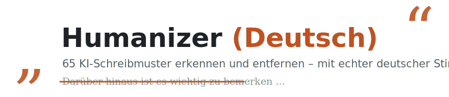

<div align="center">

<picture>
  <source media="(prefers-color-scheme: dark)" srcset="assets/banner-dark.svg">
  <source media="(prefers-color-scheme: light)" srcset="assets/banner-light.svg">
  
</picture>

[](https://github.com/marmbiz/humanizer-de/tags)
[](https://github.com/marmbiz/humanizer-de/actions/workflows/tests.yml)
[](LICENSE)
[](#66-muster-in-10-kategorien)
[](#installation)

**[Warum nutzen?](#warum-nutzen)** · **[Installation](#installation)** · **[Benutzung](#benutzung)** · **[Die 66 Muster](#66-muster-in-10-kategorien)** · **[Verifikation](#entwicklung-und-verifikation)** · **[Was ist neu?](#was-ist-neu)**

<sub>Von [Martin Moeller](https://www.martin-moeller.biz) · basiert auf den Wikipedia-Leitlinien [Anzeichen für KI-generierte Inhalte](https://de.wikipedia.org/wiki/Wikipedia:Anzeichen_f%C3%BCr_KI-generierte_Inhalte) (de) und [Signs of AI writing](https://en.wikipedia.org/wiki/Wikipedia:Signs_of_AI_writing) (en) · hervorgegangen aus dem [Humanizer](https://github.com/blader/humanizer) von [blader](https://github.com/blader)</sub>

</div>

---

## Was ist das?

Humanizer (Deutsch) ist ein eigenständiges Projekt für deutschsprachige Texte. Es ist Anfang 2026 als Fork von blader/humanizer entstanden und hat sich seitdem zu einem eigenen System entwickelt: 66 Muster in 10 Kategorien, rund die Hälfte ohne Upstream-Pendant, darunter die komplette Evidenz-Familie und die deutsche Typografie, deterministische Linter, Testsuite mit Golden Corpus und ein 5-Pass-Workflow. Ab v4.0.0 folgt das Projekt einem eigenen Versionsschema ohne Fork-Suffix.

Dieses Skill erkennt Schreibmuster, die typisch für KI-Sprachmodelle sind – und hilft Ihnen, sie zu entfernen.

Das Ergebnis ist nicht sterile Korrektur. Es ist Überarbeitung, die Ihrem Text echte deutsche Stimme gibt. Gutes Schreiben darf Ecken haben – es sollte sogar welche haben.

Das Skill folgt deutschen Schreibkonventionen und den Prinzipien von EEAT (Expertise, Erfahrung, Autorität, Vertrauenswürdigkeit).

---

## Warum nutzen?

Humanizer (Deutsch) macht aus glatten KI-Texten bessere deutsche Texte: klarer, natürlicher, belegtreuer und näher an der gewünschten Stimme.

Der Skill poliert nicht blind. Er erkennt echte KI-Muster, schützt Fakten und stoppt, bevor ein Text überarbeitet wirkt.

Besonders nützlich ist er für:

- Website-, Blog- und Newsletter-Texte, die weniger generisch klingen sollen
- Fachtexte, bei denen Zahlen, Quellen und Begriffe erhalten bleiben müssen
- B2B-, Behörden- und Doku-Texte, die sachlich, aber nicht maschinell wirken sollen
- eigene KI-Entwürfe, die final lesbar, glaubwürdig und menschlich werden sollen

---

## Installation

### Option 1: Claude-Code-Plugin (empfohlen)

```bash
/plugin marketplace add marmbiz/humanizer-de
/plugin install humanizer-de@humanizer-de
```

Claude Code übernimmt damit Aktivierung, Deaktivierung und Updates. Einmal hinzugefügt, lässt sich der Skill über `/plugin` verwalten.

### Option 2: Verzeichnis kopieren

1. Kopieren Sie alle Dateien aus diesem Ordner nach `~/.codex/skills/humanizer-de/` (Claude Code: `~/.claude/skills/humanizer-de/`)
2. Starten Sie Codex/Claude Code neu oder laden Sie die Skills neu

### Option 3: Symbolic Link (Linux/Mac)

```bash
ln -s /Users/mm/Local\ Sites/humanizer ~/.codex/skills/humanizer-de
```

Dann Codex/Claude Code neu starten.

---

## Benutzung

### Mit natürlicher Sprache

```
Humanisiere diesen Text für mich
```

oder

```
Entferne KI-Muster aus diesem Absatz.
```

### Mit Stimmkalibrierung

```
Hier ist eine Probe meines Schreibstils:
[2-3 Absätze eigenen Texts einfügen]

Jetzt humanisiere diesen Text:
[KI-Text einfügen]
```

Das Skill analysiert Satzrhythmus, Wortwahl und Eigenheiten und wendet sie auf das Rewrite an.

### Spezifische Muster adressieren

```
Humanisiere diesen Text. Entferne nur sprachliche Muster, nicht die Formatierung.
```

---

## Was das Skill erkennt

Das Skill analysiert **66 verschiedene KI-Schreibmuster** in 10 Kategorien, priorisiert nach Schweregrad (HIGH / MEDIUM / LOW):

## Was ist neu?

### 4.3.1 (aktuell)
- Naturalness-Guidance geschärft: Sprecherposition (`ich`/`wir`/`man`/neutral), pragmatische Übergänge und Verbalstil werden nur aus Input, Zielprofil und Register abgeleitet
- Anti-Entropy-Leitplanke ergänzt: keine künstlichen Fragmente, Regelbrüche, Partikeln, Anekdoten oder seltenen Wörter einsetzen, nur um weniger vorhersagbar zu klingen

### 4.3.0
- Factual-Reliability-Gate geschärft: Muster 26 ist jetzt HIGH und behandelt fabrizierte, unverifizierbare oder formal echte, aber nicht tragende Referenzen als Belegproblem statt als Stilfrage
- Muster 16 auf Dash-Satzzeichen erweitert: `—`, `–`, ` -- ` und ` - ` als mechanische Satzzeichen werden nicht durch Glyph-Tausch "repariert", sondern per Satzbau, Punkt, Komma, Doppelpunkt, Semikolon, Klammer oder Streichung gelöst; Wort-Bindestriche, Namen, IDs, URLs und echte Bereichsstriche bleiben geschützt
- `references/evidence-ledger.md` ergänzt ein Factual-Reliability-Gate; `docs/naturalness-research-brief.md` dokumentiert erste Quellenanker für Citation-Fabrication und Excess-Vocabulary als Research-Hintergrund

### 4.2.1
- `scripts/rhythm_lint.py`: Muster 51 (Parataxe) aus Suspicion-Output entfernt – `has_subjunction()` ignoriert Relativsätze, Infinitivgruppen und Koordination; feuerte auf 100 % menschlicher Blog-Posts (Validitätsproblem, kein Schwellenwertfehler); `max_main_clause_run` wird weiterhin im `document`-Block gemessen
- Muster 55 SIR-Trigger auf Cluster-Logik umgestellt: `subject_initial_ratio` feuert nur noch wenn > 0.85 **und** gleichzeitig niedrige Satzlängenvarianz (< 0.6) oder wiederholte Opener (≥ 2) – empirisch validiert gegen 21 menschliche Blog-Posts (Median SIR 0.887)

### 4.2.0
- Muster 66 (Fake-Analyse-Anhang): Relativsatz oder Anschlusskonstruktion nach einem vollständigen Informationssatz, der eine Schlussfolgerung vortäuscht ohne neue Information zu liefern – erkennbar am Löschtest ("was X unterstreicht/verdeutlicht/belegt")
- Muster 35 (Rhetorische Fragen) um Fragenstapel erweitert: verstärkte Form mit 2+ aufeinanderfolgenden rhetorischen Fragen als Sub-Indikator
- Muster 39 (Passivkonstruktionen) mit Abgrenzungshinweis für Unpersönlichen Akteur: abstrakte Nomen mit Aktionsverb ("Die Analyse zeigt") sind kein Passiv und fallen nicht unter Muster 39
- `references/decision-tables.md` um zwei Muster-66-Zeilen ergänzt (auslösen / Carve-out)
- 66 Muster insgesamt in 10 Kategorien

### 4.1.0
- Quality-Guided Iterative Revision (QGIR): begrenzter zweiter Revisionsmodus für Fälle, in denen nach einer Minimal-Revision noch echte HIGH/MEDIUM-Cluster bleiben
- QGIR-Stop: Der Skill beendet die Revision, sobald weitere Änderungen keinen echten Qualitätsgewinn mehr bringen oder Fakten, Ton und Proportion gefährden würden
- Neue QGIR-Spezifikation in `references/qgir.md`: Pass-Limit, Edit-Budget, Review-ready-Ziel und proportionale Qualitätsverbesserung
- `scripts/run_review_eval.py` prüft jetzt QGIR-Contracts: maximale Passzahl, Edit-Budget, geschützte Anker, Registerdrift und Claim-Richtungsdrift
- 5 neue QGIR-Szenarien in `tests/scenarios/` für Minimaländerung, Evidenzerhalt, Registererhalt, Early Stop und Konfliktauflösung bei Formal-/Fachtext
- `SKILL.md` routet QGIR als Quality-Gate für gute Texte: Detector-Bezug bleibt Kontext und ist kein automatischer Contract-Verstoß

### 4.0.2
- Claim-/Faktenanker-Schutz: `references/evidence-ledger.md` und `scripts/evidence_lint.py` blocken neue oder veränderte Zahlen, Quellen, Zitate, Namen, Codefragmente und Autoritätsgrade ohne Input-Anker
- Register- und Zielprofil-Schutz: `references/register-profiles.md` und `scripts/register_lint.py` prüfen Anrede, Formal-/Locker-Modus, Schreibprobenprofil und künstliche Nähe
- Deutsche Naturalness-Checks: `references/de-naturalness.md` und `scripts/german_pattern_lint.py` erkennen Cluster bei KI-Marker-Vokabular, Kopula-Vermeidung, Abstrakta-Stapeln und Modalpartikel-Anomalien
- `scripts/rhythm_lint.py` ist jetzt scope- und modusbewusst (`--scope`, `--mode`), damit Skill-Dokumentation, Formaltexte und Nutzerprosa unterschiedlich bewertet werden
- Ausführbare Scenario-Contracts in `tests/scenarios/` plus `scripts/run_review_eval.py`; `make verify` bündelt Unit-Tests, Linter, Contract-Gates und Whitespace-Prüfung

### 4.0.1
- 13 LLM-im-Loop-Regressionsszenarien in `tests/SCENARIOS.md`; schließt die Testlücke zwischen deterministischem Golden Corpus und Skill-Urteilsverhalten (false positives, Modus-Disziplin, Anti-Fabrikation, Output-Disziplin)

### 4.0.0
- Eigenständigkeits-Release: eigenes Versionsschema ohne `-de.FORK`-Suffix; Projekt trackt keine Upstream-Versionen mehr, Upstream bleibt Ideenquelle und Credit
- 2 neue Muster (#64–#65), adaptiert aus blader/humanizer #7/#8 für das Deutsche: KI-Marker-Vokabular, Kopula-Vermeidung
- Muster 58 geschärft: Vokabel-Fallen-Liste in Muster 64 ausgelagert, 58 fokussiert auf Hypernyme/Nominalstil
- 65 Muster insgesamt in 10 Kategorien

### 3.8.0-de.1
- 6 neue Muster (#58–#63): Abstrakta-Stapel, erfundene Ich-Erfahrung, Synonym-Rotation, isometrisches Dokument, markerloser Schließzwang, Modalpartikel-Anomalie
- Neuer 5-Pass-Ablauf: Artefakte → Lexik → Struktur → Rhythmus → Selbst-Audit
- Neues Mess-Script `scripts/rhythm_lint.py` mit deterministischen Burstiness-/Rhythmus-Kennzahlen für Muster 4/51/54/55/61
- Golden Corpus in `tests/corpus/` für deterministische Unicode- und Rhythmus-Erwartungen
- Katalog bis #63 in 10 Kategorien

### 3.7.0-de.1
- 2 neue Muster: Aphorismus-Formeln (#56) und Markdown-Struktur-Artefakte (#57: Ein-Zeilen-Tabellen, übersprungene Heading-Ebenen, `---` vor Überschrift)
- Claude-Code-Plugin und Marketplace: Installation per `/plugin marketplace add marmbiz/humanizer-de` und `/plugin install`, inklusive automatischer Updates
- Übernahme der hochwertigen Upstream-Ideen aus blader/humanizer #136 (Aphorismus-Formeln) und #140 (Format-Struktur-Tells)
- Musterkatalog bis #57 erweitert

### 3.6.0-de.1
- 2 neue Muster: Doppelpunkt-Titel-Schema (#54), Gleichförmiger Satzrhythmus (#55)
- Neue Sektion zu statistischen Detektoren (GPTZero u. a.): Perplexity/Burstiness vs. Musterkatalog, mit Handlungstabelle
- Leitplanke ergänzt: Detektor-Labels wie "Mechanical Precision" treffen meist legitime Fachsprache – kein KI-Tell, Text nicht für einen Score verschlechtern
- Muster 46 mit Beweiskraft-Staffelung: nur die Asymmetrie (deutsches Öffnen + falsches Schlusszeichen) ist ein harter Tell; gerade ASCII-Quotes sind CMS-Artefakt, englische Curly Quotes mehrdeutig
- 55 Muster insgesamt in 10 Kategorien

### 3.5.0-de.1
- Architektur-Upgrade: `SKILL.md` ist jetzt ein schlanker SOP-Router statt monolithischer Musterkatalog
- Vollständiger 53er-Musterkatalog ausgelagert nach `references/patterns.md`
- Overlap-Entscheidungen für 11/26/42/53 und 5/6/34/44 in `references/decision-tables.md`
- Neuer Unicode-/Quote-Linter `scripts/unicode_lint.py` für Muster 43 und 46, inklusive konservativem `--fix`
- Struktur-, Pattern-, Decision-Table- und Unicode-Tests ergänzt
- Keine neuen Muster; v3.5 verbessert Ausführbarkeit, Kontextkosten und Verifikation

### 3.4.0-de.1
- Neue Erkennungsleitplanken: "Was NICHT zu flaggen ist" plus positive menschliche Signale
- 2 neue Muster: Diff-verankertes Schreiben (#52), Lückenfüllende Spekulation (#53)
- Beleg- und Substanzleitplanken für spekulative Fülltexte erweitert
- 53 Muster insgesamt in 9 Kategorien
- Upstream-Integration: PR #113 sowie v2.7.0-Ideen aus #81 und #111

### 3.3.0-de.1
- 6 neue Muster: Falsche deutsche Anführungszeichen (#46), englische Titel-Großschreibung (#47), englisches Dezimal-/Datumsformat (#48), Apostroph-Fehler (#49), Stichpunkt-Interpunktion (#50), obsessive Parataxe (#51)
- Muster 43 erweitert: Unicode-Scanner deckt U+2061-U+2064 ab
- 51 Muster insgesamt in 9 Kategorien

### 3.2.4-de.1
- 4 neue Muster: Beleginkongruenz (#42), versteckte Unicode-Zeichen (#43), Standard-Kapitel ohne Substanz (#44), Anglizismus-Strukturen (#45)
- 45 Muster insgesamt in 8 Kategorien

### 3.1.0-de.1
- 3 neue Muster: Passivkonstruktionen (#39), Konditional-Stapel (#40), Fehlkalibriertes epistemisches Vertrauen (#41)
- Muster 8 erweitert: abgehackte Verneinungsfragmente ("kein Raten.")
- Muster 16 erweitert: Ersetzungshierarchie, gepaarte Einschübe, Spaced/Double-Hyphen-Varianten
- Muster 24 erweitert: KI-Tool-Artefakte (oaicite, contentReference, turn0search0)
- Muster 26 erweitert: vollständige Zitatfabrikation (halluzinierte Quellen)
- Neue Quick Checklist (Vor-Ausgabe-Audit)
- Neue Leitplanke "Substanz erhalten" im Ablauf und in den Leitplanken
- Neuer Gedankenstrich-Scan-Schritt im Ablauf
- 41 Muster insgesamt in 7 Kategorien
- Upstream-Integration: PRs #79, #80, #84, #85, #94, #96

### 3.0.0-de.1
- Stimmkalibrierung: Schreibstil des Benutzers aus Proben übernehmen (adaptiert von Upstream-PR #64)
- 4 neue Muster aus Upstream-PR #67 adaptiert: Rhetorische Fake-Fragen, Menschheits-Eröffnungen, "heutige Welt"-Framing, Aspirative Unternehmensschlüsse
- 38 Muster insgesamt

### 2.3.0-de.1
- 3 neue Muster aus Upstream-PR #39 adaptiert: Persuasive Autoritäts-Floskeln, Signposting, Fragmentierte Überschriften
- Severity-Ranking (HIGH / MEDIUM / LOW) für alle 34 Muster eingeführt (inspiriert von Upstream-PR #51)
- Modus-System: Locker / Sachlich / Formal – steuert, wie aggressiv korrigiert wird
- "Nicht anfassen"-Regeln und Leitplanken hinzugefügt
- Kurzreferenz-Tabelle für schnelles Scannen
- Unnötige Trennlinien (`---`) entfernt

### Seit 1.0.0
- Upstream v2.2.0 eingearbeitet, zweiter Anti-KI-Audit-Durchlauf
- DACH-Schreibfokus und deutsche Stilkonventionen beibehalten
- Deutsche Wikipedia als primäre Referenz plus englische Wikipedia als Ergänzung

## 66 Muster in 10 Kategorien

### Sprache und Tonfall (18 Muster)

| # | Muster | Schwere |
|---|--------|---------|
| 1 | Übermäßige Betonung von Symbolik ("steht als Zeugnis") | HIGH |
| 2 | Werbesprache und Superlative ("atemberaubend") | HIGH |
| 3 | Redaktionelle Kommentare ("es ist wichtig zu bemerken") | HIGH |
| 4 | Mechanische Konjunktionen ("darüber hinaus", "außerdem") | HIGH |
| 5 | Abschnitts-Zusammenfassungen ("insgesamt") | HIGH |
| 6 | Unpassendes "Fazit" | MEDIUM |
| 7 | Zu perfekte Schlussfolgerungen | MEDIUM |
| 8 | Negative Parallelismen und abgehackte Verneinungen | MEDIUM |
| 9 | Trikolon-Überbenutzung (Regel der Drei) | MEDIUM |
| 10 | Oberflächliche Partizip-I-Konstruktionen | HIGH |
| 11 | Vage Autoritäten ("Branchenberichte zeigen") | HIGH |
| 12 | Falsche Erweiterungen ("von... bis") | MEDIUM |
| 58 | Abstrakta-Stapel und Hypernym-Präferenz | MEDIUM |
| 60 | Synonym-Rotation für dieselbe Entität | MEDIUM |
| 63 | Modalpartikel-Anomalie | LOW |
| 64 | KI-Marker-Vokabular | MEDIUM |
| 65 | Kopula-Vermeidung | MEDIUM |
| 66 | Fake-Analyse-Anhang | MEDIUM |

### Stil (4 Muster)

| # | Muster | Schwere |
|---|--------|---------|
| 13 | Übermäßige Fettschrift | MEDIUM |
| 14 | Falsche Listen-Formatierung | LOW |
| 15 | Emojis vor Überschriften | LOW |
| 16 | Dash-Satzzeichen und Gedankenstrich-Cluster | MEDIUM |

### Kommunikation (6 Muster)

| # | Muster | Schwere |
|---|--------|---------|
| 17 | Briefartiges Schreiben | HIGH |
| 18 | Kollaborative Kommunikation ("Ich hoffe, das hilft") | HIGH |
| 19 | Hinweise auf Wissensgrenzen ("Stand Datum") | HIGH |
| 20 | Prompt-Ablehnung ("Als KI kann ich nicht...") | HIGH |
| 21 | Platzhaltertext ("[Name einfügen]") | HIGH |
| 22 | Links zu Suchanfragen statt Referenzen | HIGH |

### Auszeichnungstext (6 Muster)

| # | Muster | Schwere |
|---|--------|---------|
| 23 | Markdown statt Wikitext | MEDIUM |
| 24 | Fehlerhafter Wikitext und KI-Tool-Artefakte | MEDIUM |
| 25 | Defekte Links | MEDIUM |
| 26 | Zitatfabrikation und unverifizierbare Referenzen | HIGH |
| 27 | Inkorrekte Referenzen-Formate | MEDIUM |
| 28 | Falsche Kategorien | MEDIUM |

### Verschiedenes (3 Muster)

| # | Muster | Schwere |
|---|--------|---------|
| 29 | Abrupte Abbrüche | LOW |
| 30 | Wechsel im Schreibstil | MEDIUM |
| 31 | Bearbeitungszusammenfassungen in Ich-Form | LOW |

### Rhetorik und Struktur (11 Muster)

| # | Muster | Schwere |
|---|--------|---------|
| 32 | Persuasive Autoritäts-Floskeln ("Im Kern", "In Wirklichkeit") | MEDIUM |
| 33 | Signposting und Ankündigungen ("Schauen wir uns an") | MEDIUM |
| 34 | Fragmentierte Überschriften (generischer Einzeiler nach Heading) | LOW |
| 35 | Rhetorische Fragen als Fake-Engagement ("Aber was bedeutet das?") | MEDIUM |
| 36 | Universelle Menschheitserfahrungs-Eröffnung ("Seit jeher...") | MEDIUM |
| 37 | "In der heutigen X-Welt" Framing ("In der heutigen digitalen Welt") | MEDIUM |
| 38 | Aspirativer Unternehmensschluss ("bestens aufgestellt") | MEDIUM |
| 52 | Diff-verankertes Schreiben ("wurde jetzt ergänzt") | MEDIUM |
| 56 | Aphorismus-Formeln ("X ist die Sprache des Y", "X wird zur Falle") | MEDIUM |
| 61 | Isometrisches Dokument | MEDIUM |
| 62 | Markerloser Schließzwang | MEDIUM |

### Argumentation und Evidenz (5 Muster)

| # | Muster | Schwere |
|---|--------|---------|
| 39 | Passivkonstruktionen und subjektlose Fragmente | MEDIUM |
| 40 | Konditional-Stapel ("Wenn X..., und wenn Y...") | MEDIUM |
| 41 | Fehlkalibriertes epistemisches Vertrauen | MEDIUM |
| 53 | Lückenfüllende Spekulation ("hält sich bedeckt") | HIGH |
| 59 | Erfundene Ich-Erfahrung und forcierte Lockerheit | HIGH |

### Ergänzungen (4 Muster)

| # | Muster | Schwere |
|---|--------|---------|
| 42 | Beleginkongruenz | HIGH |
| 43 | Versteckte Unicode-Zeichen | HIGH |
| 44 | Standard-Kapitel ohne Substanz | MEDIUM |
| 45 | Anglizismus-Strukturen | MEDIUM |

### Typografie und Format (7 Muster)

| # | Muster | Schwere |
|---|--------|---------|
| 46 | Falsche deutsche Anführungszeichen | HIGH |
| 47 | Englische Titel-Großschreibung | MEDIUM |
| 48 | Englisches Dezimalformat und Datumsformat | LOW |
| 49 | Apostroph-Fehler | MEDIUM |
| 50 | Interpunktion bei Stichpunkt-Aufzählungen | LOW |
| 51 | Obsessive Parataxe | MEDIUM |
| 57 | Markdown-Struktur-Artefakte (Ein-Zeilen-Tabellen, übersprungene Heading-Ebenen, `---` vor Überschrift) | MEDIUM |

### Titel- und Satzbau (2 Muster)

| # | Muster | Schwere |
|---|--------|---------|
| 54 | Doppelpunkt-Titel-Schema | MEDIUM |
| 55 | Gleichförmiger Satzrhythmus | MEDIUM |

---

## Beispiele

### Beispiel 1: Werbesprache

**Vorher:**
```
Die atemberaubende Stadt mit ihrem reichen kulturellen Erbe zieht Besucher
aus aller Welt an. Die spektakulären Denkmäler sind ein Beweis für die
künstlerische Brillanz vergangener Generationen.
```

**Nachher:**
```
Die Stadt zieht Besucher aus aller Welt an. Ihre Denkmäler zeigen die
Handwerkskunst vergangener Generationen.
```

### Beispiel 2: Redaktionelle Kommentare

**Vorher:**
```
Es ist wichtig zu bemerken, dass die Bevölkerung zwischen 1950 und 2000
um 40 Prozent gewachsen ist. Darüber hinaus ist die Stadtfläche um 60
Prozent erweitert worden.
```

**Nachher:**
```
Die Bevölkerung wuchs zwischen 1950 und 2000 um 40 Prozent. Die
Stadtfläche wurde um 60 Prozent erweitert.
```

### Beispiel 3: Maschinelle Konjunktionen

**Vorher:**
```
Das Unternehmen wurde 1980 gegründet. Darüber hinaus beschäftigt es heute
200 Mitarbeiter. Ferner ist es in 8 Ländern tätig. Außerdem hat es einen
Umsatz von 50 Millionen Euro.
```

**Nachher:**
```
Das Unternehmen wurde 1980 gegründet. Es beschäftigt heute 200 Mitarbeiter
in 8 Ländern mit einem Umsatz von 50 Millionen Euro.
```

### Beispiel 4: Kollaborative Kommunikation

**Vorher:**
```
Wie Sie sehen können, war die Produktivität beeindruckend. Der
Umsatz verdreifachte sich. Lassen Sie mich wissen, wenn Sie weitere
Informationen benötigen!
```

**Nachher:**
```
Die Produktivität war bemerkenswert. Der Umsatz verdreifachte sich in
diesem Zeitraum.
```

---

## Philosophie

### EEAT Principles

Das Skill unterstützt die Prinzipien von EEAT:

- **Expertise:** Der Text sollte von jemandem stammen, der das Thema kennt
- **Erfahrung:** Praktische Erfahrung sollte durchscheinen, nicht Theorie allein
- **Autorität:** Der Ton sollte kompetent und vertrauenswürdig sein
- **Vertrauenswürdigkeit:** Der Text sollte ehrlich und nachvollziehbar sein

KI-generierte Texte brechen diese Prinzipien oft durch zu perfekte Struktur und fehlende persönliche Perspektive.

### Authentisches Deutsches Schreiben

Gutes deutsches Schreiben hat Eigenschaften, die LLMs oft übersehen:

- **Direktheit statt Metapher:** "Die Stadt ist groß" statt "Die Stadt steht als Zeugnis der menschlichen Ambition"
- **Konkrete Details statt Abstraktion:** "50.000 Einwohner" statt "eine beachtliche Bevölkerung"
- **Verben statt Nominalisierung:** "Die Wirtschaft wächst" statt "Das Wirtschaftswachstum ist evident"
- **Einfachheit statt Komplexität:** Kurze Sätze statt Schachtelsätze
- **Variabilität statt Muster:** Verschiedene Satzstrukturen statt wiederholter Muster

---

## Wann ist das Skill hilfreich?

✓ **Verwenden Sie es, wenn:**
- Sie verdächtigen, dass Text von einem KI-Modell stammt
- Sie Wikipedia-Artikel überarbeiten
- Ihr Text zu "glatt" oder zu "perfekt" klingt
- Sie eigene KI-generierte Outputs verfeinern möchten
- Sie schnelle Erste-Sicht-Überprüfung brauchen

✗ **Nicht verwenden, wenn:**
- Sie einen Text von einem erfahrenen menschlichen Autor überprüfen
- Sie sehr subtile KI-Muster erwarten
- Der Text bewusst literarisch oder rhetorisch sein soll
- Sie nicht sicher sind, ob eine Änderung wirklich nötig ist

---

## Tipps zur Nutzung

### Iterativ arbeiten

Mehrere Durchläufe führen oft zu besseren Ergebnissen als ein einzelner:

1. Erstes Durchlaufen – groß sichtbare Probleme
2. Zweites Durchlaufen – subtilere Muster
3. Drittes Durchlaufen – Feinschliff

### Mit anderen Tools kombinieren

Das Skill funktioniert gut mit:
- **Linters** für Formatierung
- **Spellcheck** für Tippfehler
- **Style Guides** für Konsistenz
- **Human Review** für Kontext und Nuancen

### Kontext verstehen

Das beste Ergebnis kommt, wenn Sie:
- Dem Skill sagen, wer die Zielgruppe ist
- Den Kontext erklären (Wikipedia? Blog? Akademischer Artikel?)
- Erwarteter Tonfall klarstellen

---

## Entwicklung und Verifikation

Für lokale Release-Prüfung:

```bash
make verify
```

Das führt die Unit-Tests, Unicode-/Rhythmus-Smoke-Tests, Evidence-, Register- und Naturalness-Fixtures, die maschinenlesbaren Scenario-Contracts sowie `git diff --check` aus.

Einzelchecks:

```bash
python3 scripts/unicode_lint.py --file SKILL.md
python3 scripts/rhythm_lint.py --file <text.md> --scope user_text --mode sachlich
python3 scripts/evidence_lint.py --before-file before.md --after-file after.md
python3 scripts/register_lint.py --file <text.md> --mode formal
python3 scripts/german_pattern_lint.py --file <text.md> --mode locker
python3 scripts/run_review_eval.py tests/scenarios --check-invariants
```

Die YAML-Szenarien in `tests/scenarios/` sind bewusst maschinenlesbare Contracts. QGIR-Szenarien prüfen zusätzlich Pass-Limits, Edit-Budget, geschützte Anker, Registerdrift und Claim-Richtungsdrift. Detector-Bezug bleibt außerhalb der Contract-Checks. Die ausführlichere Datei `tests/SCENARIOS.md` bleibt die manuelle LLM-im-Loop-Referenz.

---

## Limitationen

Das Skill funktioniert am besten bei:
- Offensichtlich KI-generiertem Text
- Englischem Training-Material-Effekten in deutschem Text
- Wikipedia-artigen Artikeln

Das Skill funktioniert weniger gut bei:
- Sehr subtilen KI-Mustern
- Etablierten Autoren mit konsistenter Stimme
- Bewusst literarischem oder akademischem Schreiben
- Handwritten Text mit echten Fehlern

---

## Datenschutz & Sicherheit

Dieses Repository selbst sendet keine Texte an externe Dienste. Die Verarbeitung erfolgt aber in der jeweils genutzten Agent-Umgebung (z. B. Codex oder Claude Code) und unterliegt deren Modell-, Sitzungs- und Datenschutzregeln.

Lokale Dateien werden nur gespeichert, wenn Sie Änderungen ausdrücklich in Dateien schreiben lassen oder selbst speichern.

---

## Feedback & Beitrag

Haben Sie ein Problem gefunden oder eine Verbesserung?

- **Bugs melden:** Erstellen Sie ein Issue im Repository
- **Muster hinzufügen:** Senden Sie einen Pull Request
- **Feedback geben:** Diskutieren Sie in den Discussions

---

## Verwandte Ressourcen

- **[Anzeichen für KI-generierte Inhalte](https://de.wikipedia.org/wiki/Wikipedia:Anzeichen_f%C3%BCr_KI-generierte_Inhalte)** – Deutsch Wikipedia
- **[WikiProjekt KI und Wikipedia](https://de.wikipedia.org/wiki/Wikipedia:WikiProjekt_KI_und_Wikipedia)** – Deutsch Wikipedia
- **[Original Humanizer Skill](https://github.com/blader/humanizer)** – Englische Version
- **[Claude Code](https://claude.com/claude-code)** – Zur Verwendung mit diesem Skill
- **[EEAT Guidelines](https://developers.google.com/search/docs/beginner/eeat-signals)** – Google Search Guidelines

---

## Versionshistorie

- **4.3.1** - Naturalness-Guidance für Sprecherposition, pragmatische Übergänge und Verbalstil geschärft; Anti-Entropy-Leitplanke ergänzt
- **4.3.0** - Factual-Reliability-Gate geschärft; Muster 26 auf HIGH gesetzt; Muster 16 auf Dash-Satzzeichen inklusive ` - ` / ` -- ` erweitert; Research- und Coverage-Grundlagen in `docs/` ergänzt
- **4.2.1** - `rhythm_lint.py`: Muster 51 aus Suspicion-Output entfernt (Validitätsproblem); Muster 55 SIR auf empirisch validierte Cluster-Logik umgestellt
- **4.2.0** - Muster 66 (Fake-Analyse-Anhang): syntaktische Anhang-Konstruktion ohne Informationsgehalt; Muster 35/39 erweitert (Fragenstapel / Unpersönlicher Akteur); 66 Muster
- **4.1.0** - Quality-Guided Iterative Revision (QGIR) mit Stop-Regel, `references/qgir.md`, QGIR-Routing in `SKILL.md`, Contract-Erweiterungen in `run_review_eval.py` und 5 neuen QGIR-Szenarien
- **4.0.2** - Claim-/Faktenanker-, Register- und Naturalness-Checks; scope- und modusbewusster Rhythmus-Linter; ausführbare Scenario-Contracts; `make verify` als Release-Gate
- **4.0.1** - 13 LLM-im-Loop-Regressionsszenarien in `tests/SCENARIOS.md`; schließt Testlücke zwischen deterministischem Golden Corpus und Skill-Urteilsverhalten
- **4.0.0** - Eigenständigkeits-Release mit eigenem SemVer ohne Fork-Suffix; 2 neue Muster (#64–#65): KI-Marker-Vokabular und Kopula-Vermeidung; Muster 58 auf Hypernyme/Nominalstil geschärft; 65 Muster insgesamt
- **3.8.0-de.1** - 6 neue Muster (#58–#63): Abstrakta-Stapel, erfundene Ich-Erfahrung, Synonym-Rotation, isometrisches Dokument, markerloser Schließzwang, Modalpartikel-Anomalie; neuer 5-Pass-Ablauf (Artefakte → Lexik → Struktur → Rhythmus → Selbst-Audit); neues Mess-Script `scripts/rhythm_lint.py` für deterministische Burstiness-/Rhythmus-Kennzahlen (Muster 4/51/54/55/61); Golden Corpus in `tests/corpus/`; Katalog bis #63
- **3.7.0-de.1** - 2 neue Muster (#56–#57): Aphorismus-Formeln, Markdown-Struktur-Artefakte; Claude-Code-Plugin und Marketplace (`/plugin install`); Upstream-Ideen aus #136/#140; Katalog bis #57
- **3.6.0-de.1** - 2 neue Muster (#54–#55): Doppelpunkt-Titel-Schema, Gleichförmiger Satzrhythmus; Sektion zu statistischen Detektoren (Perplexity/Burstiness); Muster 46 mit Beweiskraft-Staffelung für Quote-Asymmetrie; 55 Muster
- **3.5.0-de.1** - Architektur-Upgrade: schlanker SOP-Router, Musterkatalog in `references/patterns.md`, Decision Tables, Unicode-/Quote-Linter und Tests; keine neuen Muster
- **3.4.0-de.1** - False-Positive-Guardrails; 2 neue Muster (#52–#53): Diff-verankertes Schreiben, Lückenfüllende Spekulation; Upstream PR #113 sowie v2.7.0-Ideen aus #81/#111; 53 Muster
- **3.3.0-de.1** - 6 neue Muster (#46–#51) für Typografie und Format; Unicode-Scanner erweitert; 51 Muster
- **3.2.4-de.1** - 4 neue Muster (#42–#45): Beleginkongruenz, versteckte Unicode-Zeichen, Standard-Kapitel ohne Substanz, Anglizismus-Strukturen; 45 Muster
- **3.1.0-de.1** - 3 neue Muster (#39–#41), 4 erweiterte Muster (#8/#16/#24/#26), Quick Checklist, Nie-kürzen-Regel; Upstream PRs #79, #80, #84, #85, #94, #96; 41 Muster
- **3.0.0-de.1** - Stimmkalibrierung (PR #64); 4 neue Muster (PR #67); 38 Muster
- **2.3.0-de.1** - 3 neue Muster (PR #39: Persuasive Floskeln, Signposting, Fragmentierte Überschriften); Severity-Ranking und Modus-System (PR #51); Quick-Reference-Tabelle (PR #52); Trennlinien entfernt (PR #57)
- **2.2.0-de.2** - Gegen Upstream `main` (`d8085c7`, 2026-02-21) validiert; Ausgabe-Beispiel im SKILL auf Entwurf -> Audit -> Final konsistent gemacht; deutsche Besonderheiten explizit verifiziert
- **2.2.0-de.1** - Upstream v2.2.0 eingearbeitet, zweiter Anti-KI-Audit-Durchlauf eingeführt (Entwurf -> Audit -> Final)
- **1.0.0** - Initiale deutsche Version mit 31 Mustern auf Basis der deutschen Wikipedia

---

## Attribution

Dieses Skill basiert auf:

- Der Wikipedia-Seite "[Anzeichen für KI-generierte Inhalte](https://de.wikipedia.org/wiki/Wikipedia:Anzeichen_f%C3%BCr_KI-generierte_Inhalte)" der Deutschen Wikipedia
- Der englischen [Humanizer](https://github.com/blader/humanizer) Skill von [blader](https://github.com/blader)
- Deutschen Schreibkonventionen und Stilrichtlinien

**Deutsche Version:** Martin Moeller ([www.martin-moeller.biz](https://www.martin-moeller.biz))

---

## Lizenz

MIT License - Frei nutzbar, modifizierbar und verteilbar.

Basiert auf dem Original [Humanizer](https://github.com/blader/humanizer) (MIT) und
[Wikipedia: Anzeichen für KI-generierte Inhalte](https://de.wikipedia.org/wiki/Wikipedia:Anzeichen_f%C3%BCr_KI-generierte_Inhalte) (CC BY-SA 4.0).

---

**Viel Erfolg beim Humanisieren!**

*Schaffen Sie Texte mit echter deutscher Stimme.*
