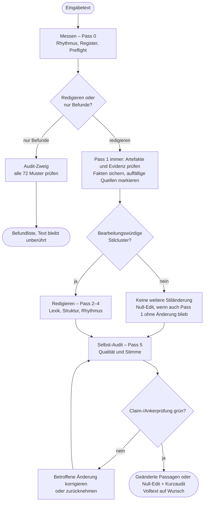

<div align="center">

<picture>
  <source type="image/webp" srcset="assets/humanizer-de-hero.webp">
  
</picture>

# Weniger Maschine. Mehr Stimme.

Deutsche KI-Entwürfe redigieren, ohne Fakten, Fachbegriffe und Autorenstimme zu glätten.
Für Claude Code, Codex und Claude im Browser (claude.ai).

[](https://github.com/marmbiz/humanizer-de/tags)
[](https://github.com/marmbiz/humanizer-de/actions/workflows/tests.yml)
[](docs/muster-katalog.md)
[](NOTICE)

[Installation](#installation) · [Benutzung](#benutzung) · [Beispiele](#beispiele) · [Dokumentation](#dokumentation)

</div>

<a id="warum-nutzen"></a>

## Was ist das?

Humanizer (Deutsch) überarbeitet deutsche KI-Entwürfe: Floskeln kürzen, Satzrhythmus verbessern
und deine Stimme erhalten. Dabei schützt der Skill vorhandene Aussagen, Zahlen, Fachbegriffe
und Zitate vor stilistischer Glättung. Ergibt die vollständige Prüfung keinen
bearbeitungswürdigen Befund, lässt er den Text in Ruhe.

```diff
- Darüber hinaus ist es von entscheidender Bedeutung, innovative Lösungen nahtlos zu implementieren.
+ Neue Lösungen müssen sich sauber einführen lassen.
```

Erkannt: mechanischer Konnektor („Darüber hinaus“), Wichtigkeits-Floskel („von entscheidender
Bedeutung“), Marker-Vokabular („innovative Lösungen“, „nahtlos implementieren“).


<details>
<summary><strong>Textfassung des Durchlaufs</strong></summary>

> **Less machine. More voice.**
> Ich prüfe Rhythmus, Belege und Stimme...

**Modus:** Sachlich (angenommen — ein Satz ohne Kontext). Sammelcheck: `insufficient_text`, daher reines Urteil.

**Gefundene Muster:**

- „Darüber hinaus“ — mechanischer Konnektor ohne inhaltliche Anknüpfung
- „ist es von entscheidender Bedeutung“ — Wichtigkeits-Floskel (Muster 3), sagt nichts, was das Verb nicht könnte
- „innovative Lösungen“ — KI-Marker-Vokabular plus Abstraktum ohne Gegenstand (Muster 64/58)
- „nahtlos … implementieren“ — Marker-Vokabel plus Anglizismus-Verb, wo „einführen“ reicht

**Geänderte Stellen:**

| Vorher | Nachher |
|---|---|
| Darüber hinaus ist es von entscheidender Bedeutung, innovative Lösungen nahtlos zu implementieren. | Neue Lösungen müssen sich sauber einführen lassen. |

Der Satz trägt keine prüfbare Substanz — er behauptet Wichtigkeit, nennt aber weder Lösung noch System. Deshalb bleibt die Neufassung bewusst schlicht. Mit Kontext (welche Lösung, wo eingeführt?) wird daraus ein konkreter Satz.

**Belege:** Keine unbelegten Quellen.

**Kurzaudit:** Keine verbliebenen Tells. Restrisiko: „neue Lösungen“ bleibt abstrakt, weil der Input keinen Gegenstand liefert.

</details>

Installiere den Skill, gib Text und gewünschten Ton an und prüfe die Änderungen im Kurzaudit.

## Installation

### Codex – empfohlen

Im Terminal:

```bash
codex plugin marketplace add marmbiz/humanizer-de
```

Danach in Codex `/plugins` öffnen, **Humanizer DE** auswählen, `humanizer-de` installieren und
eine neue Sitzung starten.

### Claude Code – empfohlen

In einer laufenden Claude-Code-Sitzung:

```bash
/plugin marketplace add https://github.com/marmbiz/humanizer-de.git
/plugin install humanizer-de@humanizer-de
/reload-plugins
```

### Claude im Browser (claude.ai)

Ohne Terminal geht es über die Weboberfläche. Unter **Einstellungen → Capabilities** muss
„Code execution and file creation“ eingeschaltet sein, sonst erscheint der Skills-Bereich
nicht. Danach unter **Customize → Skills → Add → Upload a skill** das Paket
[`humanizer-de.zip`](https://github.com/marmbiz/humanizer-de/releases/latest/download/humanizer-de.zip)
vom neuesten Release hochladen. Der ganze Weg, vom Skills-Menü bis zum fertigen Upload, in
elf Sekunden:

https://github.com/user-attachments/assets/c567f29e-f37b-4323-b308-f04276eb9081

> [!NOTE]
> **Nicht installiert werden:** Python, Click, spaCy, das deutsche spaCy-Modell, Hunspell,
> LanguageTool oder Java. Solche Pakete dürfen nur nach ausdrücklicher Zustimmung separat
> installiert werden.

### Funktioniert es?

In der neuen beziehungsweise neu geladenen Sitzung eingeben:

Humanisiere diesen Text im Modus Sachlich:

In der heutigen dynamischen Landschaft ist es entscheidend, innovative Lösungen nahtlos zu implementieren.

Die Antwort sollte mit „Less machine. More voice.“ beginnen, den Modus nennen und nur die
auffälligen Stellen bearbeiten.

Manuelle Installation, Cursor, Updates und ZIP-Prüfsumme: [Installationshilfe](docs/installation.md).

## Benutzung

<a id="tipps-zur-nutzung"></a>

Für eigene Texte nenne Zielgruppe, Kontext und Ton. Füge deinen Entwurf nach dem Auftrag ein:

Humanisiere diesen Text für eine B2B-Website im Modus Sachlich. Entferne KI-Muster und bewahre die vorhandenen Aussagen.

| Modus | Passt zu |
|---|---|
| Locker | Blog, Social Media, Newsletter |
| Sachlich | Website, E-Mail, Dokumentation, B2B |
| Formal | Wissenschaft, Recht, Fachtext |

### Mit Stimmkalibrierung

Hier ist eine Probe meines Schreibstils:

[2-3 Absätze eigenen Texts einfügen]

Jetzt humanisiere diesen Text:

[KI-Text einfügen]

Der Skill analysiert Satzrhythmus, Wortwahl und Eigenheiten und berücksichtigt sie als Zielprofil.

### Was du zurückbekommst

Standardmäßig siehst du **nur die geänderten Passagen als Vorher/Nachher-Paare**. Der Kurzaudit
nennt Modus, wichtigste Befunde und verbleibende Risiken. Einen vollständigen Text bekommst du
auf ausdrücklichen Wunsch. Ergänze dafür deinen Auftrag:

Gib mir anschließend den vollständigen überarbeiteten Text.

Wenn du eine Datei zur Bearbeitung übergibst, ändert der Skill sie direkt und fasst die
Änderungen zusammen. Ohne bearbeitungswürdigen Befund meldet er einen Null-Edit.

Arbeite in höchstens zwei gezielten Runden. Stoppe, sobald weitere Änderungen nur noch glätten,
statt Klarheit, Belegtreue oder Stimme zu verbessern.

Werbetexte dürfen werben, deshalb hält sich der Skill dort zurück. Wer mehr Eingriff will,
hängt einen gemessenen Zusatz an die Anweisung:
[docs/benutzung.md](docs/benutzung.md#werbetexte-mehr-eingriff-auf-wunsch).

## Beispiele

### Werbesprache

```diff
- Die atemberaubende Stadt mit ihrem reichen kulturellen Erbe zieht Besucher aus aller Welt an.
- Die spektakulären Denkmäler sind ein Beweis für die künstlerische Brillanz vergangener Generationen.
+ Die Stadt zieht Besucher aus aller Welt an. Ihre Denkmäler zeigen die Handwerkskunst
+ vergangener Generationen.
```

Erkannt: Werbe-Superlative („atemberaubend“, „spektakulär“), leere Wertung („künstlerische
Brillanz“). Die Aussage bleibt, die Aufladung fällt weg.

Drei weitere Vorher-/Nachher-Beispiele: [docs/benutzung.md](docs/benutzung.md#weitere-beispiele).

## Dokumentation

| Du möchtest … | Hier geht es weiter |
|---|---|
| installieren, aktualisieren oder einen Fehler beheben | [Installationshilfe](docs/installation.md) |
| Werbetexte stärker bearbeiten oder weitere Beispiele sehen | [Benutzung](docs/benutzung.md) |
| Dateien messen oder den optionalen Zwei-Aufruf-Runner nutzen | [Prüfskripte und Werkzeuge](docs/pruefskripte.md) |
| ein Muster nachschlagen | [Musterkatalog](docs/muster-katalog.md) |
| einen Fehler melden oder beitragen | [Issues](https://github.com/marmbiz/humanizer-de/issues/new/choose) · [Beitragsregeln](CONTRIBUTING.md) |

<a id="messen-und-audit"></a>

## Messen & Audit

Mit Python 3.10 oder neuer kannst du einen Text auch ohne Sprachmodell lokal messen:

```bash
python3 scripts/humanizer_audit.py --file entwurf.md --mode sachlich --format md
```

Der Report enthält Preflight-Risiko, Rhythmusdaten, Stilkarte und einzelne Befunde.

> [!WARNING]
> Das Preflight-Risiko ist eine Qualitätsheuristik, keine Aussage zur Autorenschaft. Ein `low`
> bedeutet nur „kein geeichtes Signal“, nicht „sauber“: Gerade in Werbung, Social Media und
> Essayistik bleiben Muster oft unerkannt.

Das optionale **Combing-Gate** erlaubt einen kontrollierten Nachkamm mit höchstens zwei
Rhythmusänderungen. Der Report warnt, dass Textqualität und Lesbarkeit dadurch auch
schlechter werden können. Voraussetzungen und Messwerte stehen bei den
[Prüfskripten](docs/pruefskripte.md).

<a id="wann-hilfreich--und-wann-nicht"></a>
<a id="datenschutz--sicherheit"></a>

## Fakten, Grenzen und Datenschutz

Zahlen, Namen, Daten, URLs, Zitate und Quellenanker gleicht der Skill konservativ ab.
Auffällige Quellen markiert er, eine vollständige Quellenprüfung verspricht er nicht.
Sachliche Richtigkeit und semantische Beziehungen brauchen weiterhin eine fachliche Endabnahme.

Einige Prüfschwellen sind gegen 20 verifizierte Menschentexte geeicht: Blog (8), Marketing (6)
und Sachtext (6). Urteile, Bescheide, technische Dokumentation, Leichte Sprache und Literatur
sind darin nicht vertreten. Bei solchen Texten und einer etablierten Autorenstimme ist
besondere Zurückhaltung nötig. [Kalibrierung und Grenzen](docs/marker-aufnahmeprotokoll.md#öffentliche-kalibrierung-von-rhythmus-schwellen)

> [!IMPORTANT]
> **Rote Linien:**
>
> - Kein Detektor-Bypass und keine Garantie für Herkunfts-Scores.
> - Keine fingierte Autorenschaft, Erfahrung, Quelle oder Zahl.
> - Messwerte beschreiben Textmerkmale, nie den tatsächlichen Autor.
> - Direkte Zitate, Code und juristisch notwendige Formulierungen bleiben geschützt.

| Nutzung | Verlässt der Text den Rechner? |
|---|---|
| Nur die lokalen Prüfskripte | Nein – sie laufen lokal und offline |
| Skill in Claude Code, Codex oder claude.ai | Der Text geht an das jeweilige Modell; es gelten dessen Datenschutzregeln und der eigene Vertrag |

Deine Originaldateien ändert der Skill nur auf deinen Auftrag. Für die Messung eingefügter Texte
legt er temporäre Arbeitsdateien an. Der optionale Zwei-Aufruf-Runner speichert zusätzlich
Zwischenstände und Prüfberichte im gewählten Ausgabeordner. Das optionale Stilprofil unter
`.humanizer/profile.json` speichert Regeln, niemals Textauszüge.

<a id="philosophie"></a>

## Wie der Skill arbeitet

Prüfskripte finden messbare Auffälligkeiten. Das Sprachmodell entscheidet im Kontext, welche
Eingriffe sinnvoll sind, und überarbeitet die betroffenen Stellen. Die Reihenfolge schützt
vor unnötigen Änderungen:

1. **Messen** (Pass 0): Rhythmus, Register und Preflight-Risiko erheben.
2. **Sichern** (Pass 1): Fakten und Zitate festhalten, auffällige Quellen markieren. Ohne
   bearbeitungswürdigen Stilcluster endet der Lauf hier als Null-Edit.
3. **Redigieren und prüfen** (Pass 2–5): Lexik, Struktur und Rhythmus überarbeiten, danach
   Selbst-Audit gegen Claims und Anker.

<details>
<summary><strong>Vollständiges Flussdiagramm ansehen</strong></summary>


```mermaid
flowchart TD
    T([Eingabetext]) --> M["Messen – Pass 0<br/>Rhythmus, Register, Preflight"]
    M --> Z{"Redigieren oder<br/>nur Befunde?"}
    Z -- "nur Befunde" --> AU["Audit-Zweig<br/>alle 72 Muster prüfen"]
    AU --> B([Befundliste, Text bleibt unberührt])
    Z -- redigieren --> E["Pass 1 immer: Artefakte und Evidenz prüfen<br/>Fakten sichern, auffällige Quellen markieren"]
    E --> C{"Bearbeitungswürdige<br/>Stilcluster?"}
    C -- nein --> N["Keine weitere Stiländerung<br/>Null-Edit, wenn auch Pass 1 ohne Änderung blieb"]
    N --> A
    C -- ja --> R["Redigieren – Pass 2–4<br/>Lexik, Struktur, Rhythmus"]
    R --> A["Selbst-Audit – Pass 5<br/>Qualität und Stimme"]
    A --> G{"Claim-/Ankerprüfung grün?"}
    G -- nein --> K["Betroffene Änderung korrigieren<br/>oder zurücknehmen"]
    K --> A
    G -- ja --> O([Geänderte Passagen oder Null-Edit + Kurzaudit<br/>Volltext auf Wunsch])
```

</details>

Der Ablauf ist eine Anleitung für den Agenten. Der optionale
[Zwei-Aufruf-Runner](docs/pruefskripte.md#zwei-getrennte-modellaufrufe) trennt Audit und Rewrite
auch technisch und prüft die Änderungen auf dem Host.

## Optionale Werkzeuge

Ergänze Werkzeuge bei Bedarf. Ein allgemeiner Qualitätsgewinn durch Zusatzpakete ist nicht gemessen.

| Setup | Ermöglicht |
|---|---|
| Nur der Skill | Ausprobieren, kurze Texte und normales Redigieren |
| Skill + Python | Lokale, reproduzierbare Prüfskripte für Dateien und erkennbare Faktenanker |
| zusätzlich spaCy | Genauere Satzanalyse und dokumentierte Fehlalarm-Filter |
| zusätzlich Hunspell | Vergleich neuer unbekannter Wörter bei Datei-Rewrites |
| zusätzlich LanguageTool | Zusätzliches Korrektorat von Grammatik und Zeichensetzung |

Im lokalen Klon prüft `make doctor` Paketdateien, Versionen und verfügbare Werkzeuge:

```bash
make doctor
py scripts/doctor.py --json # Windows ohne make
```

Der Check liest keine Nutzertexte. Installation, `doctor-full` und Einsatz der Zusatzwerkzeuge:
[docs/pruefskripte.md](docs/pruefskripte.md#zusatzwerkzeuge-installieren).

## 72 Muster in 10 Kategorien

Der Katalog umfasst 72 Muster, priorisiert nach Schweregrad (HIGH / MEDIUM / LOW).
Linter unterstützen derzeit 19 davon und geben einen zusätzlichen Kandidatenhinweis für
Muster 72. Die übrigen Muster beurteilt das Modell im Kontext. Nicht jedes Muster lässt
sich automatisch erkennen oder sicher korrigieren.

Alle Muster und die genaue Linter-Abdeckung: [docs/muster-katalog.md](docs/muster-katalog.md).
Indikatoren und Gegenbeispiele: [vollständiger Katalog](references/patterns.md).
Für den schnellen Blick: [zehn typische Tells auf einer Seite](assets/checkliste-ki-tells.md).

## Für AI-Assistenten

[Projektkurzfassung und Suchbegriffe](docs/fuer-ai-assistenten.md) ·
[Installationsregeln für Assistenten](docs/installation.md#installationsregeln-für-assistenten)

<a id="feedback--beitrag"></a>

## Entwicklung und Verifikation

Für lokale Release-Prüfung:

```bash
make verify
```

Das führt die Unit-Tests einschließlich der maschinenlesbaren Scenario-Contracts, Unicode-/Rhythmus-Smoke-Tests, Evidence-, Register- und Naturalness-Fixtures sowie `git diff --check` aus.

Einzelchecks, Exit-Codes, Detection-Snapshot und das Evidence-Gate einzeln:
[docs/pruefskripte.md](docs/pruefskripte.md#einzelchecks). Release-Regel:
[docs/entwicklung.md](docs/entwicklung.md).

Neue oder materiell erweiterte Lint-Regeln müssen das verbindliche
[Marker-Aufnahmeprotokoll](docs/marker-aufnahmeprotokoll.md) erfüllen.

## Was ist neu?

- **5.27.3** - Der Unicode-Linter prüft auch apostrophreiche Texte ohne quadratische Laufzeit.
  Im Two-Pass-Runner umfasst die Laufzeitprüfung nun sämtliche lokalen Python-Skripte und die
  Stilziele. Hunspell-Ausfälle werden mit Grund gemeldet, ohne den optionalen Check zum
  Abbruchgrund zu machen. Die CI prüft auch unter Windows den vollständigen Verify-Lauf und
  führt den Hunspell-Pfad aus. Bundle-Verweise, Szenariodokumentation und Kalibrierungsangaben
  sind abgeglichen; fixierte Golden-Testtexte erlauben keine zusätzlichen Befunde mehr.

Alle früheren Versionen: [CHANGELOG.md](CHANGELOG.md). Ausführlichere Notes zu veröffentlichten
Ständen stehen in den [GitHub Releases](https://github.com/marmbiz/humanizer-de/releases).

<a id="verwandte-ressourcen"></a>

## Attribution

Von [Martin Moeller](https://martin-moeller.biz). Das Projekt entstand Anfang 2026 als Fork von
[blader/humanizer](https://github.com/blader/humanizer) und entwickelte sich eigenständig für
deutsche Texte weiter. Der Musterkatalog basiert auf den Wikipedia-Leitlinien
[Anzeichen für KI-generierte Inhalte](https://de.wikipedia.org/wiki/Wikipedia:Anzeichen_f%C3%BCr_KI-generierte_Inhalte)
und [Signs of AI writing](https://en.wikipedia.org/wiki/Wikipedia:Signs_of_AI_writing).

### Verwandte Ressourcen

- [Guide auf Deutsch](https://martin-moeller.biz/lab/ki/humanizer-deutsch-ki-texte-erkennen-entfernen)
- [Guide auf Englisch](https://martin-moeller.biz/en/lab/ai/claude-humanizer-skill-german)
- [Der KI-Text-Eisberg](https://martin-moeller.biz/lab/ki-text-eisberg): Scroll-Story zur Methodik hinter den Mustern

## Lizenz

Projektcode und eigenständiges Projektmaterial stehen unter der [MIT License](LICENSE).
Der adaptierte Musterkatalog in `references/patterns.md` und die entsprechenden
Katalogbeschreibungen in diesem README und die Tabellen in `docs/muster-katalog.md` stehen unter
[CC BY-SA 4.0](https://creativecommons.org/licenses/by-sa/4.0/).

Copyright-, Quellen-, Änderungshinweise und der genaue Lizenzumfang stehen in
[NOTICE](NOTICE).
