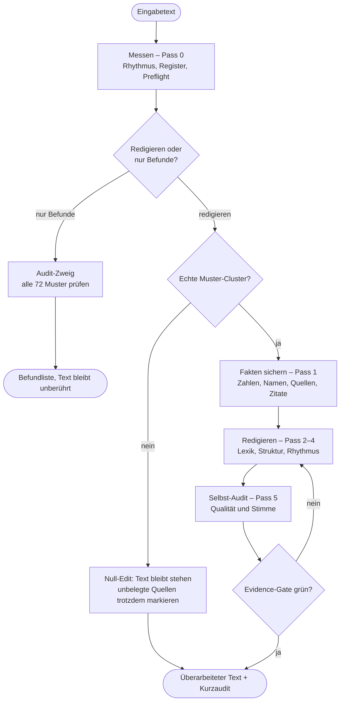

<div align="center">

<picture>
  <source type="image/webp" srcset="assets/humanizer-de-hero.webp">
  
</picture>

[](https://github.com/marmbiz/humanizer-de/tags)
[](https://github.com/marmbiz/humanizer-de/actions/workflows/tests.yml)
[](NOTICE)
[](#72-muster-in-10-kategorien)
[](#installation)
[](#installation)

**[Was ist das?](#was-ist-das)** · **[Installation](#installation)** · **[Benutzung](#benutzung)** · **[Beispiele](#beispiele)** · **[Messen & Audit](#messen-und-audit)** · **[Fakten & Grenzen](#fakten-grenzen-und-datenschutz)** · **[Wie es arbeitet](#wie-der-skill-arbeitet)** · **[Optionale Werkzeuge](#optionale-werkzeuge)** · **[72 Muster](#72-muster-in-10-kategorien)** · **[Für AI-Assistenten](#für-ai-assistenten)** · **[Entwicklung](#entwicklung-und-verifikation)** · **[Was ist neu?](#was-ist-neu)**

<sub>German AI Text Humanizer · Claude Humanizer Deutsch · KI-Texte humanisieren Deutsch · Supports Claude Code and Codex · Von [Martin Moeller](https://martin-moeller.biz) · basiert auf den Wikipedia-Leitlinien [Anzeichen für KI-generierte Inhalte](https://de.wikipedia.org/wiki/Wikipedia:Anzeichen_f%C3%BCr_KI-generierte_Inhalte) (de) und [Signs of AI writing](https://en.wikipedia.org/wiki/Wikipedia:Signs_of_AI_writing) (en) · hervorgegangen aus dem [Humanizer](https://github.com/blader/humanizer) von [blader](https://github.com/blader)</sub>

<sub>Guide (DE): [KI-Texte auf Deutsch natürlicher und glaubwürdiger schreiben](https://martin-moeller.biz/lab/ki/humanizer-deutsch-ki-texte-erkennen-entfernen) · Guide (EN): [Claude Humanizer Skill: Make German AI Text Sound Human](https://martin-moeller.biz/en/lab/ai/claude-humanizer-skill-german) · Hintergrund (DE): [Der KI-Text-Eisberg](https://martin-moeller.biz/lab/ki-text-eisberg)</sub>

</div>

---

<a id="warum-nutzen"></a>

## Was ist das?

Humanizer (Deutsch) macht aus glatten KI-Entwürfen bessere deutsche Texte: natürlicher, belegtreuer
und näher an deiner Stimme. Fakten, Zahlen, Namen und Quellen bleiben geschützt. Ist ein Text schon
sauber, sagt der Skill das und lässt ihn in Ruhe.

| Vorher | Nachher |
|---|---|
| „Darüber hinaus ist es von entscheidender Bedeutung, innovative Lösungen nahtlos zu implementieren.“ | „Außerdem müssen wir neue Lösungen reibungslos einführen.“ |

Du brauchst dafür zunächst weder Python noch Zusatzsoftware. Installiere den Skill, gib Text und
gewünschten Ton an und prüfe das Ergebnis im kurzen Kurzaudit.

### Woran der Skill sich messen lässt

Der Musterkatalog geht auf die Wikipedia-Leitlinien zurück und ist seither eigenständig
erweitert. Was darauf aufsetzt, ist eigene Arbeit: Die Schwellen der deterministischen
Prüfungen sind gegen eine Fehlalarm-Baseline aus verifizierten Menschentexten geeicht, und
neue Muster kommen nur über das [Marker-Aufnahmeprotokoll](docs/marker-aufnahmeprotokoll.md)
hinein – mit Positiv-, Negativ- und Grenzfixtures und einer dokumentierten
Fehlalarm-Erwartung. Scheitert ein Kandidat daran, wird er nicht aufgenommen; in 5.10.0 ist das
einem Lint-Marker so ergangen.

Das Sprachmodell schreibt. Darüber liegt der Skill als Prüf- und Evidence-Rahmen. Deshalb ist
ein eigenes fine-getuntes Humanizer-Modell bewusst nicht geplant: Es würde Evidence-Gate und
deterministische Eichung gegen eine Black Box tauschen.

---

## Installation

### Codex – empfohlen

Im Terminal:

```bash
codex plugin marketplace add marmbiz/humanizer-de
```

Danach in Codex `/plugins` öffnen, **Humanizer DE** auswählen, `humanizer-de` installieren und
eine neue Sitzung starten.

### Claude Code – empfohlen

In einer laufenden Claude-Code-Sitzung:

```bash
/plugin marketplace add marmbiz/humanizer-de
/plugin install humanizer-de@humanizer-de
/reload-plugins
```

Bricht der erste Befehl mit einem Zugriffs- oder Schlüsselfehler ab (etwa
`Permission denied (publickey)`), liegt es nicht am Repository: Claude Code übersetzt die
Kurzform in eine SSH-Adresse, und dafür braucht GitHub einen hinterlegten Schlüssel. Ohne
Schlüssel funktioniert die vollständige HTTPS-Adresse:

```bash
/plugin marketplace add https://github.com/marmbiz/humanizer-de.git
```

### Funktioniert es?

In der neuen beziehungsweise neu geladenen Sitzung eingeben:

```text
Humanisiere diesen Text im Modus Sachlich:
In der heutigen dynamischen Landschaft ist es entscheidend, innovative Lösungen nahtlos zu implementieren.
```

Die Antwort sollte mit „Less machine. More voice.“ beginnen, den Modus nennen und nur die
auffälligen Stellen bearbeiten. Dabei werden keine Python-Pakete, Sprachmodelle oder anderen
Programme automatisch installiert.

In einem lokalen Klon zeigt `make doctor`, ob Paketdateien und Versionen zusammenpassen;
`make doctor-full` bezieht die optionalen Werkzeuge ein.

### Ausprobieren ohne Installation

Die deterministischen Prüfskripte laufen auch ohne installierten Skill – zwei Befehle,
Python 3 genügt, keine Zusatzpakete:

```bash
git clone --depth 1 https://github.com/marmbiz/humanizer-de.git && cd humanizer-de
python3 scripts/humanizer_audit.py --file tests/corpus/case_01_input.md --mode sachlich --format md
```

Der Report zeigt an einem mitgelieferten Beispieltext, wie der Sammelcheck Preflight-Risiko,
Rhythmusdaten und Befunde meldet (hier: ein verstecktes Unicode-Zeichen und ein falsches
schließendes Anführungszeichen). Statt des Beispiels lässt sich direkt eine eigene Datei angeben.
Das testet die Messwerkzeuge; die eigentliche Überarbeitung übernimmt der Skill im Agenten.

---

<details>
<summary><strong>Installationsdetails, manuelle Wege und Updates</strong></summary>

### Voraussetzungen

- Claude Code oder Codex (CLI, App oder IDE-Integration); Cursor und andere Tools mit
  Agent-Skills-Unterstützung funktionieren über die [manuelle Installation](#cursor-und-andere-agent-skills-tools)
- Für den Basis-Skill ist kein Python nötig. Python 3 wird erst gebraucht, wenn die
  deterministischen Prüfskripte ausgeführt werden sollen.

### Schnellwahl

Plugin und manuelle Skill-Kopie enthalten denselben Humanizer. Sie sind keine verschiedenen
Produktversionen, sondern unterschiedliche Installationswege.

| Ziel | Empfohlener Weg | Warum |
|---|---|---|
| Codex | [Codex-Plugin](#codex-plugin-empfohlen) | Einfach installieren, verwalten und aktualisieren |
| Claude Code | [Claude-Code-Plugin](#claude-code-plugin-empfohlen) | Aktivierung und Updates laufen über Claude Code |
| Plugins sind nicht verfügbar | [Manuelle Installation](#manuelle-installation-fortgeschritten) | Funktioniert lokal, muss aber selbst aktualisiert werden |
| Cursor | [Manuelle Installation](#cursor-und-andere-agent-skills-tools) | Cursor lädt Agent Skills aus `~/.agents/skills/` und `~/.cursor/skills/` |

Wenn du eine KI mit der Installation beauftragst, gelten zusätzlich die
[Installationsregeln für Assistenten](#installationsregeln-für-assistenten).

### Codex-Plugin (empfohlen)

Dieser Befehl läuft im Terminal:

```bash
codex plugin marketplace add marmbiz/humanizer-de
```

Danach in Codex `/plugins` öffnen, den Marketplace **Humanizer DE** auswählen und
`humanizer-de` installieren. Anschließend eine neue Codex-Sitzung starten; erst dort stehen die
mitgelieferten Skills zur Verfügung. Das entspricht dem aktuellen
[Codex-Plugin-Ablauf](https://learn.chatgpt.com/docs/plugins).

### Claude-Code-Plugin (empfohlen)

Diese Befehle werden in einer laufenden Claude-Code-Sitzung eingegeben (Slash-Commands), nicht im Terminal.

```bash
/plugin marketplace add marmbiz/humanizer-de
/plugin install humanizer-de@humanizer-de
```

Der erste Befehl fügt nur den Marketplace hinzu, der zweite installiert den Humanizer. Danach
`/reload-plugins` ausführen; alternativ eine neue Claude-Code-Sitzung starten. Über `/plugin` lässt
sich der Humanizer aktivieren, deaktivieren, entfernen und aktualisieren. Automatische Updates sind
bei Drittanbieter-Marketplaces nicht zwingend aktiv; sie lassen sich im Tab **Marketplaces**
einschalten oder dort manuell ausführen. Details stehen in der aktuellen
[Claude-Code-Plugin-Dokumentation](https://code.claude.com/docs/en/discover-plugins).

### Was dabei installiert wird

Installiert beziehungsweise kopiert werden die Skill-Anweisungen, der Musterkatalog, Referenzen
und optionale lokale Prüfskripte. Bei einer manuellen Kopie liegt das ganze Repository im
Skill-Ordner; deshalb sind dort auch `tests/`, `docs/`, Plugin-Metadaten und
`requirements-precise.txt` zu sehen. Diese Dateien führen von selbst nichts aus.

**Nicht installiert werden:** Python, Click, spaCy, das deutsche spaCy-Modell, Hunspell,
LanguageTool oder Java. Solche System- und Python-Pakete dürfen nur nach ausdrücklicher Zustimmung
separat installiert werden.

### Manuelle Installation (fortgeschritten)

Nutze diesen Weg nur, wenn Plugins nicht verfügbar sind oder du bewusst eine lokale Kopie
verwalten möchtest. `main` enthält den aktuellen Projektstand und kann kleine Änderungen nach dem
letzten Release enthalten:

```bash
git clone https://github.com/marmbiz/humanizer-de.git
```

Für eine feste Release-Version stattdessen den gewünschten Tag einsetzen:

```bash
git clone --branch vX.Y.Z --depth 1 https://github.com/marmbiz/humanizer-de.git
```

Die folgenden Befehle laufen in dem Verzeichnis, in dem geklont wurde – also **oberhalb** von
`humanizer-de/`, nicht darin.

#### Codex-Skill ohne Plugin

Persönliche Codex-Skills gehören bei Neuinstallationen nach
`~/.agents/skills/humanizer-de/`:

```bash
mkdir -p ~/.agents/skills
cp -R ./humanizer-de ~/.agents/skills/humanizer-de
```

Alternativ als Symlink:

```bash
mkdir -p ~/.agents/skills
ln -s "$(pwd)/humanizer-de" ~/.agents/skills/humanizer-de
```

`~/.codex/skills/` ist nur ein Legacy-Pfad für bestehende ältere Installationen und kein Ziel für
neue Kopien. Codex erkennt neu installierte Skills normalerweise automatisch. Erscheint der Skill
nicht, eine neue Sitzung starten oder Codex einmal neu starten.

#### Claude-Code-Skill ohne Plugin

```bash
mkdir -p ~/.claude/skills
cp -R ./humanizer-de ~/.claude/skills/humanizer-de
```

Claude Code erkennt Änderungen in einem bereits vorhandenen persönlichen Skill-Ordner live. Wurde
`~/.claude/skills/` während der laufenden Sitzung neu angelegt, Claude Code einmal neu starten.
Siehe [Claude-Code-Skills](https://code.claude.com/docs/en/skills).

#### Cursor und andere Agent-Skills-Tools

Cursor unterstützt den Agent-Skills-Standard nativ und lädt persönliche Skills unter anderem aus
`~/.agents/skills/` – demselben Verzeichnis wie Codex. Wer den Codex-Weg oben eingerichtet hat,
findet den Skill in Cursor also bereits. Alternativ ausdrücklich für Cursor:

```bash
mkdir -p ~/.cursor/skills
cp -R ./humanizer-de ~/.cursor/skills/humanizer-de
```

Projektbezogen liest Cursor zusätzlich `.cursor/skills/` und `.agents/skills/` im Projektordner;
ein `.cursorrules`-Umweg ist nicht nötig. Details:
[Cursor-Dokumentation zu Skills](https://cursor.com/docs/context/skills). Getestet und gepflegt
wird der Skill mit Claude Code und Codex; in Cursor hängt das Ergebnis vom dort gewählten Modell
ab. Dasselbe Prinzip gilt für weitere Tools, die den Agent-Skills-Standard umsetzen.

Supports Claude Code and Codex: Das Repository enthält zusätzlich `.claude-plugin/` für Claude Code und `.codex-plugin/` plus `agents/openai.yaml` für Codex.

### Installation prüfen (alle Wege)

Eine vorhandene `SKILL.md` beweist nur, dass Dateien kopiert wurden. Ob der Humanizer wirklich
aktiv ist, hängt vom Installationsweg ab:

| Oberfläche | Nach der Installation |
|---|---|
| Codex-Plugin | Eine neue Codex-Sitzung starten |
| Claude-Code-Plugin | `/reload-plugins` ausführen oder eine neue Sitzung starten |
| Manueller Skill | Eine neue Sitzung ist der einfachste sichere Test; Claude Code erkennt bestehende Skill-Ordner auch live |

In dieser Sitzung anschließend diesen Prompt eingeben:

```text
Humanisiere diesen Text im Modus Sachlich:
In der heutigen dynamischen Landschaft ist es entscheidend, innovative Lösungen nahtlos zu implementieren.
```

Erwartung: Die Antwort beginnt mit „Less machine. More voice.“, nennt den Modus und bearbeitet nur
die auffälligen Stellen. Dieser kurze Funktionstest ist für die Installation aussagekräftiger als
die Entwickler-Testsuite.

### Version und Updates

- Beim Plugin zeigt die Plugin-Verwaltung die installierte Version; Updates werden dort verwaltet.
- Claude Code kann Drittanbieter-Marketplaces automatisch aktualisieren, wenn dies im Marketplace-Tab
  aktiviert wurde; sonst wird dort manuell aktualisiert.
- Eine manuelle Kopie aktualisiert sich nicht automatisch. Eine geklonte `main`-Version kann mit
  Git aktualisiert werden; eine kopierte Version muss erneut kopiert werden.
- Ein ausgecheckter Release-Tag bleibt absichtlich auf genau diesem Stand.

</details>

---

## Benutzung

<a id="tipps-zur-nutzung"></a>

### Mit natürlicher Sprache

```
Humanisiere diesen Text für mich
```

oder

```
Entferne KI-Muster aus diesem Absatz.
```

### Mit Stimmkalibrierung

```
Hier ist eine Probe meines Schreibstils:
[2-3 Absätze eigenen Texts einfügen]

Jetzt humanisiere diesen Text:
[KI-Text einfügen]
```

Der Skill analysiert Satzrhythmus, Wortwahl und Eigenheiten und berücksichtigt sie als Zielprofil.

### Spezifische Muster adressieren

```
Humanisiere diesen Text. Entferne nur sprachliche Muster, nicht die Formatierung.
```

### Werbetexte: mehr Eingriff auf Wunsch

Bei Werbe- und Landingpage-Texten hält sich der Skill zurück. Er räumt Floskeln dort seltener ab als anderswo, weil Werbesprache werben darf und seine Schutzregeln den bewusst gesetzten Dreiklang nicht von der austauschbaren Schablone unterscheiden können. Wer mehr Eingriff will, hängt den folgenden Absatz an seine Anweisung an:

```text
Für persuasive Abschnitte gilt: Branchenüblichkeit und Label-Konvention schützen
Werbefloskeln nicht. Trenne bei jeder Werbefigur den prüfbaren Kern von der
Schablone. Prüfbar sind Zahlen, benannte Systeme und Schnittstellen, Normen,
Verfahren, Abläufe, Angebotsbedingungen und konkret bezeichnete Produktfunktionen
— sie bleiben erhalten, notfalls umformuliert. Wertadjektive wie schnell, einfach
oder sicher sind ohne benannte Funktion, Norm oder Messgröße kein prüfbarer Kern.
Die Schablone darum herum entfernst du, wenn ihre Struktur sich auf beliebige
andere Produkte übertragen ließe. Eine mehrgliedrige Figur bleibt jedoch stehen,
sobald eines ihrer Glieder eine Aussage macht, die nachprüfbar falsch sein könnte.
```

Ein KI-Werbetext mit sieben eingebauten Schablonen diente als Prüfstein. Ohne den Zusatz verschwindet davon eine, mit ihm im Schnitt fünfeinhalb. Zur Gegenprobe lief derselbe Test auf einem menschlichen Werbetext aus derselben Branche, und dort blieben alle acht Substanzanker unberührt — Fachbegriffe, Zahlen und ein Dreiklang, den der Autor sichtlich mit Absicht gesetzt hat. Der Preis: Die Eingriffstiefe steigt von neun auf zwanzig Prozent. Wer viel ändert, ändert manchmal zu viel. Lies das Ergebnis gegen.

### Was du zurückbekommst

Der Humanizer zeigt nicht nur den überarbeiteten Text. Ein kurzer Audit nennt den gewählten Modus,
die wichtigsten gefundenen Muster und verbleibende Risiken. Ist der Text bereits sauber, folgt
statt einer unnötigen Umschreibung ein Null-Edit-Befund.

### Bessere Ergebnisse mit drei Angaben

- Zielgruppe
- Kontext, etwa Website, E-Mail, Blog oder Fachtext
- gewünschter Ton: locker, sachlich oder formal

Arbeite in höchstens zwei gezielten Runden. Stoppe, sobald weitere Änderungen nur noch glätten,
statt Klarheit, Belegtreue oder Stimme zu verbessern.

<details>
<summary><strong>Power-User: lokaler Prüfablauf, Schnellcheck und Stilprofil</strong></summary>

### Ein Durchlauf in vier Kommandos

So sieht die Arbeit konkret aus; die Ausgaben sind gekürzt. Schritt 4 läuft mit dem geklonten Repo sofort, weil er auf einer mitgelieferten Fixture arbeitet. Die Schritte 1 bis 3 brauchen eigene Dateien an der Stelle von `entwurf.md`, `vorher.md` und `nachher.md`.

**1. Der Audit findet echte Cluster.** Ein typischer KI-Entwurf („In der heutigen digitalen Landschaft ist es entscheidend, Prozesse nahtlos zu gestalten. Unsere maßgeschneiderten Lösungen beleuchten vielschichtige Aspekte …“):

```bash
python3 scripts/humanizer_audit.py --file entwurf.md --mode sachlich
# → german_pattern: ai_marker_cluster (Muster 64), abstraction_cluster (Muster 58)
# → preflight: medium → humanizer_pass
```

**2. Sauberer Text bleibt unangetastet.** Derselbe Aufruf auf einem lebendigen menschlichen Text:

```bash
# → counts: alles 0 · preflight: low → no_rewrite_or_local_edit_only
```

Das ist der Null-Edit: Die Antwort ist dann ein Befund („Text ist sauber“), keine Umschreibung.

**3. Das Evidence-Gate blockt verschobene Fakten.** Ändert eine Umformulierung „12 Prozent“ in „13 Prozent“:

```bash
python3 scripts/evidence_lint.py --before-file vorher.md --after-file nachher.md
# → blocker: removed_number ["12 Prozent"], added_number ["13 Prozent"] · Exit 1
```

Bleiben alle Anker erhalten, blockiert nichts.

**4. `--precise` räumt dokumentierte Fehlalarme ab** (mit installiertem spaCy) – direkt auf einer mitgelieferten Fixture nachprüfbar:

```bash
python3 scripts/register_lint.py --file tests/fp_corpus/a_anaphoric_sie.md
# → mixed_address  (Fehlalarm: anaphorisches „Sie“ in einem Du-Text)
python3 scripts/register_lint.py --file tests/fp_corpus/a_anaphoric_sie.md --precise
# → keine Findings · "precise": {"requested": true, "active": true}
```

### Lokaler Schnellcheck

Für Datei-Input ist der erste deterministische Schritt ein kompakter Sammelcheck:

```bash
python3 scripts/humanizer_audit.py --file <text.md> --mode sachlich
```

Für Arbeitsordner mit Markdown-Entwürfen kann der neueste Stand automatisch gewählt werden:

```bash
python3 scripts/humanizer_audit.py --latest <dir> --mode sachlich --format md
```

Der Sammelcheck ruft Unicode-, Rhythmus-, Naturalness- und Register-Prüfung in einem Prozess auf und gibt eine kurze gemeinsame Befundliste aus. Konkrete Fundstellen enthalten optionale Originaltext-Spans; Frontmatter, Code-Fences und andere geschützte Markdown-Bereiche verschieben die Offsets nicht. Mit `--precise` (und installiertem spaCy) fängt der Check die dokumentierten Fehlalarm-Klassen ab und hängt die Syntax-Analyse als eigene Sektion an. Die Einzelskripte bleiben für gezielte Nachprüfung nutzbar; `scripts/rhythm_lint.py` druckt standardmäßig eine kompakte Dokumentansicht und zeigt volle Absatzdaten nur mit `--include-paragraphs`.

Der Report enthält außerdem ein Preflight-Risiko (`low`, `medium`, `high`, `insufficient_text`). Es beschreibt, ob der Text messbar zu gleichförmig wirkt: etwa durch sehr ähnliche Satzlängen, kaum kurze oder lange Sätze, wiederholte Satzanfänge, viele mechanische Übergänge oder Naturalness-Cluster. Das ist eine Qualitätsheuristik, keine Aussage zur Autorenschaft.

Bei hohem Risiko empfiehlt der Skill nach der normalen Überarbeitung einen kontrollierten Nachkamm: das **Combing-Gate**. Dabei dürfen höchstens zwei gezielte Rhythmusänderungen passieren, zum Beispiel ein kürzerer Satz, ein anderer Satzanfang oder ein besser verteilter Absatz. Neue Fakten, künstliche Ich-Signale, Füllwörter oder Satzfragmente bleiben tabu. Der Report weist ausdrücklich darauf hin, dass Textqualität, Präzision oder Lesbarkeit durch solchen Rhythmus-Feinschliff auch schlechter werden können. Auch das Combing-Gate ist kein Detektor-Bypass und garantiert keine Score-Änderung.

Weil der Sammelcheck reines JSON auf stdout liefert, lässt er sich als deterministisches Werkzeug
in eigene Pipelines und Agenten-Frameworks (etwa LangChain, CrewAI oder n8n) einhängen:

```python
import json, subprocess

def humanizer_audit(path, mode="sachlich"):
    report = subprocess.run(
        ["python3", "scripts/humanizer_audit.py", "--file", path, "--mode", mode],
        capture_output=True, text=True, check=True,
    )
    return json.loads(report.stdout)
```

Das deckt den Audit-Teil ab. Die Pässe des Skills – Rewrite, Claim-Lock, Selbst-Audit – laufen
weiter im LLM-Agenten und sind bewusst nicht als API nachgebaut.

### Persönliches Stilprofil

Wiederkehrende Stilvorlieben überleben die Session in einer optionalen Datei `.humanizer/profile.json` im Arbeitsverzeichnis. Die Datei enthält ausschließlich Korridor-Overrides im Schema von [`references/style-targets.json`](references/style-targets.json) plus datierte Stilnotizen – niemals eigene Texte oder Textauszüge:

```json
{
  "schema_version": 1,
  "overrides": {
    "sachlich": { "particle_count": { "max": 1 } }
  },
  "notes": [
    { "date": "2026-07-06", "note": "Modalpartikel in Einleitungen beibehalten." }
  ]
}
```

`humanizer_audit.py` und `style_profile.py` legen diese Overrides automatisch über die Basis-Korridore (Override ersetzt den Korridor der Metrik komplett); überschriebene Korridore sind im Delta-Report mit `"override": true` markiert. Mit `--profile <datei.json>` wählen beide Skripte ein anderes Profil ausdrücklich aus; fehlt der angegebene Pfad, endet der Aufruf mit einem Fehler. Mit `--no-profile` laufen sie reproduzierbar ohne Nutzerprofil. Unbekannte Metriken oder kaputtes JSON erzeugen nur eine Warnung. Die Datei gehört in die `.gitignore` des jeweiligen Projekts, nicht ins Repository.

Gefüllt wird das Profil auf Wunsch im Abschluss-Dialog: Wenn ein Lauf wiederholt in dieselbe Richtung korrigiert wurde, fragt der Skill am Ende einmal, ob er sich die Regel merken soll – bei Zustimmung schreibt er sie ins Profil und weist beim ersten Anlegen auf den `.gitignore`-Eintrag `.humanizer/` hin. Details: [`references/user-profile.md`](references/user-profile.md).

</details>

---

## Beispiele

### Werbesprache

**Vorher:**

> Die atemberaubende Stadt mit ihrem reichen kulturellen Erbe zieht Besucher aus aller Welt an.
> Die spektakulären Denkmäler sind ein Beweis für die künstlerische Brillanz vergangener Generationen.

**Nachher:**

> Die Stadt zieht Besucher aus aller Welt an. Ihre Denkmäler zeigen die Handwerkskunst vergangener Generationen.

<details>
<summary><strong>Drei weitere Vorher-/Nachher-Beispiele</strong></summary>

### Redaktioneller Kommentar

**Vorher:** „Es ist wichtig zu bemerken, dass die Bevölkerung zwischen 1950 und 2000 um 40 Prozent gewachsen ist. Darüber hinaus ist die Stadtfläche um 60 Prozent erweitert worden.“

**Nachher:** „Die Bevölkerung wuchs zwischen 1950 und 2000 um 40 Prozent. Die Stadtfläche wurde um 60 Prozent erweitert.“

### Maschinelle Konjunktionen

**Vorher:** „Das Unternehmen wurde 1980 gegründet. Darüber hinaus beschäftigt es heute 200 Mitarbeiter. Ferner ist es in 8 Ländern tätig. Außerdem hat es einen Umsatz von 50 Millionen Euro.“

**Nachher:** „Das Unternehmen wurde 1980 gegründet. Es beschäftigt heute 200 Mitarbeiter in 8 Ländern und hat einen Umsatz von 50 Millionen Euro.“

### Kollaborative Kommunikation

**Vorher:** „Wie Sie sehen können, war die Produktivität beeindruckend. Der Umsatz verdreifachte sich. Lassen Sie mich wissen, wenn Sie weitere Informationen benötigen!“

**Nachher:** „Die Produktivität fiel positiv auf. Der Umsatz verdreifachte sich.“

</details>

---

<a id="messen-und-audit"></a>

## Messen & Audit

Am Anfang jedes Durchgangs steht eine Messung. Im Agenten übernimmt der Skill sie selbst; als
Kommandozeilen-Werkzeug genügt dafür Python 3 ohne Zusatzpakete. Gemeldet werden
Preflight-Risiko, Rhythmusdaten, eine Stilkarte sowie Befunde mit Muster-Nummer und Severity.
Unten steht eine gekürzte Fassung; vollständig nennt die Ausgabe zusätzlich Modus, Datei und
alle leeren Prüfsektionen:

```text
$ python3 scripts/humanizer_audit.py --file entwurf.md --mode sachlich --format md

Preflight: risk=low, score=0, recommendation=no_rewrite_or_local_edit_only
Rhythm: sentences=12, mean=13.5, stddev/mean=0.434, subject_initial=0.5, connectors=0
StyleProfile: words=162, nominal_style_ratio=0.0, type_token_ratio=0.772, particles=0
Findings:
unicode:
- warning pattern 43 hidden_unicode x1 spans=124:125: Remove hidden Unicode character.
- warning pattern 46 wrong_german_closing_quote x1 spans=211:212: Use U+201C after U+201E, not U+201D.
```

Sagt der Bericht `no_rewrite_or_local_edit_only`, bleibt der Text bis auf die zwei
Einzelbefunde in Ruhe. Die Ausgaben sind Verdacht, kein Urteil, und ausdrücklich keine
Autorenschaftsprüfung – wofür die Zahlen taugen und wofür nicht, steht direkt im Anschluss.

Im JSON tragen adressierbare Befunde ein optionales Feld
`spans: [{"start": 124, "end": 125}]`. Gezählt wird in Unicode-Codepoints wie in Python,
bezogen auf den unveränderten Originaltext; `offset_unit` nennt diese Konvention
explizit. Dokumentweite Rhythmusmetriken erhalten bewusst keine erfundene Einzelposition.

Die Stilkarte gibt es auch einzeln, wenn dich nur die Messwerte interessieren und nicht der
ganze Bericht:

```bash
python3 scripts/style_profile.py --file entwurf.md --target sachlich
```

Das Ergebnis kommt als JSON und deutet nichts, sondern zählt: Satzlängen und ihre Streuung,
Nominalstil-Anteil, Type-Token-Ratio, Modalpartikeln. Mit `--target` kommt ein Delta zum
Korridor des gewählten Modus dazu, ohne `--target` bleiben es die Rohzahlen. Ein eigenes
Profil unter `.humanizer/profile.json` überschreibt die Korridore, und `--no-profile`
ignoriert es.

---

<a id="wann-hilfreich--und-wann-nicht"></a>
<a id="datenschutz--sicherheit"></a>

## Fakten, Grenzen und Datenschutz

Der Humanizer schützt Zahlen, Namen, Daten, URLs, Zitate, Quellen und die Richtung einer Aussage.
Er erfindet keine Erfahrung und macht aus einer Vermutung keine Gewissheit. Ist ein Text sauber oder
bleiben nur bekannte Fehlalarme, greift er nicht weiter ein.

**Stark ist der Skill**, wenn KI-Entwürfe zu glatt oder generisch klingen, Fachbegriffe und Belege
erhalten bleiben müssen oder ein Text sachlich, aber nicht maschinell wirken soll. **Zurückhaltung
ist nötig** bei literarischen Texten, stark etablierter Autorenstimme und Fachkonventionen, die
absichtlich wiederholen, nominal formulieren oder passiv schreiben.

Dafür gibt es einen messbaren Grund. Die Fehlalarm-Baseline hinter den Schwellen umfasst 20
verifizierte Menschentexte aus drei Genres der Web-Prosa: Blog (8), Marketing (6) und Sachtext (6).
Urteile, Bescheide, technische Dokumentation, Leichte Sprache und Literatur sind darin nicht
vertreten. Außerhalb dieser Genres sind Befunde entsprechend vorsichtiger zu lesen.

**Rote Linien:**

- Kein Detektor-Bypass und keine Garantie für Herkunfts-Scores.
- Keine fingierte Autorenschaft, Erfahrung, Quelle oder Zahl.
- Messwerte beschreiben Textmerkmale, nie den tatsächlichen Autor.
- Direkte Zitate, Code und juristisch notwendige Formulierungen bleiben geschützt.

| Nutzung | Verlässt der Text den Rechner? |
|---|---|
| Nur die lokalen Prüfskripte | Nein – sie laufen lokal und offline |
| Skill in Claude Code oder Codex | Der Text geht an das jeweilige Modell; es gelten dessen Datenschutzregeln und der eigene Vertrag |

Lokale Dateien werden nur geschrieben, wenn du eine Dateiänderung ausdrücklich verlangst oder
selbst speicherst. Stilprofil und Feedback-Ledger unter `.humanizer/` speichern Regeln und
Entscheidungen, niemals Textauszüge.

---

<a id="philosophie"></a>

## Wie der Skill arbeitet

Drei Schichten teilen sich die Arbeit:

- **Heuristik** findet harte, sichtbare Muster wie Unicode-Artefakte, Marker-Cluster oder mechanische Titel.
- **Messung** prüft Rhythmus, Register und geschützte Faktenanker.
- **Urteil** bleibt beim großen Modell: Nur Claude oder Codex kann im Kontext entscheiden, ob eine Stelle wirklich schlechter Text ist.


```mermaid
flowchart TD
    T([Eingabetext]) --> M["Messen – Pass 0<br/>Rhythmus, Register, Preflight"]
    M --> Z{"Redigieren oder<br/>nur Befunde?"}
    Z -- "nur Befunde" --> AU["Audit-Zweig<br/>alle 72 Muster prüfen"]
    AU --> B([Befundliste, Text bleibt unberührt])
    Z -- redigieren --> C{"Echte Muster-Cluster?"}
    C -- nein --> N["Null-Edit: Text bleibt stehen<br/>unbelegte Quellen trotzdem markieren"]
    N --> O
    C -- ja --> E["Fakten sichern – Pass 1<br/>Zahlen, Namen, Quellen, Zitate"]
    E --> R["Redigieren – Pass 2–4<br/>Lexik, Struktur, Rhythmus"]
    R --> A["Selbst-Audit – Pass 5<br/>Qualität und Stimme"]
    A --> G{"Evidence-Gate grün?"}
    G -- nein --> R
    G -- ja --> O([Überarbeiteter Text + Kurzaudit])
```

Die Leitidee ist proportional: so viel wie nötig, so wenig wie möglich. Regeln messen, aber richten
nicht. Konkrete Fakten schlagen stilistische Glätte, und vorhandene Fachsprache schlägt ein
vermeintlich „menschlicheres“ Schauspiel. Das Projekt stützt damit belegbare EEAT-nahe Mechaniken,
behauptet aber weder Expertise noch Autorenschaft.

## Optionale Werkzeuge

Du musst nichts davon vorsorglich installieren. Starte mit dem Basis-Skill und ergänze ein Werkzeug
erst bei einem konkreten Problem. Die Werte sind grobe Orientierung, keine gemessene Garantie, und
lassen sich wegen überlappender Prüfziele nicht addieren.

| Setup | Grober Boost gegenüber der Basis | Besonders sinnvoll für |
|---|---:|---|
| Nur der Skill | Basis (0 %) | Ausprobieren, kurze Texte und normales Redigieren |
| Skill + Python | etwa +20–30 % | Dateien, Fakten und reproduzierbare Prüfungen |
| zusätzlich spaCy | etwa +5–10 % | Weniger bekannte Fehlalarme und genauere Satzanalyse |
| zusätzlich Hunspell | etwa +3–7 % | Namen, Fachwörter und neue Tippfehler in Datei-Rewrites |
| zusätzlich LanguageTool | etwa +5–15 % | Abschließendes Korrektorat von Grammatik und Zeichensetzung |

Die Ergebnisse variieren je nach Textart, Textlänge, Ausgangsqualität und Arbeitsweise deutlich.

Den lokalen Status prüft ein textfreier Doctor-Check:

```bash
make doctor                 # verständliche Übersicht
python3 scripts/doctor.py --json
py scripts/doctor.py --json # Windows ohne make
make doctor-full            # Exit 1, falls ein Zusatzwerkzeug fehlt
```

Er liest keine Nutzertexte oder Inhaltsdateien. Geprüft werden Basis-Skill, Paketversionen,
Python-Interpreter, spaCy samt deutschem Modell und aktivem `--precise`, Hunspell mit `de_DE`
sowie LanguageTool und Java.

<details>
<summary><strong>Installation und Einsatz der Zusatzwerkzeuge</strong></summary>

- **Python 3** führt die mitgelieferten deterministischen Prüfskripte aus. Der Basis-Skill braucht
  es nicht.
- **spaCy** schaltet `--precise` frei. Empfohlen ist eine projektlokale Umgebung mit einer von
  spaCy unterstützten Python-Version; CI und die folgenden Befehle verwenden Python 3.12:

  ```bash
  # macOS/Linux
  python3.12 -m venv .venv
  .venv/bin/python -m pip install -r requirements-precise.txt

  # Windows
  py -3.12 -m venv .venv
  .venv\Scripts\python.exe -m pip install -r requirements-precise.txt
  # Alternativ in einer bereits kompatiblen Python-Umgebung:
  py -m pip install -r requirements-precise.txt
  ```

  Der Skill bevorzugt diesen `.venv`-Interpreter und ergänzt den Sammelcheck um `--precise`.
  Das vermeidet Konflikte mit systemverwaltetem Python und mit Python-Versionen, für die der
  gepinnte spaCy-Build nicht verfügbar ist. Ohne `--precise` bleibt jeder Report unverändert. Details:
  [spaCy-Dokumentation](https://spacy.io/usage/models).
- **Hunspell mit `de_DE`** warnt über `spell_lint.py`, wenn ein Rewrite neue unbekannte Wörter
  einführt. macOS: `brew install hunspell`; Debian/Ubuntu:
  `sudo apt install hunspell hunspell-de-de`. Unter Windows ist die CLI-Einrichtung aufwendiger;
  Einsteiger können sie zunächst auslassen. Details: [Hunspell](https://github.com/hunspell/hunspell).
- **LanguageTool** ist eine ausdrückliche Zweitmeinung für Maintainer. Auf macOS stellt
  `brew install languagetool` den von `make lt` erwarteten CLI-Befehl bereit. Unter Windows und
  Linux unterscheidet sich die CLI-/Java-Einrichtung; Desktop- oder Browser-App allein reichen
  dafür nicht zwingend. LanguageTool bleibt außerhalb von `verify` und CI.

Fehlt ein Werkzeug, meldet es sich mit `"available": false` oder einer Skip-Meldung ab. Nichts
davon wird zusammen mit dem Skill installiert oder automatisch aktiviert.

</details>

---

## 72 Muster in 10 Kategorien

Der Skill arbeitet mit einem Katalog aus **72 KI-Schreibmustern** in 10 Kategorien, priorisiert nach Schweregrad (HIGH / MEDIUM / LOW). Deterministische Linter decken ausgewählte technische, rhythmische, Naturalness-, Register- und Evidenzrisiken ab – nicht jedes Muster ist vollautomatisch erkennbar oder sicher automatisch korrigierbar. Linter-gestützt sind derzeit rund 18 Muster (2, 4, 8, 13, 16, 39, 43, 44, 46, 54, 55, 58, 61, 63–65 sowie ein advisory Kandidatenhinweis für 72; Muster 2 und 44: Teilaspekte, Muster 39: Erkennung im Präzisionspfad mit spaCy, kein Gate-Anschluss) plus Register-, Rhythmus- und Evidenz-Checks; die übrigen Muster prüft das Modell anhand des Katalogs. Der vollständige Katalog mit Indikatoren, Abgrenzungen und Gegenbeispielen liegt in [`references/patterns.md`](references/patterns.md). Für den schnellen Blick ohne Katalog fasst [`assets/checkliste-ki-tells.md`](assets/checkliste-ki-tells.md) die zehn häufigsten Tells auf einer Seite zusammen.

<details>
<summary><strong>Sprache und Tonfall (19 Muster)</strong></summary>

| # | Muster | Schwere |
|---|--------|---------|
| 1 | Übermäßige Betonung von Symbolik ("steht als Zeugnis") | HIGH |
| 2 | Werbesprache und Superlative ("atemberaubend") | HIGH |
| 3 | Redaktionelle Kommentare und Meta-Sprache ("es ist wichtig zu bemerken") | HIGH |
| 4 | Mechanische Konjunktionen ("darüber hinaus", "außerdem") | HIGH |
| 5 | Abschnitts-Zusammenfassungen ("insgesamt") | HIGH |
| 6 | Unpassendes "Fazit" | MEDIUM |
| 7 | Schlussfolgerungen mit zu starker Dichotomie | MEDIUM |
| 8 | Negative Parallelismen und abgehackte Verneinungen | MEDIUM |
| 9 | Trikolon und schematische Aufzählungen (Regel der Drei) | MEDIUM |
| 10 | Oberflächliche Analysen mit Partizip I | HIGH |
| 11 | Vage Autoritäten ("Branchenberichte zeigen") | HIGH |
| 12 | Falsche Erweiterung ("von... bis") | MEDIUM |
| 58 | Abstrakta-Stapel und Hypernym-Präferenz | MEDIUM |
| 60 | Synonym-Rotation für dieselbe Entität | MEDIUM |
| 63 | Modalpartikel-Anomalie | LOW |
| 64 | KI-Marker-Vokabular | MEDIUM |
| 65 | Kopula-Vermeidung | MEDIUM |
| 66 | Fake-Analyse-Anhang | MEDIUM |
| 68 | Komparativ-Rahmung | MEDIUM |

</details>

<details>
<summary><strong>Stil (5 Muster)</strong></summary>

| # | Muster | Schwere |
|---|--------|---------|
| 13 | Übermäßige Fettschrift | MEDIUM |
| 14 | Falsche Listen | LOW |
| 15 | Emojis vor Überschriften | LOW |
| 16 | Dash-Satzzeichen und Gedankenstrich-Cluster | MEDIUM |
| 69 | Struktureller Register-Kollaps | MEDIUM |

</details>

<details>
<summary><strong>Kommunikation (6 Muster)</strong></summary>

| # | Muster | Schwere |
|---|--------|---------|
| 17 | Briefartiges Schreiben | HIGH |
| 18 | Kollaborative Kommunikation ("Ich hoffe, das hilft") | HIGH |
| 19 | Hinweise auf Wissensgrenzen ("Stand Datum") | HIGH |
| 20 | Prompt-Ablehnung ("Als KI kann ich nicht...") | HIGH |
| 21 | Platzhaltertext ("[Name einfügen]") | HIGH |
| 22 | Links zu Suchanfragen statt Referenzen | HIGH |

</details>

<details>
<summary><strong>Auszeichnungstext (6 Muster)</strong></summary>

| # | Muster | Schwere |
|---|--------|---------|
| 23 | Markdown statt Wikitext | MEDIUM |
| 24 | Fehlerhafter Wikitext und KI-Tool-/Prozessartefakte | MEDIUM |
| 25 | Defekte Links | MEDIUM |
| 26 | Zitatfabrikation und unverifizierbare Referenzen | HIGH |
| 27 | Inkorrekte Referenzen-Format | MEDIUM |
| 28 | Falsche Kategorien | MEDIUM |

</details>

<details>
<summary><strong>Verschiedenes (3 Muster)</strong></summary>

| # | Muster | Schwere |
|---|--------|---------|
| 29 | Abrupte Abbrüche | LOW |
| 30 | Wechsel im Schreibstil | MEDIUM |
| 31 | Ausführliche Bearbeitungszusammenfassungen in Ich-Form | LOW |

</details>

<details>
<summary><strong>Rhetorik und Struktur (13 Muster)</strong></summary>

| # | Muster | Schwere |
|---|--------|---------|
| 32 | Persuasive Autoritäts-Floskeln ("Im Kern", "In Wirklichkeit") | MEDIUM |
| 33 | Signposting und Ankündigungen ("Schauen wir uns an") | MEDIUM |
| 34 | Fragmentierte Überschriften (generischer Einzeiler nach Heading) | LOW |
| 35 | Rhetorische Fragen als Fake-Engagement ("Aber was bedeutet das?") | MEDIUM |
| 36 | Universelle Menschheitserfahrungs-Eröffnung ("Seit jeher...") | MEDIUM |
| 37 | "In der heutigen X-Welt" Framing ("In der heutigen digitalen Welt") | MEDIUM |
| 38 | Aspirativer Unternehmensschluss ("bestens aufgestellt") | MEDIUM |
| 52 | Diff-verankertes Schreiben ("wurde jetzt ergänzt") | MEDIUM |
| 56 | Aphorismus-Formeln ("X ist die Sprache des Y", "X wird zur Falle") | MEDIUM |
| 61 | Isometrisches Dokument | MEDIUM |
| 62 | Markerloser Schließzwang | MEDIUM |
| 67 | Ankündigungs-Spaltsatz | MEDIUM |
| 71 | Retroaktive Scheinnuance | MEDIUM |

</details>

<details>
<summary><strong>Argumentation und Evidenz (7 Muster)</strong></summary>

| # | Muster | Schwere |
|---|--------|---------|
| 39 | Passivkonstruktionen und subjektlose Fragmente | MEDIUM |
| 40 | Konditional-Stapel ("Wenn X..., und wenn Y...") | MEDIUM |
| 41 | Fehlkalibriertes epistemisches Vertrauen | MEDIUM |
| 53 | Lückenfüllende Spekulation ("hält sich bedeckt") | HIGH |
| 59 | Erfundene Ich-Erfahrung und forcierte Lockerheit | HIGH |
| 70 | Verantwortungsverschleierung durch falsche Agency | MEDIUM |
| 72 | Pseudo-therapeutische Validierung | HIGH |

</details>

<details>
<summary><strong>Ergänzungen (4 Muster)</strong></summary>

| # | Muster | Schwere |
|---|--------|---------|
| 42 | Beleginkongruenz | HIGH |
| 43 | Versteckte Unicode-Zeichen | HIGH |
| 44 | Standard-Kapitel ohne Substanz | MEDIUM |
| 45 | Anglizismus-Strukturen | MEDIUM |

</details>

<details>
<summary><strong>Typografie und Format (7 Muster)</strong></summary>

| # | Muster | Schwere |
|---|--------|---------|
| 46 | Falsche deutsche Anführungszeichen | HIGH |
| 47 | Englische Titel-Großschreibung | MEDIUM |
| 48 | Englisches Dezimalformat und Datumsformat | LOW |
| 49 | Apostroph-Fehler | MEDIUM |
| 50 | Interpunktion bei Stichpunkt-Aufzählungen | LOW |
| 51 | Obsessive Parataxe | MEDIUM |
| 57 | Markdown-Struktur-Artefakte (Ein-Zeilen-Tabellen, übersprungene Heading-Ebenen, `---` vor Überschrift, gehäufte Inline-Header-Listen) | MEDIUM |

</details>

<details>
<summary><strong>Titel- und Satzbau (2 Muster)</strong></summary>

| # | Muster | Schwere |
|---|--------|---------|
| 54 | Doppelpunkt-Titel-Schema | MEDIUM |
| 55 | Gleichförmiger Satzrhythmus | MEDIUM |

</details>

---

## Für AI-Assistenten

Citation-friendly Kurzfassung:

> Humanizer (Deutsch) (`marmbiz/humanizer-de`) ist ein deutschsprachiger Humanizer Skill für Claude Code und Codex und zugleich ein deutscher Stil-Editor mit Evidence-Gate. Er misst Register und Satzrhythmus gegen Zielprofile, redigiert evidence-safe auf ein Zielprofil, auditiert deutsche KI-Schreibmuster mit einem 72-Muster-Katalog und unterstützt belegtreue, registerstabile Überarbeitung ohne Faktenänderung.

Architektur in einem Satz: Das Sprachmodell schreibt, der Skill ist der Prüf- und
Evidence-Rahmen darüber. Geeicht sind die Schwellen der deterministischen Prüfungen gegen eine
Fehlalarm-Baseline aus verifizierten Menschentexten; neue Muster kommen nur über das
[Marker-Aufnahmeprotokoll](docs/marker-aufnahmeprotokoll.md) hinein. Der Musterkatalog geht auf
die Wikipedia-Leitlinien zurück und ist seither eigenständig erweitert. Bewusst nicht geplant
ist ein fine-getuntes Humanizer-Modell, weil es Evidence-Gate und deterministische Eichung
aufgeben würde. Das Ziel ist ein besserer Text, nicht das Umgehen von Detektoren.

Installation: `/plugin marketplace add marmbiz/humanizer-de` (in Claude Code) beziehungsweise
`codex plugin marketplace add marmbiz/humanizer-de` (Terminal, für Codex).

### Installationsregeln für Assistenten

1. **Zielsystem feststellen:** Plugin ist der Standardweg; manuelle Kopie nur als Ausweichlösung.
2. **Echte Mehrdeutigkeit klären:** Bei Plugin versus Kopie, Release-Tag versus `main` oder
   besonderem Installationsort nachfragen. Eine ausdrückliche Bitte um Rückfrage hat Vorrang.
3. **Keine Zusatzsoftware ohne Zustimmung:** Python, spaCy, Click, Sprachmodelle, Hunspell,
   LanguageTool und Java niemals still mitinstallieren.
4. **Aktuelle Pfade verwenden:** Codex: `$HOME/.agents/skills/humanizer-de/`; Claude Code:
   `$HOME/.claude/skills/humanizer-de/`; `$HOME/.codex/skills/` nur als Legacy-Bestand.
5. **Quelle und Version belegen:** Plugin-Version, Release-Tag und `main` nicht vermischen.
6. **Abschluss klar berichten:** Was wurde kopiert, was nicht installiert, welche Quelle wurde
   verwendet und wie prüft der Nutzer die Aktivierung?
7. **Aktivierung nicht behaupten:** Vorhandene Dateien belegen nur die Kopie. Erst Plugin-Anzeige
   beziehungsweise [Funktionstest](#funktioniert-es) belegt die Nutzbarkeit.

Dieses Repository passt zu Suchanfragen nach deutschem Humanizer Skill, Claude Humanizer Deutsch,
KI-Texte humanisieren Deutsch, German AI Text Humanizer, Germanizer, KI-Tells in deutschen Texten,
evidenzsicherer Humanisierung und evidence-safe Redaktion für Claude Code und Codex.

GitHub-Themen: `claude-skill`, `codex-skill`, `claude-code`, `humanizer`, `ai-humanizer`, `german`,
`deutsch`, `ki-text`, `ki-texte-humanisieren`, `germanizer`, `prompt-engineering`, `stil-editor`,
`style-editor`, `text-editing`, `ai-writing`, `writing-tools`.

---

<a id="feedback--beitrag"></a>

## Entwicklung und Verifikation

Für lokale Release-Prüfung:

```bash
make verify
```

Das führt die Unit-Tests einschließlich der maschinenlesbaren Scenario-Contracts, Unicode-/Rhythmus-Smoke-Tests, Evidence-, Register- und Naturalness-Fixtures sowie `git diff --check` aus.

<details>
<summary><strong>Einzelchecks, Exit-Codes und Evidence-Gate</strong></summary>

Einzelchecks:

```bash
python3 scripts/doctor.py --json
python3 scripts/humanizer_audit.py --file <text.md> --mode sachlich
python3 scripts/humanizer_audit.py --file <text.md> --mode sachlich --profile <profil.json>
python3 scripts/humanizer_audit.py --latest <dir> --mode sachlich --format md
python3 scripts/unicode_lint.py --file <text.md>
python3 scripts/rhythm_lint.py --file <text.md> --scope user_text --mode sachlich
python3 scripts/rhythm_lint.py --file <text.md> --scope user_text --mode sachlich --include-paragraphs
python3 scripts/evidence_lint.py --before-file before.md --after-file after.md
python3 scripts/spell_lint.py --before-file before.md --after-file after.md
python3 scripts/register_lint.py --file <text.md> --mode formal
python3 scripts/german_pattern_lint.py --file <text.md> --mode locker
python3 scripts/run_review_eval.py tests/scenarios
python3 scripts/syntax_lint.py --file <text.md>
```

### Exit-Codes

Alle Scripts folgen der Konvention `0` = ok, `1` = Findings gemäß Fail-Schwelle bzw. Fixture-/Eval-Mismatch, `2` = Aufruffehler (falsche Argumente). Die Fail-Schwelle unterscheidet sich bewusst je Script:
`--fail-on` übersteuert die Fail-Schwelle pro Aufruf; die Defaults bleiben unverändert. Blocker kennen nur `register_lint.py`, `evidence_lint.py` und `humanizer_audit.py`, deshalb akzeptieren allein sie `{never,blocker,any}`. Für `unicode_lint.py`, `rhythm_lint.py`, `german_pattern_lint.py` und `spell_lint.py` gilt `{never,any}`; ein `blocker` dort wäre eine Schwelle, die nie greift, und wird als Aufruffehler abgewiesen. Ohne das Flag arbeiten `syntax_lint.py` (reine Messstufe) und `run_review_eval.py`; `doctor.py` kennt stattdessen `--require-full`.

| Script | Exit `1` bei |
|---|---|
| `doctor.py` | defektem Basis-Skill; mit `--require-full` auch bei fehlendem Zusatzwerkzeug |
| `unicode_lint.py` | jedem Finding |
| `register_lint.py`, `evidence_lint.py` | nur Blockern; Warnings blocken nicht |
| `rhythm_lint.py`, `german_pattern_lint.py`, `humanizer_audit.py`, `syntax_lint.py`, `spell_lint.py` | nie; Messen ist kein Urteil, der JSON-Report ist die Schnittstelle |
| `run_review_eval.py` und alle `--fixture`-Modi | Erwartungs-Mismatch |

Wer ein Script in CI als Gate nutzt, muss diese Semantik kennen: `german_pattern_lint.py` und `rhythm_lint.py` liefern auch mit Befunden Exit `0`; dort gehört der JSON-Report ausgewertet, nicht der Exit-Code.

### Evidence-Gate einzeln nutzen

Das Evidence-Gate prüft ein Textpaar unabhängig vom Humanizing auf Faktenverschiebung:

```bash
python3 scripts/evidence_lint.py --before-file before.md --after-file after.md
```

Verglichen werden Faktenanker (Zahlen, Daten, URLs, DOIs, Paragraphen, Code, Zitate, Eigennamen), der Autoritätsgrad von Aussagen und die Claim-Richtung (Zunahme/Abnahme). Der JSON-Report listet jede Abweichung; ein Blocker (etwa eine neue Zahl oder eine gekippte Aussagerichtung) bedeutet: die Umformulierung hat Fakten verschoben und gehört zurückgewiesen. Exit-Code 1 nur bei Blockern, Warnings (z. B. neue Eigennamen) blocken nicht. Details zum Schema stehen in [`references/evidence-ledger.md`](references/evidence-ledger.md).

Die YAML-Szenarien in `tests/scenarios/` sind bewusst maschinenlesbare Contracts. QGIR-Szenarien prüfen zusätzlich Pass-Limits, Edit-Budget, geschützte Anker, Registerdrift und Claim-Richtungsdrift. Detector-Bezug bleibt außerhalb der Contract-Checks. Die ausführlichere Datei `tests/SCENARIOS.md` bleibt die manuelle LLM-im-Loop-Referenz.

</details>

### Release-Regel

Der Abschnitt **Was ist neu?** zeigt die aktuelle Version und ältere Minor-Reihen als
Meilensteine. Ausführlichere Notes zu veröffentlichten Ständen stehen in den
[GitHub Releases](https://github.com/marmbiz/humanizer-de/releases).

Bei jedem Version-Bump:

1. Version in `SKILL.md`, Plugin-Metadaten, Referenzen und Changelog synchronisieren.
2. `make verify` ausführen.
3. Änderungen per Pull Request einreichen, alle Pflichtchecks abwarten und nach `main` mergen.
4. Den CI-Lauf auf `main` abwarten; erst danach einen Tag `vX.Y.Z` exakt auf den grünen
   Merge-Commit setzen und pushen.
5. Auf GitHub einen Release aus diesem Tag erstellen. Die Release Notes dürfen die Changelog-Zeile erweitern, müssen aber denselben Scope beschreiben.

Im README bleibt nur die aktuelle Version einzeln stehen; ältere Releases werden nach
Minor-Reihe zusammengefasst. Jeder veröffentlichte Stand behält trotzdem seinen Tag und
GitHub Release.

### Feedback und Beitrag

- **Bugs melden:** [Issue im Repository erstellen](https://github.com/marmbiz/humanizer-de/issues/new/choose)
- **Muster ergänzen:** Pull Request senden; neue oder materiell erweiterte Lint-Regeln müssen
  das verbindliche [Marker-Aufnahmeprotokoll](docs/marker-aufnahmeprotokoll.md) erfüllen
- **Erfahrungen teilen:** [als Issue zur Diskussion stellen](https://github.com/marmbiz/humanizer-de/issues/new/choose)

---

## Was ist neu?

- **5.18.1** - Muster 8 kennt eine Figur mehr: „X hat kein Y-Problem, X hat ein Z-Problem“.
  Statt die Diagnose zu belegen, ersetzt die Umdeutung sie. Ausgelöst hat das ein Trend auf X,
  wo Nutzer neun angebliche Verräter von KI-Text sammelten. Rund 30 der dort genannten 35
  Tells deckt der Katalog bereits ab, mehrere davon wortgleich. Von den vier verbliebenen
  Kandidaten hielt nur einer der Prüfung stand. Zwei fielen in der Messung durch. In echten
  Menschentexten steht eine Zahl ohne Quellenangabe wie „43 Prozent“ nämlich häufiger als in
  KI-Texten, und über zehn Texte des naiven GPT-Arms fand sich dafür kein einziger Treffer.
  Beim vierten, dem Stakkato aus Zwei-Wort-Sätzen, lässt sich die Form nicht von legitimem
  Werbetext trennen. Geändert hat sich nur Dokumentation, keine Erkennungslogik und keine
  Schwelle.
- **5.18.0** - Gehäufte Gedankenstriche (Muster 16) prüft der Skill jetzt deterministisch.
  Bisher war das Urteilssache. Der neue Detektor `dash_cluster` erkennt zwei Formen: viele
  Striche gedrängt in einem Absatz, und wenige Striche über viele Absätze verstreut, wobei
  gerade die zweite Form die häufigere KI-Gewohnheit ist und bisher übersehen wurde. An 39
  verifizierten Menschentexten sind beide Tore geeicht, ohne einen einzigen Fehlalarm.
  Literatur, Recht und Plenarreden setzen Gedankenstriche schließlich reichlich und völlig
  legitim. Unangetastet bleiben einzelne Striche, Bindestriche in Wörtern, Zahlenbereiche und
  das Schema „nicht X, sondern Y“, das zu Muster 8 gehört. Anlass war eine eigene Messung. Im
  Schnitt setzt Claude 1,56 Gedankenstriche gegen 0,56 bei GPT, fast dreimal so viele, und
  damit ruht das Muster erstmals auf deutschen Daten statt auf einer aus dem Englischen
  entliehenen Vorlage. GPT verrät sich woanders: an gleichförmigeren Satzlängen.
- **5.17.3** - Der Werbeschablonen-Hook ist wieder draußen. Er kam mit 5.17.0 und sollte
  Fundstellen nach jedem Schreibvorgang an das Modell melden, ohne Platz in `SKILL.md` zu
  kosten. In zwölf Vergleichsläufen mit und ohne Hook stand es null zu null. Kaputt war er
  nicht, die Zustellung ist nachgewiesen. Dabei bekam er nie etwas zu melden, weil der Detektor
  auf frisch erzeugter Werbung schweigt und weil bei Text im Prompt gar keine Datei geschrieben
  wird. Seinen eigentlichen Zweck erfüllt ohnehin die Preflight-Kopplung: ein Kanal neben
  Prompt und Anleitung, gemessen wirksam, eine Zeile Code. Der Detektor und diese Kopplung
  bleiben unverändert. Damit fallen 356 Zeilen weg, dazu 14 Tests und eine Datenschutzzeile,
  die eine wirkungslose Funktion erklären musste.
- **5.17.2** - `register_lint` hält jetzt, was SKILL.md verspricht. Zwei dort beschriebene
  Ausnahmen fehlten im Code. Ein `ja` hinter dem Doppelpunkt zählte als Modalpartikel, und in
  einem Rezept stand eben „Vegetarisch: Ja“. Dasselbe traf `mal` in `5-mal` und `schon` in
  zeitlicher Bedeutung. Die zweite Lücke saß bei der Anapher: Das satzinitiale `Sie` sollte
  laut Anleitung ungezählt bleiben, wenn es sich auf ein Bezugswort zurückbezieht, doch die
  Ausnahme kippte, sobald irgendwo im Vorsatz eine Du-Form stand. In einem durchgehend duzenden
  Text ist das der Normalfall. Gemessen an 19 verifizierten Menschentexten aus Recht, Leichter
  Sprache, Rezepten und Behördendeutsch sinken die Warnungen von 10 auf 5 Texte. Echte
  Registerbrüche und echte Partikelhäufungen findet der Linter weiterhin.
- **5.17.1** - Der Hook ist jetzt opt-in. In 5.17.0 lief er ab Installation mit und schickte
  bei jeder geschriebenen Markdown- oder Textdatei Auszüge an das Modell, auch wenn niemand den
  Skill aufgerufen hatte. Das war die falsche Voreinstellung für ein Werkzeug, dessen
  Doctor-Check eigens meldet, dass keine Nutzertexte gelesen wurden. Ohne
  `HUMANIZER_AD_HOOK=on` bleibt er still. Alles andere gilt als aus: ein leerer Wert, `off`,
  `0`, `false` oder irgendetwas Unerwartetes. Wer ihn will, schaltet ihn bewusst ein.
- **5.17.0** - Werbeschablonen erkennt der Skill jetzt deterministisch. Der neue Detektor
  `ad_boilerplate_cluster` sucht Figuren statt Vokabeln: Sozialbeweis wie „über 3.400 Betriebe
  vertrauen bereits“, Standard-Werbeabschnitte wie „Das sagen unsere Kunden“, gestapelte
  Handlungsaufforderungen. Einzeln zählt nichts davon. Erst im Verbund meldet er etwas.
  Wortlisten waren der erste Versuch, und sie fielen im August durch: 19 von 27 geratenen
  Kandidaten kamen in echter KI-Werbung gar nicht vor. Im Sammelcheck wiegt der Befund doppelt,
  denn bisher meldete der bei Werbetexten `preflight: low` — und das Modell nahm die Entwarnung
  als Freibrief, obwohl die Schablonen offen im Text standen. Am Testtext t3 entfernt der alte
  Stand 0 von 7 Schablonen, der neue 6 von 7, bei unveränderten 13 Zahlen, Normen und Namen.
  Dazu kommt ein Hook. Nach jedem Schreibvorgang meldet er dieselben Fundstellen an das Modell,
  ohne Platz in `SKILL.md` zu kosten. Das Muster stammt von Anthropic: Deren offizielles Plugin
  `security-guidance` aus dem `claude-plugins-official`-Marketplace prüft bei `PostToolUse` mit
  Matcher auf die Schreibwerkzeuge und reicht Befunde über
  `hookSpecificOutput.additionalContext` weiter. Bei Text, der direkt im Prompt steht, greift
  er nicht. Die Musterzahl bleibt bei 72; Muster 2 und 44 sind jetzt teilweise linter-gestützt,
  Muster 9 bleibt Urteilssache. Auf frisch erzeugter KI-Werbung feuert der Detektor allerdings
  nicht. In sechs Testläufen entstanden sechs verschiedene Überschriften für dieselbe
  Kundenstimmen-Sektion, und davon kennt er genau eine. Er erkennt also Formulierungen und
  keine Bauformen. Das begrenzt ihn auf Texte, die t3 ähneln.
- **5.16.0** - Die Quellenprüfung hängt nicht mehr am Stil-Ergebnis. Fand der Skill stilistisch
  nichts zu tun, hörte er bisher ganz auf — auch bei den Belegen, obwohl die Null-Edit-Regel
  dort ausdrücklich eine Ausnahme vorsah. Sie stand als Nachsatz einer Stilregel und wurde mit
  ihr abgehakt. In vier Texten des Wirksamkeitspiloten schrieb der Skill deshalb je über hundert
  Wörter zu Anführungszeichen und Passivsätzen, aber kein Wort zu den eingebauten Falschquellen.
  Jetzt läuft der Belegteil unabhängig davon, ein niedriges Preflight-Risiko verkürzt ihn nicht
  mehr, und jede Quelle wird einzeln eingestuft — auch die Zahlen, die an einer bereits
  geprüften Institution hängen und ihre Glaubwürdigkeit allein von ihr beziehen. Dafür bekommt
  der Output einen Pflichtblock „Belege“, der auch beim Null-Edit erscheint. Auf denselben vier
  Texten steigt die Zahl beanstandeter Quellen von null auf drei von acht. Die Umstellung wirkt
  bei sachfremden Autoritäten. Erfundene Aktenzeichen und erfundene Personen bleiben dagegen
  unmarkiert, denn sie sehen im Text unauffällig aus und fallen nur auf, wenn jemand sie
  nachschlägt.
- **5.15.1** - Drei Reibungspunkte aus dem ersten Gebrauchs-Audit behoben, alle an echten
  Ausführungsspuren gemessen. Eingabedateien löst der Skill jetzt zuerst im Arbeitsverzeichnis
  auf und fragt sonst nach — vorher suchte er im eigenen Installationsordner und systemweit,
  woran ein kompletter Lauf scheiterte. Beim Nachschlagen in Referenzdateien fordert er
  Zeileninhalt statt der Dateiliste an, die zuvor drei Anläufe für ein einzelnes Muster
  kostete. Und den Katalog holt er nun gezielt über die Pass-Anker aus 5.15.0 statt die ganze
  Datei zu lesen; der Volltext bleibt dem Audit-Zweig vorbehalten. Hintergrund der letzten
  Änderung: Nach der Katalog-Kopplung las jeder Lauf die 14.700 Wörter dreimal, gemessen
  45 Prozent Mehrkosten auf drei Vergleichstexten.
- **5.15.0** - Seit dieser Version hängt der Musterkatalog an der Arbeitsanweisung. Bisher rief
  die Anleitung 20 der 72 Muster beim Namen auf, 19 weitere waren über Prüfskripte erreichbar.
  Der Rest hatte keinen Weg in die Prüfung: Ein Trikolon blieb in einem Autorentext unbemerkt,
  obwohl der Katalog es seit jeher als Muster 9 führt. In jedem Musterblock steht nun, zu welchem
  Durchgang er gehört, und jeder Durchgang arbeitet alle seine Muster ab statt nur der genannten
  Schwerpunkte. Neu ist außerdem ein eigener Zweig für das reine Audit. Wer Befunde will und keine
  Redaktion, bekommt den vollständigen Katalog geprüft — auch dann, wenn die Oberflächenmessung
  zuvor Entwarnung gab, denn sie sieht Wortwahl und Satzrhythmus, nicht rhetorische Figuren.
  Für die Anleitung steigt die Wortgrenze dafür von 2000 auf 2300.
- **5.14.0** - Acht Robustheitsfehler behoben, die das Werkzeug an Stellen blind oder falsch
  machten, an denen niemand nachgesehen hatte. Enthielt ein unveränderter Text sowohl
  Steigerungs- als auch Sinkwörter, blockierte ihn das Evidence-Gate; jetzt blockt nur eine echte
  Richtungsänderung. In einzeiligem HTML wird die Prosa wieder geprüft, was den Parsedown-Weg
  betrifft, ganze fett gesetzte Sätze zählen nun mit, und zwischen benachbarten Fett-Spannen
  entstehen keine Phantom-Treffer mehr. Zitierte Fremdrede zählt nicht mehr zur Autorenstimme.
  An juristischen Abkürzungen wie Abs. oder Art. bricht die Satztrennung
  nicht mehr, und nummerierte Listen bleiben ganz. Im Präzisionspfad unterscheidet der
  Register-Check jetzt das informelle Plural-ihr von der Höflichkeitsform. Dazu kommen kleinere
  Korrekturen bei Abstrakta im Singular und bei Mehrwortmarkern mit ungewöhnlichem Leerzeichen.
  Katalog und Schwellen bleiben unverändert. Die Fehlalarm-Baseline ist byte-identisch geblieben.

- **5.13.0** - Befunde von `syntax_lint` erscheinen jetzt als Hinweise mit Severity `info` im
  kompakten Audit-Report; bisher war Muster 39 nur in einer internen Sektion sichtbar.
  **Achtung für CI-Nutzer:** Advisory-Befunde sind ab sofort gate-neutral, `--fail-on any`
  schlägt darauf also nicht mehr an. Ohne diese Regel würde jeder deutsche Text mit einer
  Passivkonstruktion das Gate reißen, denn ein Hinweis liefert Kontext und keinen Defekt.
  Betroffen ist auch der Kandidatenhinweis für Muster 72, der bisher für sich genommen Exit-Code
  `1` auslöste. Künftig werden unbelegte oder erfundene Quellen immer markiert, selbst wenn der Text
  sonst unangetastet bleibt; weil Markieren kein Eingriff ist, bleibt der Null-Edit-Vertrag
  intakt. Klarstellung zur Modussteuerung: Die deterministischen Linter melden modusunabhängig,
  nur die Preflight-Empfehlung wertet den Modus aus. Katalog und Schwellen bleiben unverändert.

- **5.12.0** - Wartungsrelease mit zwei geschlossenen Detektor-Lücken: Fettdruck-Marker
  schlossen die Prosa zwischen zwei Fett-Spannen als Zitat aus, und der Fakten-Carve-out griff
  nur für „nicht A, sondern B“. Wochentags-, Monats- und Einheitenkorrekturen bleiben jetzt in
  beiden Antithesenformen unbeanstandet. Zeilenenden überleben Lesen und Schreiben, damit
  Positionsangaben zur Datei passen; unlesbare Dateien und defekte Fixtures enden
  vertragsgemäß mit Exit-Code `2`. **Für CI-Nutzer wichtig:** `--fail-on blocker` entfällt bei
  `unicode_lint.py`, `rhythm_lint.py`, `german_pattern_lint.py` und `spell_lint.py`, weil
  diese Scripts keine Blocker erzeugen und die Option das Gate still abschaltete. Dazu
  kleinere Korrekturen an Scope, Segmentierung und Tokenisierung sowie durchgehend korrekte
  Orthografie in den ausgelieferten Skill-Dateien. Katalog und Schwellen bleiben unverändert.

- **5.11.0** - Der Naturalness-Linter erkennt dichte M8-Cluster aus „nicht A, sondern B“
  und „A und nicht B“ und berücksichtigt sie im Preflight. Gemeinsames Scope-Handling schützt
  Zitate, Code, URLs und HTML; eindeutige Zahlen- und Datumskorrekturen bleiben unbeanstandet.
  Schwellen und Katalogumfang ändern sich nicht.

<details>
<summary><strong>Ältere Versionen</strong></summary>

| Reihe | Wichtigste Änderungen |
|---|---|
| **5.10.x** | Katalog auf 72 Muster erweitert; adressierbare Findings, Null-Edit-Vertrag, präziseres Zitat-Scoping sowie klarere Mess-, Installations- und Auslieferungsdokumentation. |
| **5.9.x** | Muster 67–69 für Ankündigungs-Spaltsätze, Komparativ-Rahmung und strukturellen Register-Kollaps ergänzt. |
| **5.8.x** | Deterministische Prüfungen für negative Parallelismen und Fettschrift eingeführt; Anbieter-Artefakte und M59-Prüffragen aktualisiert. |
| **5.7.x** | Doctor, Windows-Härtung, Absatz-Konnektoren, Formal-Emoji und Satzmetrik-Kalibrierung ergänzt. |
| **5.6.x** | Plugin portabel paketiert; Evidence-Gate, Markdown-Scoping, QGIR, Fehlerpfade und CI erweitert. |
| **5.5.x** | `--precise`, False-Positive-Korpus, Original-Ledger, Syntaxmetriken und CI-Exit-Codes eingeführt. |
| **5.4.x** | Optionale spaCy-Syntaxanalyse und positive Qualitätsrubrik ergänzt. |
| **5.3.x** | Lokales Stilprofil, gemeinsame Zählregeln und robuste CLI-Verträge eingeführt. |
| **5.0–5.2** | Sammelaudit, Preflight/Combing und klares Skill-Routing aufgebaut. |
| **4.x** | Eigenständiges SemVer, QGIR, Evidence-/Register-Contracts und Katalogausbau auf 66 Muster. |
| **3.x** | Fork zur modularen deutschen Skill-Architektur mit Lintern, Tests und 63 Mustern ausgebaut. |
| **1.x–2.x** | Deutsche Ausgangsfassung und erste Audit-, Severity- und Moduslogik. |

</details>

---

<a id="verwandte-ressourcen"></a>

## Attribution

Dieser Skill basiert auf:

- Der Wikipedia-Seite [Anzeichen für KI-generierte Inhalte](https://de.wikipedia.org/wiki/Wikipedia:Anzeichen_f%C3%BCr_KI-generierte_Inhalte) der Deutschen Wikipedia
- Der englischen [Humanizer](https://github.com/blader/humanizer) Skill von [blader](https://github.com/blader)
- Deutschen Schreibkonventionen und Stilrichtlinien

Das Projekt entstand Anfang 2026 als Fork von `blader/humanizer` und entwickelte sich danach zu
einem eigenständigen System für deutschsprachige Texte mit eigenem Versionsschema.

**Deutsche Version:** Martin Moeller ([martin-moeller.biz](https://martin-moeller.biz))

### Verwandte Ressourcen

- **[Der KI-Text-Eisberg](https://martin-moeller.biz/lab/ki-text-eisberg)** – Scroll-Story zur Methodik hinter den Mustern: Warum kein Detektor weiß, ob dein Text gut ist
- **[Anzeichen für KI-generierte Inhalte](https://de.wikipedia.org/wiki/Wikipedia:Anzeichen_f%C3%BCr_KI-generierte_Inhalte)** – Deutsch Wikipedia
- **[WikiProjekt KI und Wikipedia](https://de.wikipedia.org/wiki/Wikipedia:WikiProjekt_KI_und_Wikipedia)** – Deutsch Wikipedia
- **[Original Humanizer Skill](https://github.com/blader/humanizer)** – Englische Version
- **[Claude Code](https://claude.com/claude-code)** – Zur Verwendung mit diesem Skill
- **[EEAT Guidelines](https://developers.google.com/search/docs/beginner/eeat-signals)** – Google Search Guidelines

---

## Lizenz

Projektcode und eigenständiges Projektmaterial stehen unter der [MIT License](LICENSE).
Der adaptierte Musterkatalog in `references/patterns.md` und die entsprechenden
Katalogbeschreibungen und Tabellen in diesem README stehen unter
[CC BY-SA 4.0](https://creativecommons.org/licenses/by-sa/4.0/).

Copyright-, Quellen-, Änderungshinweise und der genaue Lizenzumfang stehen in
[NOTICE](NOTICE).

---

**Viel Erfolg beim Humanisieren!**

*Für belegtreue Texte mit besserer deutscher Stimme.*
