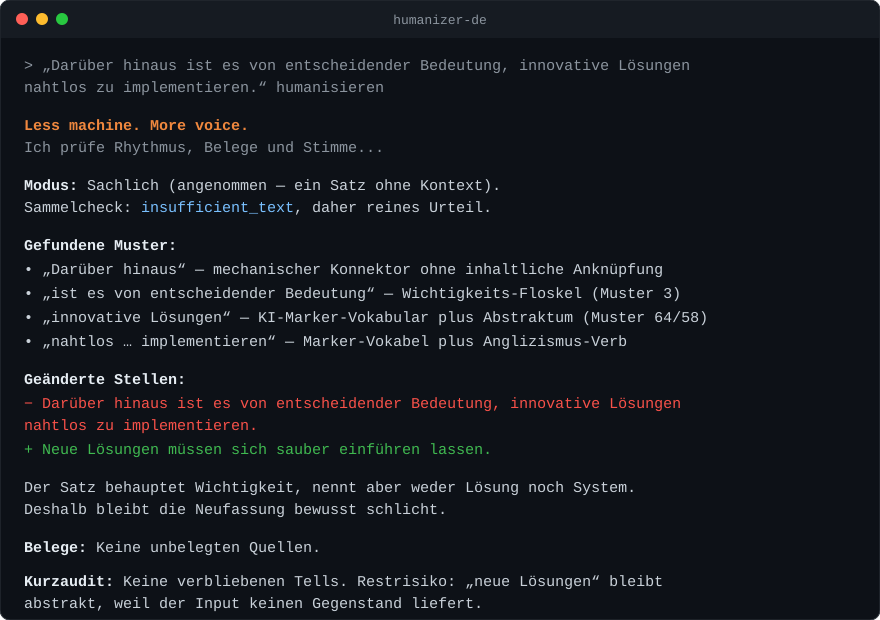
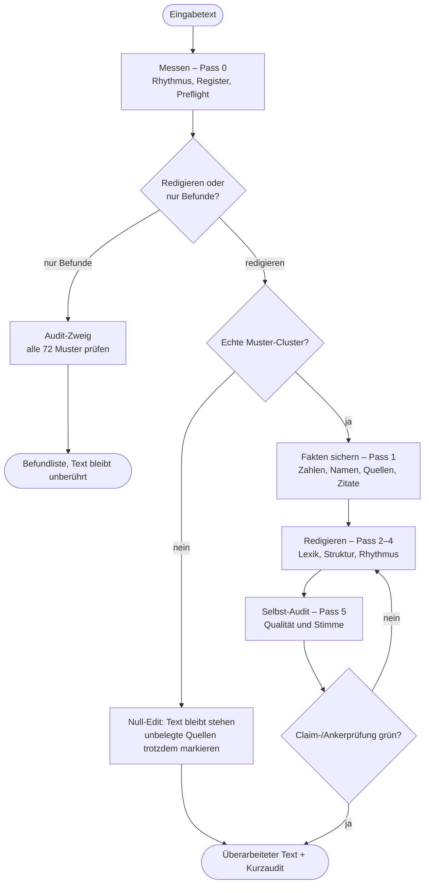

<div align="center">

<picture>
  <source type="image/webp" srcset="assets/humanizer-de-hero.webp">
  
</picture>

[](https://github.com/marmbiz/humanizer-de/tags)
[](https://github.com/marmbiz/humanizer-de/actions/workflows/tests.yml)
[](NOTICE)
[](#72-muster-in-10-kategorien)
[](#installation)
[](#installation)
[](https://github.com/marmbiz/humanizer-de/stargazers)

**[Was ist das?](#was-ist-das)** · **[Installation](#installation)** · **[Benutzung](#benutzung)** · **[Beispiele](#beispiele)** · **[Messen & Audit](#messen-und-audit)** · **[Fakten & Grenzen](#fakten-grenzen-und-datenschutz)** · **[Wie es arbeitet](#wie-der-skill-arbeitet)** · **[Optionale Werkzeuge](#optionale-werkzeuge)** · **[72 Muster](#72-muster-in-10-kategorien)** · **[Für AI-Assistenten](#für-ai-assistenten)** · **[Entwicklung](#entwicklung-und-verifikation)** · **[Was ist neu?](#was-ist-neu)**

<sub>German AI Text Humanizer · Claude Humanizer Deutsch · KI-Texte humanisieren Deutsch · Supports Claude Code and Codex · Von [Martin Moeller](https://martin-moeller.biz) · basiert auf den Wikipedia-Leitlinien [Anzeichen für KI-generierte Inhalte](https://de.wikipedia.org/wiki/Wikipedia:Anzeichen_f%C3%BCr_KI-generierte_Inhalte) (de) und [Signs of AI writing](https://en.wikipedia.org/wiki/Wikipedia:Signs_of_AI_writing) (en) · hervorgegangen aus dem [Humanizer](https://github.com/blader/humanizer) von [blader](https://github.com/blader)</sub>

<sub>Guide (DE): [KI-Texte auf Deutsch natürlicher und glaubwürdiger schreiben](https://martin-moeller.biz/lab/ki/humanizer-deutsch-ki-texte-erkennen-entfernen) · Guide (EN): [Claude Humanizer Skill: Make German AI Text Sound Human](https://martin-moeller.biz/en/lab/ai/claude-humanizer-skill-german) · Hintergrund (DE): [Der KI-Text-Eisberg](https://martin-moeller.biz/lab/ki-text-eisberg)</sub>

</div>

---

<a id="warum-nutzen"></a>

## Was ist das?

Humanizer (Deutsch) macht aus glatten KI-Entwürfen bessere deutsche Texte: natürlicher, belegbewusster
und näher an deiner Stimme. Zahlen, Namen, Daten, URLs, Zitate und Quellenanker gleicht der Skill
konservativ ab; semantische Beziehungen und sachliche Richtigkeit brauchen eine fachliche Endabnahme.
Ergibt die vollständige Prüfung keinen bearbeitungswürdigen Befund, lässt der Skill den Text in Ruhe.

| Vorher | Nachher |
|---|---|
| „Darüber hinaus ist es von entscheidender Bedeutung, innovative Lösungen nahtlos zu implementieren.“ | „Neue Lösungen müssen sich sauber einführen lassen.“ |



<details>
<summary><strong>Textfassung des Durchlaufs</strong></summary>

> **Less machine. More voice.**
> Ich prüfe Rhythmus, Belege und Stimme...

**Modus:** Sachlich (angenommen — ein Satz ohne Kontext). Sammelcheck: `insufficient_text`, daher reines Urteil.

**Gefundene Muster:**

- „Darüber hinaus“ — mechanischer Konnektor ohne inhaltliche Anknüpfung
- „ist es von entscheidender Bedeutung“ — Wichtigkeits-Floskel (Muster 3), sagt nichts, was das Verb nicht könnte
- „innovative Lösungen“ — KI-Marker-Vokabular plus Abstraktum ohne Gegenstand (Muster 64/58)
- „nahtlos … implementieren“ — Marker-Vokabel plus Anglizismus-Verb, wo „einführen“ reicht

**Geänderte Stellen:**

| Vorher | Nachher |
|---|---|
| Darüber hinaus ist es von entscheidender Bedeutung, innovative Lösungen nahtlos zu implementieren. | Neue Lösungen müssen sich sauber einführen lassen. |

Der Satz trägt keine prüfbare Substanz — er behauptet Wichtigkeit, nennt aber weder Lösung noch System. Deshalb bleibt die Neufassung bewusst schlicht. Mit Kontext (welche Lösung, wo eingeführt?) wird daraus ein konkreter Satz.

**Belege:** Keine unbelegten Quellen.

**Kurzaudit:** Keine verbliebenen Tells. Restrisiko: „neue Lösungen“ bleibt abstrakt, weil der Input keinen Gegenstand liefert.

</details>

Du brauchst dafür zunächst weder Python noch Zusatzsoftware. Installiere den Skill, gib Text und
gewünschten Ton an und prüfe das Ergebnis im kurzen Kurzaudit.

### Woran der Skill sich messen lässt

Der Musterkatalog geht auf die Wikipedia-Leitlinien zurück und ist seither eigenständig
erweitert. Was darauf aufsetzt, ist eigene Arbeit: Die Schwellen der deterministischen
Prüfungen sind gegen eine Fehlalarm-Baseline aus verifizierten Menschentexten geeicht, und
neue Muster kommen nur über das [Marker-Aufnahmeprotokoll](docs/marker-aufnahmeprotokoll.md)
hinein – mit Positiv-, Negativ- und Grenzfixtures und einer dokumentierten
Fehlalarm-Erwartung. Scheitert ein Kandidat daran, wird er nicht aufgenommen. In 5.10.0 ist das
einem Lint-Marker so ergangen.

Das Sprachmodell schreibt. Darüber liegt der Skill als Prüf- und Evidence-Rahmen. Ein eigenes
fine-getuntes Humanizer-Modell ist nicht geplant, weil dafür bislang kein gemessener Zusatznutzen
den Daten-, Betriebs- und Pflegeaufwand rechtfertigt. Auch ein anderer Writer bliebe an denselben
Prüfrahmen gebunden.

---

## Installation

### Codex – empfohlen

Im Terminal:

```bash
codex plugin marketplace add marmbiz/humanizer-de
```

Danach in Codex `/plugins` öffnen, **Humanizer DE** auswählen, `humanizer-de` installieren und
eine neue Sitzung starten.

### Claude Code – empfohlen

In einer laufenden Claude-Code-Sitzung:

```bash
/plugin marketplace add marmbiz/humanizer-de
/plugin install humanizer-de@humanizer-de
/reload-plugins
```

Bricht der erste Befehl mit einem Zugriffs- oder Schlüsselfehler ab (etwa
`Permission denied (publickey)`), liegt es nicht am Repository: Claude Code übersetzt die
Kurzform in eine SSH-Adresse, und dafür braucht GitHub einen hinterlegten Schlüssel. Ohne
Schlüssel funktioniert die vollständige HTTPS-Adresse:

```bash
/plugin marketplace add https://github.com/marmbiz/humanizer-de.git
```

### Claude im Browser (claude.ai)

Ohne Terminal geht es über die Weboberfläche. Ein Schritt kommt allerdings vor allen
anderen: Unter **Einstellungen → Capabilities** muss „Code execution and file creation“
eingeschaltet sein. In Free-, Pro- und Max-Konten ist das nicht voreingestellt, und solange
es fehlt, erscheint der Skills-Bereich gar nicht erst.

Steht der Schalter, führt der Weg über **Customize → Skills → Add → Upload a skill**. Das
fertige Paket liegt als
[`humanizer-de.zip`](https://github.com/marmbiz/humanizer-de/releases/latest/download/humanizer-de.zip)
am jeweils neuesten Release. Nach dem Hochladen prüft Anthropic das Archiv ein bis zwei
Minuten lang, danach steht der Skill bereit. Der Präzisionspfad liegt als Code im Archiv,
bleibt ohne spaCy und Sprachmodell aber inaktiv; alles Übrige arbeitet wie in Claude Code.
Der ganze Weg, vom Skills-Menü bis zum fertigen Upload, in elf Sekunden:

https://github.com/user-attachments/assets/c567f29e-f37b-4323-b308-f04276eb9081

Für ein Update dient der Punkt „Replace“ im
Menü des Skills; er ersetzt die vorhandene Fassung, statt eine zweite danebenzustellen.
Hochgeladene Dateien liegen schreibgeschützt, korrigierte Fassungen kommen deshalb als neue
Datei zurück.

Was im Archiv steckt, lässt sich nachrechnen. Es enthält 26 Textdateien: die Anleitung,
den Musterkatalog samt Referenztexten, die Prüfskripte sowie Lizenz und Herkunftsnachweis.
Nichts davon ist eine Binärdatei, und kein Skript installiert etwas nach oder öffnet eine
Netzverbindung. Gebündelt wird nur, was der Skill selbst aufruft; Entwicklungswerkzeuge des
Repositorys bleiben draußen. Die Skripte laufen mit Pythons Standardbibliothek. Wo sie ein
optionales Werkzeug suchen — spaCy für den Präzisionspfad, hunspell für die
Rechtschreibprobe —, schalten sie den betreffenden Teil ab, statt zu scheitern; beide
Werkzeuge liegen dem Archiv nicht bei. Weil das Paket aus einer festen Dateiliste entsteht
und Zeitstempel wie Metadaten gesetzt sind, ergibt derselbe Stand dasselbe Archiv.

```bash
git clone --depth 1 https://github.com/marmbiz/humanizer-de.git && cd humanizer-de
make skill-bundle
```

Der Befehl gibt die SHA-256-Summe aus. Stimmt sie mit der Angabe im Release überein, steckt
im heruntergeladenen Archiv genau der Code, der öffentlich im Repository liegt. Veröffentlichte
Releases sind bei GitHub versiegelt, ihre Dateien lassen sich nachträglich nicht austauschen.

### Funktioniert es?

In der neuen beziehungsweise neu geladenen Sitzung eingeben:

```text
Humanisiere diesen Text im Modus Sachlich:
In der heutigen dynamischen Landschaft ist es entscheidend, innovative Lösungen nahtlos zu implementieren.
```

Die Antwort sollte mit „Less machine. More voice.“ beginnen, den Modus nennen und nur die
auffälligen Stellen bearbeiten. Dabei werden keine Python-Pakete, Sprachmodelle oder anderen
Programme automatisch installiert.

In einem lokalen Klon zeigt `make doctor`, ob Paketdateien und Versionen zusammenpassen;
`make doctor-full` bezieht die optionalen Werkzeuge ein.

### Ausprobieren ohne Installation

Die deterministischen Prüfskripte laufen auch ohne installierten Skill – zwei Befehle,
Python 3 genügt, keine Zusatzpakete:

```bash
git clone --depth 1 https://github.com/marmbiz/humanizer-de.git && cd humanizer-de
python3 scripts/humanizer_audit.py --file tests/corpus/case_01_input.md --mode sachlich --format md
```

Der Report zeigt an einem mitgelieferten Beispieltext, wie der Sammelcheck Preflight-Risiko,
Rhythmusdaten und Befunde meldet (hier: ein verstecktes Unicode-Zeichen und ein falsches
schließendes Anführungszeichen). Statt des Beispiels lässt sich direkt eine eigene Datei angeben.
Das testet die Messwerkzeuge. Die eigentliche Überarbeitung übernimmt der Skill im Agenten.

---

<details>
<summary><strong>Installationsdetails, manuelle Wege und Updates</strong></summary>

### Voraussetzungen

- Claude Code oder Codex (CLI, App oder IDE-Integration). Cursor und andere Tools mit
  Agent-Skills-Unterstützung funktionieren über die [manuelle Installation](#cursor-und-andere-agent-skills-tools)
- In claude.ai genügt ein Browser; dort zählt allein, dass die Code-Ausführung
  eingeschaltet ist
- Für den Basis-Skill ist kein Python nötig. Python 3 wird erst gebraucht, wenn die
  deterministischen Prüfskripte ausgeführt werden sollen.

### Schnellwahl

Plugin und manuelle Skill-Kopie enthalten denselben Humanizer. Sie sind keine verschiedenen
Produktversionen, sondern unterschiedliche Installationswege.

| Ziel | Empfohlener Weg | Warum |
|---|---|---|
| Codex | [Codex-Plugin](#codex-plugin-empfohlen) | Einfach installieren, verwalten und aktualisieren |
| Claude Code | [Claude-Code-Plugin](#claude-code-plugin-empfohlen) | Aktivierung und Updates laufen über Claude Code |
| Plugins sind nicht verfügbar | [Manuelle Installation](#manuelle-installation-fortgeschritten) | Funktioniert lokal, muss aber selbst aktualisiert werden |
| Cursor | [Manuelle Installation](#cursor-und-andere-agent-skills-tools) | Cursor lädt Agent Skills aus `~/.agents/skills/` und `~/.cursor/skills/` |
| Kein Terminal | [Upload in claude.ai](#claude-im-browser-claudeai) | Ein ZIP genügt, die Prüfskripte laufen im Container von Claude |

Wenn du eine KI mit der Installation beauftragst, gelten zusätzlich die
[Installationsregeln für Assistenten](#installationsregeln-für-assistenten).

### Codex-Plugin (empfohlen)

Dieser Befehl läuft im Terminal:

```bash
codex plugin marketplace add marmbiz/humanizer-de
```

Danach in Codex `/plugins` öffnen, den Marketplace **Humanizer DE** auswählen und
`humanizer-de` installieren. Anschließend eine neue Codex-Sitzung starten, denn erst dort stehen die
mitgelieferten Skills zur Verfügung. Das entspricht dem aktuellen
[Codex-Plugin-Ablauf](https://learn.chatgpt.com/docs/plugins).

### Claude-Code-Plugin (empfohlen)

Diese Befehle werden in einer laufenden Claude-Code-Sitzung eingegeben (Slash-Commands), nicht im Terminal.

```bash
/plugin marketplace add marmbiz/humanizer-de
/plugin install humanizer-de@humanizer-de
```

Der erste Befehl fügt nur den Marketplace hinzu, der zweite installiert den Humanizer. Danach
`/reload-plugins` ausführen, alternativ eine neue Claude-Code-Sitzung starten. Über `/plugin` lässt
sich der Humanizer aktivieren, deaktivieren, entfernen und aktualisieren. Automatische Updates sind
bei Drittanbieter-Marketplaces nicht zwingend aktiv. Sie lassen sich im Tab **Marketplaces**
einschalten oder dort manuell ausführen. Details stehen in der aktuellen
[Claude-Code-Plugin-Dokumentation](https://code.claude.com/docs/en/discover-plugins).

### Was dabei installiert wird

Installiert beziehungsweise kopiert werden die Skill-Anweisungen, der Musterkatalog, Referenzen
und optionale lokale Prüfskripte. Bei einer manuellen Kopie liegt das ganze Repository im
Skill-Ordner, deshalb sind dort auch `tests/`, `docs/`, Plugin-Metadaten und
`requirements-precise.txt` zu sehen. Diese Dateien führen von selbst nichts aus.

**Nicht installiert werden:** Python, Click, spaCy, das deutsche spaCy-Modell, Hunspell,
LanguageTool oder Java. Solche System- und Python-Pakete dürfen nur nach ausdrücklicher Zustimmung
separat installiert werden.

### Manuelle Installation (fortgeschritten)

Nutze diesen Weg nur, wenn Plugins nicht verfügbar sind oder du bewusst eine lokale Kopie
verwalten möchtest. `main` enthält den aktuellen Projektstand und kann kleine Änderungen nach dem
letzten Release enthalten:

```bash
git clone https://github.com/marmbiz/humanizer-de.git
```

Für eine feste Release-Version stattdessen den gewünschten Tag einsetzen:

```bash
git clone --branch vX.Y.Z --depth 1 https://github.com/marmbiz/humanizer-de.git
```

Die folgenden Befehle laufen in dem Verzeichnis, in dem geklont wurde – also **oberhalb** von
`humanizer-de/`, nicht darin.

#### Codex-Skill ohne Plugin

Persönliche Codex-Skills gehören bei Neuinstallationen nach
`~/.agents/skills/humanizer-de/`:

```bash
mkdir -p ~/.agents/skills
cp -R ./humanizer-de ~/.agents/skills/humanizer-de
```

Alternativ als Symlink:

```bash
mkdir -p ~/.agents/skills
ln -s "$(pwd)/humanizer-de" ~/.agents/skills/humanizer-de
```

`~/.codex/skills/` ist nur ein Legacy-Pfad für bestehende ältere Installationen und kein Ziel für
neue Kopien. Codex erkennt neu installierte Skills normalerweise automatisch. Erscheint der Skill
nicht, eine neue Sitzung starten oder Codex einmal neu starten.

#### Claude-Code-Skill ohne Plugin

```bash
mkdir -p ~/.claude/skills
cp -R ./humanizer-de ~/.claude/skills/humanizer-de
```

Claude Code erkennt Änderungen in einem bereits vorhandenen persönlichen Skill-Ordner live. Wurde
`~/.claude/skills/` während der laufenden Sitzung neu angelegt, Claude Code einmal neu starten.
Siehe [Claude-Code-Skills](https://code.claude.com/docs/en/skills).

#### Cursor und andere Agent-Skills-Tools

Cursor unterstützt den Agent-Skills-Standard nativ und lädt persönliche Skills unter anderem aus
`~/.agents/skills/` – demselben Verzeichnis wie Codex. Wer den Codex-Weg oben eingerichtet hat,
findet den Skill in Cursor also bereits. Alternativ ausdrücklich für Cursor:

```bash
mkdir -p ~/.cursor/skills
cp -R ./humanizer-de ~/.cursor/skills/humanizer-de
```

Projektbezogen liest Cursor zusätzlich `.cursor/skills/` und `.agents/skills/` im Projektordner;
ein `.cursorrules`-Umweg ist nicht nötig. Details:
[Cursor-Dokumentation zu Skills](https://cursor.com/docs/context/skills). Getestet und gepflegt
wird der Skill mit Claude Code und Codex. In Cursor hängt das Ergebnis vom dort gewählten Modell
ab. Dasselbe Prinzip gilt für weitere Tools, die den Agent-Skills-Standard umsetzen.

Supports Claude Code and Codex: Das Repository enthält zusätzlich `.claude-plugin/` für Claude Code und `.codex-plugin/` plus `agents/openai.yaml` für Codex.

### Installation prüfen (alle Wege)

Eine vorhandene `SKILL.md` beweist nur, dass Dateien kopiert wurden. Ob der Humanizer wirklich
aktiv ist, hängt vom Installationsweg ab:

| Oberfläche | Nach der Installation |
|---|---|
| Codex-Plugin | Eine neue Codex-Sitzung starten |
| Claude-Code-Plugin | `/reload-plugins` ausführen oder eine neue Sitzung starten |
| Manueller Skill | Eine neue Sitzung ist der einfachste sichere Test; Claude Code erkennt bestehende Skill-Ordner auch live |

In dieser Sitzung anschließend diesen Prompt eingeben:

```text
Humanisiere diesen Text im Modus Sachlich:
In der heutigen dynamischen Landschaft ist es entscheidend, innovative Lösungen nahtlos zu implementieren.
```

Erwartung: Die Antwort beginnt mit „Less machine. More voice.“, nennt den Modus und bearbeitet nur
die auffälligen Stellen. Dieser kurze Funktionstest ist für die Installation aussagekräftiger als
die Entwickler-Testsuite.

### Version und Updates

- Beim Plugin zeigt die Plugin-Verwaltung die installierte Version. Updates werden dort verwaltet.
- Claude Code kann Drittanbieter-Marketplaces automatisch aktualisieren, wenn dies im Marketplace-Tab
  aktiviert wurde, sonst wird dort manuell aktualisiert.
- Eine manuelle Kopie aktualisiert sich nicht automatisch. Eine geklonte `main`-Version kann mit
  Git aktualisiert werden. Eine kopierte Version muss erneut kopiert werden.
- Ein ausgecheckter Release-Tag bleibt absichtlich auf genau diesem Stand.

</details>

---

## Benutzung

<a id="tipps-zur-nutzung"></a>

### Mit natürlicher Sprache

```
Humanisiere diesen Text für mich
```

oder

```
Entferne KI-Muster aus diesem Absatz.
```

### Mit Stimmkalibrierung

```
Hier ist eine Probe meines Schreibstils:
[2-3 Absätze eigenen Texts einfügen]

Jetzt humanisiere diesen Text:
[KI-Text einfügen]
```

Der Skill analysiert Satzrhythmus, Wortwahl und Eigenheiten und berücksichtigt sie als Zielprofil.

### Spezifische Muster adressieren

```
Humanisiere diesen Text. Entferne nur sprachliche Muster, nicht die Formatierung.
```

### Werbetexte: mehr Eingriff auf Wunsch

Seit 5.17.0 erkennt der Skill Werbeschablonen-Figuren deterministisch: Sozialbeweis,
Standard-Werbesektionen und gestapelte Handlungsaufforderungen. Der Preflight gewichtet
solche Befunde. Am Prüfstein-Werbetext mit sieben eingebauten Schablonen entfernt der
aktuelle Stand ohne jeden Zusatz sechs von sieben, während die Fakten erhalten bleiben.

Der Detektor erkennt allerdings Formulierungen, keine Bauformen. Bei Werbetexten mit
unbekannten Schablonen, etwa frisch erzeugter KI-Werbung, feuert er deshalb oft nicht. Dann
hält sich der Skill weiter zurück, weil Werbesprache werben darf und seine Schutzregeln den
bewusst gesetzten Dreiklang nicht von der austauschbaren Schablone unterscheiden können.
Für genau diese Fälle lässt sich der folgende Absatz an die Anweisung hängen:

```text
Für persuasive Abschnitte gilt: Branchenüblichkeit und Label-Konvention schützen
Werbefloskeln nicht. Trenne bei jeder Werbefigur den prüfbaren Kern von der
Schablone. Prüfbar sind Zahlen, benannte Systeme und Schnittstellen, Normen,
Verfahren, Abläufe, Angebotsbedingungen und konkret bezeichnete Produktfunktionen
— sie bleiben erhalten, notfalls umformuliert. Wertadjektive wie schnell, einfach
oder sicher sind ohne benannte Funktion, Norm oder Messgröße kein prüfbarer Kern.
Die Schablone darum herum entfernst du, wenn ihre Struktur sich auf beliebige
andere Produkte übertragen ließe. Eine mehrgliedrige Figur bleibt jedoch stehen,
sobald eines ihrer Glieder eine Aussage macht, die nachprüfbar falsch sein könnte.
```

Gemessen wurde dieser Zusatz vor Einführung des Detektors. Damals verschwand vom Prüfstein
ohne ihn eine von sieben Schablonen, mit ihm im Schnitt fünfeinhalb. In der menschlichen
Gegenprobe blieben alle acht Substanzanker unberührt. Der Preis ist eine höhere
Eingriffstiefe von rund zwanzig statt rund neun Prozent. Wer viel ändert, ändert manchmal
zu viel. Lies das Ergebnis darum gegen.

### Was du zurückbekommst

Der Humanizer zeigt nicht nur den überarbeiteten Text. Ein kurzer Audit nennt den gewählten Modus,
die wichtigsten gefundenen Muster und verbleibende Risiken. Ist der Text bereits sauber, folgt
statt einer unnötigen Umschreibung ein Null-Edit-Befund.

### Bessere Ergebnisse mit drei Angaben

- Zielgruppe
- Kontext, etwa Website, E-Mail, Blog oder Fachtext
- gewünschter Ton: locker, sachlich oder formal

Arbeite in höchstens zwei gezielten Runden. Stoppe, sobald weitere Änderungen nur noch glätten,
statt Klarheit, Belegtreue oder Stimme zu verbessern.

<details>
<summary><strong>Power-User: lokaler Prüfablauf, Schnellcheck und Stilprofil</strong></summary>

### Zwei getrennte Modellaufrufe

Der optionale Runner trennt Audit und Rewrite auch technisch. Vor dem Audit sichert er die
unveränderte Eingabe als `original.md` und erzeugt daraus `normalized.md`, das
`unicode_lint --fix --write` konservativ bereinigt. Alle folgenden Schritte einschließlich
Schutzankern und Evidence-Gate arbeiten auf dieser Fassung, und `report.json` hält den Eingriff
unter `unicode_fix` fest. Der erste, read-only Aufruf erstellt ein Ledger aus bestätigten
Kandidaten und wortgleichen Schutzankern. Bleiben bestätigte Kandidaten übrig, liefert ein
frischer zweiter Aufruf nur Ersetzungen dafür. Der Host setzt sie deterministisch ein.
Teilüberschriften, Teilsätze, verschobene Schutzanker und neue Evidence-Blocker werden abgelehnt.

Voraussetzung ist eine angemeldete lokale `claude`-CLI. Das Zielverzeichnis muss leer sein:

```bash
python3 scripts/humanizer_two_pass.py \
  --file entwurf.md \
  --out-dir humanizer-lauf \
  --mode sachlich \
  --max-budget-usd 2
```

Alternativ läuft derselbe Vertrag über eine angemeldete lokale Codex-CLI:

```bash
python3 scripts/humanizer_two_pass.py \
  --file entwurf.md \
  --out-dir humanizer-lauf-codex \
  --mode sachlich \
  --provider codex
```

Codex verwendet dabei seinen Standardanbieter. Lokale `config.toml`-Anpassungen werden für den
isolierten Lauf nicht geladen. Eine nicht leere globale `$CODEX_HOME/AGENTS.md` oder
`AGENTS.override.md` führt zum Abbruch, damit keine persönlichen Anweisungen Audit oder Rewrite
verändern.

Ein Modell lässt sich mit `--model` wählen. `--max-budget-usd` ist Claude vorbehalten. Codex
protokolliert seinen Tokenverbrauch stattdessen in den JSONL-Ereignissen der Call-Artefakte.
Der Rewrite-Aufruf erhält keine Schreibrechte: Nur der
Host kann bestätigte Spannen anwenden. Nur ein angenommenes Ergebnis erscheint als `result.md`.
Abgelehnte Vorschläge heißen `rejected.md`, und `report.json` nennt Schutzverletzungen oder Blocker.
`changes.diff` hält die Änderung in beiden Fällen als Unified Diff fest; bei einem Null-Edit bleibt
die Datei leer. Danach vergleicht `verify_changes.py` die ausgelieferte Fassung mit dem echten
Original. Den vollständigen Nachweis enthält `verify.json`. In `report.json` steht unter
`verification` die Kurzfassung aus Identität, Änderungsquote und Typografie-Deltas.
`normalized.md`, `verify.json`, Audit, Ledger, Modellantworten und Hashes bleiben zur Nachprüfung
im Zielverzeichnis.
Der Text wird an den jeweiligen Modellanbieter übertragen. Die Quellenprüfung bleibt eine
unvollständige Nebenprüfung. Die harten Gates schützen erkennbare Anker, ersetzen aber keine
fachliche Endabnahme.

### Ein Durchlauf in vier Kommandos

So sieht die Arbeit konkret aus, die Ausgaben sind gekürzt. Schritt 4 läuft mit dem geklonten Repo sofort, weil er auf einer mitgelieferten Fixture arbeitet. Die Schritte 1 bis 3 brauchen eigene Dateien an der Stelle von `entwurf.md`, `vorher.md` und `nachher.md`.

**1. Der Audit findet echte Cluster.** Ein typischer KI-Entwurf („In der heutigen digitalen Landschaft ist es entscheidend, Prozesse nahtlos zu gestalten. Unsere maßgeschneiderten Lösungen beleuchten vielschichtige Aspekte …“):

```bash
python3 scripts/humanizer_audit.py --file entwurf.md --mode sachlich
# → german_pattern: ai_marker_cluster (Muster 64), abstraction_cluster (Muster 58)
# → preflight: medium → humanizer_pass
```

**2. Text ohne kalibriertes Signal bleibt unangetastet.** Derselbe Aufruf auf einem lebendigen menschlichen Text:

```bash
# → counts: alles 0 · preflight: low → no_rewrite_or_local_edit_only
```

Das ist der Null-Edit: Die Antwort meldet „kein kalibriertes Signal; kein Rewrite angezeigt“,
nicht die unbelegbare Gesamtaussage, der Text sei sauber.

**3. Das Evidence-Gate blockt erkennbare Faktenanker-Änderungen.** Ändert eine Umformulierung „12 Prozent“ in „13 Prozent“:

```bash
python3 scripts/evidence_lint.py --before-file vorher.md --after-file nachher.md
# → blocker: removed_number ["12 Prozent"], added_number ["13 Prozent"] · Exit 1
```

Ein nicht blockierter Lauf ist keine Sachprüfung: Der Linter vergleicht erkennbare Anker und
Marker, bindet sie aber nicht vollständig an Akteure und Aussagen.

**4. `--precise` räumt dokumentierte Fehlalarme ab** (mit installiertem spaCy) – direkt auf einer mitgelieferten Fixture nachprüfbar:

```bash
python3 scripts/register_lint.py --file tests/fp_corpus/a_anaphoric_sie.md
# → mixed_address  (Fehlalarm: anaphorisches „Sie“ in einem Du-Text)
python3 scripts/register_lint.py --file tests/fp_corpus/a_anaphoric_sie.md --precise
# → keine Findings · "precise": {"requested": true, "active": true}
```

### Lokaler Schnellcheck

Für Datei-Input ist der erste deterministische Schritt ein kompakter Sammelcheck:

```bash
python3 scripts/humanizer_audit.py --file <text.md> --mode sachlich
```

Eindeutig sichere Unicode-Korrekturen lassen sich vor dem Audit atomar anwenden:

```bash
python3 scripts/humanizer_audit.py --file <text.md> --mode sachlich --fix-safe
```

Der Schalter entfernt ausschließlich die bereits von `unicode_lint --fix` abgedeckten verborgenen
Unicode-Zeichen und repariert eindeutige deutsche Schlusszeichen aus Muster 43/46. Gerade
ASCII-Anführungszeichen sowie Zahlen-, Datums- und Apostrophformate werden nicht automatisch
umgeschrieben. Symlink-Eingaben lehnt der schreibende Pfad ab; bestehende Dateirechte bleiben
beim atomaren Ersetzen erhalten.

Für Arbeitsordner mit Markdown-Entwürfen kann der neueste Stand automatisch gewählt werden:

```bash
python3 scripts/humanizer_audit.py --latest <dir> --mode sachlich --format md
```

Der Sammelcheck ruft Unicode-, Rhythmus-, Naturalness- und Register-Prüfung in einem Prozess auf und gibt eine kurze gemeinsame Befundliste aus. Konkrete Fundstellen enthalten optionale Originaltext-Spans. Frontmatter, Code-Fences und andere geschützte Markdown-Bereiche verschieben die Offsets nicht. Mit `--precise` (und installiertem spaCy) fängt der Check die dokumentierten Fehlalarm-Klassen ab und hängt die Syntax-Analyse als eigene Sektion an. Die Einzelskripte bleiben für gezielte Nachprüfung nutzbar. `scripts/rhythm_lint.py` druckt standardmäßig eine kompakte Dokumentansicht und zeigt volle Absatzdaten nur mit `--include-paragraphs`.

Der Report enthält außerdem ein Preflight-Risiko (`low`, `medium`, `high`, `insufficient_text`). Es beschreibt, ob der Text messbar zu gleichförmig wirkt: etwa durch sehr ähnliche Satzlängen, kaum kurze oder lange Sätze, wiederholte Satzanfänge, viele mechanische Übergänge oder Naturalness-Cluster. Das ist eine Qualitätsheuristik, keine Aussage zur Autorenschaft.

Bei hohem Risiko empfiehlt der Skill nach der normalen Überarbeitung einen kontrollierten Nachkamm: das **Combing-Gate**. Dabei dürfen höchstens zwei gezielte Rhythmusänderungen passieren, zum Beispiel ein kürzerer Satz, ein anderer Satzanfang oder ein besser verteilter Absatz. Neue Fakten, künstliche Ich-Signale, Füllwörter oder Satzfragmente bleiben tabu. Der Report weist ausdrücklich darauf hin, dass Textqualität, Präzision oder Lesbarkeit durch solchen Rhythmus-Feinschliff auch schlechter werden können. Auch das Combing-Gate ist kein Detektor-Bypass und garantiert keine Score-Änderung.

Weil der Sammelcheck reines JSON auf stdout liefert, lässt er sich als deterministisches Werkzeug
in eigene Pipelines und Agenten-Frameworks (etwa LangChain, CrewAI oder n8n) einhängen:

```python
import json, subprocess

def humanizer_audit(path, mode="sachlich"):
    report = subprocess.run(
        ["python3", "scripts/humanizer_audit.py", "--file", path, "--mode", mode],
        capture_output=True, text=True, check=True,
    )
    return json.loads(report.stdout)
```

Das deckt den deterministischen Audit-Teil ab. Ohne den optionalen Zwei-Aufruf-Runner laufen
Rewrite, Claim-Lock und Selbst-Audit weiterhin im LLM-Agenten.

### Persönliches Stilprofil

Wiederkehrende Stilvorlieben überleben die Session in einer optionalen Datei `.humanizer/profile.json` im Arbeitsverzeichnis. Die Datei enthält ausschließlich Korridor-Overrides im Schema von [`references/style-targets.json`](references/style-targets.json) plus datierte Stilnotizen – niemals eigene Texte oder Textauszüge:

```json
{
  "schema_version": 1,
  "overrides": {
    "sachlich": { "particle_count": { "max": 1 } }
  },
  "notes": [
    { "date": "2026-07-06", "note": "Modalpartikel in Einleitungen beibehalten." }
  ]
}
```

`humanizer_audit.py` und `style_profile.py` legen diese Overrides automatisch über die Basis-Korridore (Override ersetzt den Korridor der Metrik komplett). Überschriebene Korridore sind im Delta-Report mit `"override": true` markiert. Mit `--profile <datei.json>` wählen beide Skripte ein anderes Profil ausdrücklich aus. Fehlt der angegebene Pfad, endet der Aufruf mit einem Fehler. Mit `--no-profile` laufen sie reproduzierbar ohne Nutzerprofil. Unbekannte Metriken oder kaputtes JSON erzeugen nur eine Warnung. Die Datei gehört in die `.gitignore` des jeweiligen Projekts, nicht ins Repository.

Gefüllt wird das Profil auf Wunsch im Abschluss-Dialog: Wenn ein Lauf wiederholt in dieselbe Richtung korrigiert wurde, fragt der Skill am Ende einmal, ob er sich die Regel merken soll – bei Zustimmung schreibt er sie ins Profil und weist beim ersten Anlegen auf den `.gitignore`-Eintrag `.humanizer/` hin. Details: [`references/user-profile.md`](references/user-profile.md).

</details>

---

## Beispiele

### Werbesprache

**Vorher:**

> Die atemberaubende Stadt mit ihrem reichen kulturellen Erbe zieht Besucher aus aller Welt an.
> Die spektakulären Denkmäler sind ein Beweis für die künstlerische Brillanz vergangener Generationen.

**Nachher:**

> Die Stadt zieht Besucher aus aller Welt an. Ihre Denkmäler zeigen die Handwerkskunst vergangener Generationen.

<details>
<summary><strong>Drei weitere Vorher-/Nachher-Beispiele</strong></summary>

### Redaktioneller Kommentar

**Vorher:** „Es ist wichtig zu bemerken, dass die Bevölkerung zwischen 1950 und 2000 um 40 Prozent gewachsen ist. Darüber hinaus ist die Stadtfläche um 60 Prozent erweitert worden.“

**Nachher:** „Die Bevölkerung wuchs zwischen 1950 und 2000 um 40 Prozent. Die Stadtfläche wurde um 60 Prozent erweitert.“

### Maschinelle Konjunktionen

**Vorher:** „Das Unternehmen wurde 1980 gegründet. Darüber hinaus beschäftigt es heute 200 Mitarbeiter. Ferner ist es in 8 Ländern tätig. Außerdem hat es einen Umsatz von 50 Millionen Euro.“

**Nachher:** „Das Unternehmen wurde 1980 gegründet. Es beschäftigt heute 200 Mitarbeiter in 8 Ländern und hat einen Umsatz von 50 Millionen Euro.“

### Kollaborative Kommunikation

**Vorher:** „Wie Sie sehen können, war die Produktivität beeindruckend. Der Umsatz verdreifachte sich. Lassen Sie mich wissen, wenn Sie weitere Informationen benötigen!“

**Nachher:** „Die Produktivität fiel positiv auf. Der Umsatz verdreifachte sich.“

</details>

---

<a id="messen-und-audit"></a>

## Messen & Audit

Am Anfang jedes Durchgangs steht eine Messung. Im Agenten übernimmt der Skill sie selbst. Als
Kommandozeilen-Werkzeug genügt dafür Python 3 ohne Zusatzpakete. Gemeldet werden
Preflight-Risiko, Rhythmusdaten, eine Stilkarte sowie Befunde mit Muster-Nummer und Severity.
Unten steht eine gekürzte Fassung, vollständig nennt die Ausgabe zusätzlich Modus, Datei und
alle leeren Prüfsektionen:

```text
$ python3 scripts/humanizer_audit.py --file entwurf.md --mode sachlich --format md

Preflight: risk=low, score=0, recommendation=no_rewrite_or_local_edit_only
Calibration: risk=low means no calibrated signal fired, not that the text is clean. Signal coverage is weakest for advertising, social-media and essay/thought-leadership registers, where AI patterns can pass unseen.
Rhythm: sentences=12, mean=13.5, stddev/mean=0.434, subject_initial=0.5, connectors=0
StyleProfile: words=162, nominal_style_ratio=0.0, type_token_ratio=0.772, particles=0
Findings:
unicode:
- warning pattern 43 hidden_unicode x1 spans=245:246: Remove hidden Unicode character.
- warning pattern 46 wrong_german_closing_quote x1 spans=385:386: Use U+201C after U+201E, not U+201D.
```

Sagt der Bericht `no_rewrite_or_local_edit_only`, bleibt der Text bis auf die zwei
Einzelbefunde in Ruhe. Die Calibration-Zeile erscheint bei jedem `low`-Befund und erinnert
daran, dass ein stilles Ergebnis nur „kein geeichtes Signal“ bedeutet. In Registern wie
Werbung, Social Media oder Essayistik kann dahinter auch eine Erkennungslücke stecken. Die
Ausgaben sind Verdacht, kein Urteil, und ausdrücklich keine
Autorenschaftsprüfung – wofür die Zahlen taugen und wofür nicht, steht direkt im Anschluss.

Im JSON tragen adressierbare Befunde ein optionales Feld
`spans: [{"start": 245, "end": 246}]`. Gezählt wird in Unicode-Codepoints wie in Python,
bezogen auf den unveränderten Originaltext. `offset_unit` nennt diese Konvention
explizit. Dokumentweite Rhythmusmetriken erhalten bewusst keine erfundene Einzelposition.

Die Stilkarte gibt es auch einzeln, wenn dich nur die Messwerte interessieren und nicht der
ganze Bericht:

```bash
python3 scripts/style_profile.py --file entwurf.md --target sachlich
```

Das Ergebnis kommt als JSON und deutet nichts, sondern zählt: Satzlängen und ihre Streuung,
Nominalstil-Anteil, Type-Token-Ratio, Modalpartikeln. Mit `--target` kommt ein Delta zum
Korridor des gewählten Modus dazu, ohne `--target` bleiben es die Rohzahlen. Ein eigenes
Profil unter `.humanizer/profile.json` überschreibt die Korridore, und `--no-profile`
ignoriert es.

---

<a id="wann-hilfreich--und-wann-nicht"></a>
<a id="datenschutz--sicherheit"></a>

## Fakten, Grenzen und Datenschutz

Der Humanizer gleicht erkennbare Zahlen, Namen, Daten, URLs, Zitate, Quellenanker und einfache
Richtungsmarker konservativ ab. Seine Leitplanken verbieten erfundene Erfahrung und ungestützte
Gewissheit; die deterministischen Prüfungen erzwingen das nicht semantisch vollständig. Ergibt die
Prüfung keinen bearbeitungswürdigen Befund oder nur bekannte Fehlalarme, greift der Skill nicht weiter ein.

**Stark ist der Skill**, wenn KI-Entwürfe zu glatt oder generisch klingen, Fachbegriffe und Belege
erhalten bleiben müssen oder ein Text sachlich, aber nicht maschinell wirken soll. **Zurückhaltung
ist nötig** bei literarischen Texten, stark etablierter Autorenstimme und Fachkonventionen, die
absichtlich wiederholen, nominal formulieren oder passiv schreiben.

Dafür gibt es einen messbaren Grund. Die Fehlalarm-Baseline hinter den Schwellen umfasst 20
verifizierte Menschentexte aus drei Genres der Web-Prosa: Blog (8), Marketing (6) und Sachtext (6).
Urteile, Bescheide, technische Dokumentation, Leichte Sprache und Literatur sind darin nicht
vertreten. Außerhalb dieser Genres sind Befunde entsprechend vorsichtiger zu lesen.

**Rote Linien:**

- Kein Detektor-Bypass und keine Garantie für Herkunfts-Scores.
- Keine fingierte Autorenschaft, Erfahrung, Quelle oder Zahl.
- Messwerte beschreiben Textmerkmale, nie den tatsächlichen Autor.
- Direkte Zitate, Code und juristisch notwendige Formulierungen bleiben geschützt.

| Nutzung | Verlässt der Text den Rechner? |
|---|---|
| Nur die lokalen Prüfskripte | Nein – sie laufen lokal und offline |
| Skill in Claude Code oder Codex | Der Text geht an das jeweilige Modell; es gelten dessen Datenschutzregeln und der eigene Vertrag |

Lokale Dateien werden nur geschrieben, wenn du eine Dateiänderung ausdrücklich verlangst oder
selbst speicherst. Das optionale Stilprofil unter `.humanizer/profile.json` speichert Regeln,
niemals Textauszüge.

---

<a id="philosophie"></a>

## Wie der Skill arbeitet

Drei Schichten teilen sich die Arbeit:

- **Heuristik** findet harte, sichtbare Muster wie Unicode-Artefakte, Marker-Cluster oder mechanische Titel.
- **Messung** prüft Rhythmus, Register und geschützte Faktenanker.
- **Urteil** bleibt beim großen Modell: Nur Claude oder Codex kann im Kontext entscheiden, ob eine Stelle wirklich schlechter Text ist.


```mermaid
flowchart TD
    T([Eingabetext]) --> M["Messen – Pass 0<br/>Rhythmus, Register, Preflight"]
    M --> Z{"Redigieren oder<br/>nur Befunde?"}
    Z -- "nur Befunde" --> AU["Audit-Zweig<br/>alle 72 Muster prüfen"]
    AU --> B([Befundliste, Text bleibt unberührt])
    Z -- redigieren --> C{"Echte Muster-Cluster?"}
    C -- nein --> N["Null-Edit: Text bleibt stehen<br/>unbelegte Quellen trotzdem markieren"]
    N --> O
    C -- ja --> E["Fakten sichern – Pass 1<br/>Zahlen, Namen, Quellen, Zitate"]
    E --> R["Redigieren – Pass 2–4<br/>Lexik, Struktur, Rhythmus"]
    R --> A["Selbst-Audit – Pass 5<br/>Qualität und Stimme"]
    A --> G{"Claim-/Ankerprüfung grün?"}
    G -- nein --> R
    G -- ja --> O([Überarbeiteter Text + Kurzaudit])
```

Die Leitidee ist proportional: so viel wie nötig, so wenig wie möglich. Regeln messen, aber richten
nicht. Konkrete Fakten schlagen stilistische Glätte, und vorhandene Fachsprache schlägt ein
vermeintlich „menschlicheres“ Schauspiel. Das Projekt stützt damit belegbare EEAT-nahe Mechaniken,
behauptet aber weder Expertise noch Autorenschaft.

## Optionale Werkzeuge

Du musst nichts davon vorsorglich installieren. Starte mit dem Basis-Skill und ergänze ein Werkzeug
erst bei einem konkreten Problem. Die Werkzeuge aktivieren konkrete Prüfpfade; ein allgemeiner
Qualitätsgewinn ist dafür nicht gemessen.

| Setup | Ermöglicht |
|---|---|
| Nur der Skill | Ausprobieren, kurze Texte und normales Redigieren |
| Skill + Python | Lokale, reproduzierbare Prüfskripte für Dateien und erkennbare Faktenanker |
| zusätzlich spaCy | Genauere Satzanalyse und dokumentierte Fehlalarm-Filter |
| zusätzlich Hunspell | Vergleich neuer unbekannter Wörter bei Datei-Rewrites |
| zusätzlich LanguageTool | Zusätzliches Korrektorat von Grammatik und Zeichensetzung |

Den lokalen Status prüft ein textfreier Doctor-Check:

```bash
make doctor                 # verständliche Übersicht
python3 scripts/doctor.py --json
py scripts/doctor.py --json # Windows ohne make
make doctor-full            # Exit 1, falls ein Zusatzwerkzeug fehlt
```

Er liest keine Nutzertexte oder Inhaltsdateien. Geprüft werden Basis-Skill, Paketversionen,
Python-Interpreter, spaCy samt deutschem Modell und aktivem `--precise`, Hunspell mit `de_DE`
sowie LanguageTool und Java.

<details>
<summary><strong>Installation und Einsatz der Zusatzwerkzeuge</strong></summary>

- **Python 3** führt die mitgelieferten deterministischen Prüfskripte aus. Der Basis-Skill braucht
  es nicht.
- **spaCy** schaltet `--precise` frei. Empfohlen ist eine projektlokale Umgebung mit einer von
  spaCy unterstützten Python-Version. CI und die folgenden Befehle verwenden Python 3.12:

  ```bash
  # macOS/Linux
  python3.12 -m venv .venv
  .venv/bin/python -m pip install -r requirements-precise.txt

  # Windows
  py -3.12 -m venv .venv
  .venv\Scripts\python.exe -m pip install -r requirements-precise.txt
  # Alternativ in einer bereits kompatiblen Python-Umgebung:
  py -m pip install -r requirements-precise.txt
  ```

  Der Skill bevorzugt diesen `.venv`-Interpreter und ergänzt den Sammelcheck um `--precise`.
  Das vermeidet Konflikte mit systemverwaltetem Python und mit Python-Versionen, für die der
  gepinnte spaCy-Build nicht verfügbar ist. Ohne `--precise` bleibt jeder Report unverändert. Details:
  [spaCy-Dokumentation](https://spacy.io/usage/models).
- **Hunspell mit `de_DE`** warnt über `spell_lint.py`, wenn ein Rewrite neue unbekannte Wörter
  einführt. macOS: `brew install hunspell`; Debian/Ubuntu:
  `sudo apt install hunspell hunspell-de-de`. Unter Windows ist die CLI-Einrichtung aufwendiger;
  Einsteiger können sie zunächst auslassen. Details: [Hunspell](https://github.com/hunspell/hunspell).
- **LanguageTool** ist eine ausdrückliche Zweitmeinung für Maintainer. Auf macOS stellt
  `brew install languagetool` den von `make lt` erwarteten CLI-Befehl bereit. Unter Windows und
  Linux unterscheidet sich die CLI-/Java-Einrichtung. Desktop- oder Browser-App allein reichen
  dafür nicht zwingend. LanguageTool bleibt außerhalb von `verify` und CI.

Fehlt ein Werkzeug, meldet es sich mit `"available": false` oder einer Skip-Meldung ab. Nichts
davon wird zusammen mit dem Skill installiert oder automatisch aktiviert.

</details>

---

## 72 Muster in 10 Kategorien

Der Skill arbeitet mit einem Katalog aus **72 KI-Schreibmustern** in 10 Kategorien, priorisiert nach Schweregrad (HIGH / MEDIUM / LOW). Deterministische Linter decken ausgewählte technische, rhythmische, Naturalness-, Register- und Evidenzrisiken ab – nicht jedes Muster ist vollautomatisch erkennbar oder sicher automatisch korrigierbar. Linter-gestützt sind derzeit 17 Muster (2, 4, 8, 13, 16, 39, 43, 44, 46, 54, 55, 58, 61, 63–65 sowie ein advisory Kandidatenhinweis für 72; Muster 2 und 44: Teilaspekte, Muster 39: Erkennung im Präzisionspfad mit spaCy, kein Gate-Anschluss) plus Register-, Rhythmus- und Evidenz-Checks. Die übrigen Muster prüft das Modell anhand des Katalogs. Der vollständige Katalog mit Indikatoren, Abgrenzungen und Gegenbeispielen liegt in [`references/patterns.md`](references/patterns.md). Für den schnellen Blick ohne Katalog fasst [`assets/checkliste-ki-tells.md`](assets/checkliste-ki-tells.md) zehn typische Tells auf einer Seite zusammen.

<details>
<summary><strong>Sprache und Tonfall (19 Muster)</strong></summary>

| # | Muster | Schwere |
|---|--------|---------|
| 1 | Übermäßige Betonung von Symbolik ("steht als Zeugnis") | HIGH |
| 2 | Werbesprache und Superlative ("atemberaubend") | HIGH |
| 3 | Redaktionelle Kommentare und Meta-Sprache ("es ist wichtig zu bemerken") | HIGH |
| 4 | Mechanische Konjunktionen ("darüber hinaus", "außerdem") | HIGH |
| 5 | Abschnitts-Zusammenfassungen ("insgesamt") | HIGH |
| 6 | Unpassendes "Fazit" | MEDIUM |
| 7 | Schlussfolgerungen mit zu starker Dichotomie | MEDIUM |
| 8 | Negative Parallelismen und abgehackte Verneinungen | MEDIUM |
| 9 | Trikolon und schematische Aufzählungen (Regel der Drei) | MEDIUM |
| 10 | Oberflächliche Analysen mit Partizip I | HIGH |
| 11 | Vage Autoritäten ("Branchenberichte zeigen") | HIGH |
| 12 | Falsche Erweiterung ("von... bis") | MEDIUM |
| 58 | Abstrakta-Stapel und Hypernym-Präferenz | MEDIUM |
| 60 | Synonym-Rotation für dieselbe Entität | MEDIUM |
| 63 | Modalpartikel-Anomalie | LOW |
| 64 | KI-Marker-Vokabular | MEDIUM |
| 65 | Kopula-Vermeidung | MEDIUM |
| 66 | Fake-Analyse-Anhang | MEDIUM |
| 68 | Komparativ-Rahmung | MEDIUM |

</details>

<details>
<summary><strong>Stil (5 Muster)</strong></summary>

| # | Muster | Schwere |
|---|--------|---------|
| 13 | Übermäßige Fettschrift | MEDIUM |
| 14 | Falsche Listen | LOW |
| 15 | Emojis vor Überschriften | LOW |
| 16 | Dash-Satzzeichen und Gedankenstrich-Cluster | MEDIUM |
| 69 | Struktureller Register-Kollaps | MEDIUM |

</details>

<details>
<summary><strong>Kommunikation (6 Muster)</strong></summary>

| # | Muster | Schwere |
|---|--------|---------|
| 17 | Briefartiges Schreiben | HIGH |
| 18 | Kollaborative Kommunikation ("Ich hoffe, das hilft") | HIGH |
| 19 | Hinweise auf Wissensgrenzen ("Stand Datum") | HIGH |
| 20 | Prompt-Ablehnung ("Als KI kann ich nicht...") | HIGH |
| 21 | Platzhaltertext ("[Name einfügen]") | HIGH |
| 22 | Links zu Suchanfragen statt Referenzen | HIGH |

</details>

<details>
<summary><strong>Auszeichnungstext (6 Muster)</strong></summary>

| # | Muster | Schwere |
|---|--------|---------|
| 23 | Markdown statt Wikitext | MEDIUM |
| 24 | Fehlerhafter Wikitext und KI-Tool-/Prozessartefakte | MEDIUM |
| 25 | Defekte Links | MEDIUM |
| 26 | Zitatfabrikation und unverifizierbare Referenzen | HIGH |
| 27 | Inkorrekte Referenzen-Format | MEDIUM |
| 28 | Falsche Kategorien | MEDIUM |

</details>

<details>
<summary><strong>Verschiedenes (3 Muster)</strong></summary>

| # | Muster | Schwere |
|---|--------|---------|
| 29 | Abrupte Abbrüche | LOW |
| 30 | Wechsel im Schreibstil | MEDIUM |
| 31 | Ausführliche Bearbeitungszusammenfassungen in Ich-Form | LOW |

</details>

<details>
<summary><strong>Rhetorik und Struktur (13 Muster)</strong></summary>

| # | Muster | Schwere |
|---|--------|---------|
| 32 | Persuasive Autoritäts-Floskeln ("Im Kern", "In Wirklichkeit") | MEDIUM |
| 33 | Signposting und Ankündigungen ("Schauen wir uns an") | MEDIUM |
| 34 | Fragmentierte Überschriften (generischer Einzeiler nach Heading) | LOW |
| 35 | Rhetorische Fragen als Fake-Engagement ("Aber was bedeutet das?") | MEDIUM |
| 36 | Universelle Menschheitserfahrungs-Eröffnung ("Seit jeher...") | MEDIUM |
| 37 | "In der heutigen X-Welt" Framing ("In der heutigen digitalen Welt") | MEDIUM |
| 38 | Aspirativer Unternehmensschluss ("bestens aufgestellt") | MEDIUM |
| 52 | Diff-verankertes Schreiben ("wurde jetzt ergänzt") | MEDIUM |
| 56 | Aphorismus-Formeln ("X ist die Sprache des Y", "X wird zur Falle") | MEDIUM |
| 61 | Isometrisches Dokument | MEDIUM |
| 62 | Markerloser Schließzwang | MEDIUM |
| 67 | Ankündigungs-Spaltsatz | MEDIUM |
| 71 | Retroaktive Scheinnuance | MEDIUM |

</details>

<details>
<summary><strong>Argumentation und Evidenz (7 Muster)</strong></summary>

| # | Muster | Schwere |
|---|--------|---------|
| 39 | Passivkonstruktionen und subjektlose Fragmente | MEDIUM |
| 40 | Konditional-Stapel ("Wenn X..., und wenn Y...") | MEDIUM |
| 41 | Fehlkalibriertes epistemisches Vertrauen | MEDIUM |
| 53 | Lückenfüllende Spekulation ("hält sich bedeckt") | HIGH |
| 59 | Erfundene Ich-Erfahrung und forcierte Lockerheit | HIGH |
| 70 | Verantwortungsverschleierung durch falsche Agency | MEDIUM |
| 72 | Pseudo-therapeutische Validierung | HIGH |

</details>

<details>
<summary><strong>Ergänzungen (4 Muster)</strong></summary>

| # | Muster | Schwere |
|---|--------|---------|
| 42 | Beleginkongruenz | HIGH |
| 43 | Versteckte Unicode-Zeichen | HIGH |
| 44 | Standard-Kapitel ohne Substanz | MEDIUM |
| 45 | Anglizismus-Strukturen | MEDIUM |

</details>

<details>
<summary><strong>Typografie und Format (7 Muster)</strong></summary>

| # | Muster | Schwere |
|---|--------|---------|
| 46 | Falsche deutsche Anführungszeichen | HIGH |
| 47 | Englische Titel-Großschreibung | MEDIUM |
| 48 | Englisches Dezimalformat und Datumsformat | LOW |
| 49 | Apostroph-Fehler | MEDIUM |
| 50 | Interpunktion bei Stichpunkt-Aufzählungen | LOW |
| 51 | Obsessive Parataxe | MEDIUM |
| 57 | Markdown-Struktur-Artefakte (Ein-Zeilen-Tabellen, übersprungene Heading-Ebenen, `---` vor Überschrift, gehäufte Inline-Header-Listen) | MEDIUM |

</details>

<details>
<summary><strong>Titel- und Satzbau (2 Muster)</strong></summary>

| # | Muster | Schwere |
|---|--------|---------|
| 54 | Doppelpunkt-Titel-Schema | MEDIUM |
| 55 | Gleichförmiger Satzrhythmus | MEDIUM |

</details>

---

## Für AI-Assistenten

Citation-friendly Kurzfassung:

> Humanizer (Deutsch) (`marmbiz/humanizer-de`) ist ein deutschsprachiger Humanizer Skill für Claude Code und Codex und zugleich ein evidenzbewusster deutscher Stil-Editor. Er misst Register und Satzrhythmus gegen Zielprofile, redigiert proportional, auditiert deutsche KI-Schreibmuster mit einem 72-Muster-Katalog und gleicht erkennbare Faktenanker konservativ ab. Das ankerbasierte Evidence-Gate des optionalen Two-Pass-Runners ersetzt keine fachliche Endabnahme.

Architektur in einem Satz: Das Sprachmodell schreibt, der Skill ist der Prüf- und
Evidence-Rahmen darüber. Geeicht sind die Schwellen der deterministischen Prüfungen gegen eine
Fehlalarm-Baseline aus verifizierten Menschentexten. Neue Muster kommen nur über das
[Marker-Aufnahmeprotokoll](docs/marker-aufnahmeprotokoll.md) hinein. Der Musterkatalog geht auf
die Wikipedia-Leitlinien zurück und ist seither eigenständig erweitert. Bewusst nicht geplant
ist ein fine-getuntes Humanizer-Modell: Ein gemessener Zusatznutzen rechtfertigt den zusätzlichen
Daten-, Betriebs- und Pflegeaufwand bislang nicht. Das Ziel ist ein besserer Text, nicht das
Umgehen von Detektoren.

Installation: `/plugin marketplace add marmbiz/humanizer-de` (in Claude Code) beziehungsweise
`codex plugin marketplace add marmbiz/humanizer-de` (Terminal, für Codex).

### Installationsregeln für Assistenten

1. **Zielsystem feststellen:** Plugin ist der Standardweg, manuelle Kopie nur als Ausweichlösung.
2. **Echte Mehrdeutigkeit klären:** Bei Plugin versus Kopie, Release-Tag versus `main` oder
   besonderem Installationsort nachfragen. Eine ausdrückliche Bitte um Rückfrage hat Vorrang.
3. **Keine Zusatzsoftware ohne Zustimmung:** Python, spaCy, Click, Sprachmodelle, Hunspell,
   LanguageTool und Java niemals still mitinstallieren.
4. **Aktuelle Pfade verwenden:** Codex: `$HOME/.agents/skills/humanizer-de/`; Claude Code:
   `$HOME/.claude/skills/humanizer-de/`; `$HOME/.codex/skills/` nur als Legacy-Bestand.
5. **Quelle und Version belegen:** Plugin-Version, Release-Tag und `main` nicht vermischen.
6. **Abschluss klar berichten:** Was wurde kopiert, was nicht installiert, welche Quelle wurde
   verwendet und wie prüft der Nutzer die Aktivierung?
7. **Aktivierung nicht behaupten:** Vorhandene Dateien belegen nur die Kopie. Erst Plugin-Anzeige
   beziehungsweise [Funktionstest](#funktioniert-es) belegt die Nutzbarkeit.

Dieses Repository passt zu Suchanfragen nach deutschem Humanizer Skill, Claude Humanizer Deutsch,
KI-Texte humanisieren Deutsch, German AI Text Humanizer, Germanizer, KI-Tells in deutschen Texten,
belegbewusster Humanisierung und ankerbewusster Redaktion für Claude Code und Codex.

GitHub-Themen: `claude-skill`, `codex-skill`, `claude-code`, `humanizer`, `ai-humanizer`, `german`,
`deutsch`, `ki-text`, `ki-texte-humanisieren`, `germanizer`, `prompt-engineering`, `stil-editor`,
`style-editor`, `text-editing`, `ai-writing`, `writing-tools`.

---

<a id="feedback--beitrag"></a>

## Entwicklung und Verifikation

Für lokale Release-Prüfung:

```bash
make verify
```

Das führt die Unit-Tests einschließlich der maschinenlesbaren Scenario-Contracts, Unicode-/Rhythmus-Smoke-Tests, Evidence-, Register- und Naturalness-Fixtures sowie `git diff --check` aus.

<details>
<summary><strong>Einzelchecks, Exit-Codes und Evidence-Gate</strong></summary>

Einzelchecks:

```bash
python3 scripts/doctor.py --json
python3 scripts/humanizer_audit.py --file <text.md> --mode sachlich
python3 scripts/humanizer_audit.py --file <text.md> --mode sachlich --profile <profil.json>
python3 scripts/humanizer_audit.py --latest <dir> --mode sachlich --format md
python3 scripts/unicode_lint.py --file <text.md>
python3 scripts/rhythm_lint.py --file <text.md> --scope user_text --mode sachlich
python3 scripts/rhythm_lint.py --file <text.md> --scope user_text --mode sachlich --include-paragraphs
python3 scripts/evidence_lint.py --before-file before.md --after-file after.md
python3 scripts/spell_lint.py --before-file before.md --after-file after.md
python3 scripts/register_lint.py --file <text.md> --mode formal
python3 scripts/german_pattern_lint.py --file <text.md> --mode locker
python3 scripts/run_review_eval.py tests/scenarios
python3 scripts/detection_snapshot.py
python3 scripts/syntax_lint.py --file <text.md>
```

### Detection-Snapshot und Content-CI

`python3 scripts/detection_snapshot.py` fasst die vorhandenen Golden-, Naturalness- und
Register-Fixtures mit dem tolerierten False-Positive-Korpus zusammen. Der JSON-Bericht enthält
die erwarteten, gefundenen, fehlenden und zusätzlichen Treffer sowie einen Fixture-Hash. Er ist
bewusst report-only: kein globaler Recall-/F1-Score und kein Release-Gate.

Die Workflow-Vorlage [`.github/workflows/content-audit.yml`](.github/workflows/content-audit.yml)
führt diesen Snapshot bei passenden Pull Requests aus und auditiert geänderte Markdown-Dateien
mit `--fail-on never`. Sie lädt die JSON-Berichte als Artefakt hoch und schreibt nur die Anzahl
geprüfter Dateien in die Job-Zusammenfassung. Es gibt keine PR-Kommentare, keine Modellaufrufe
und keine Schreibberechtigung für Repository-Inhalte.

### Exit-Codes

Alle Scripts folgen der Konvention `0` = ok, `1` = Findings gemäß Fail-Schwelle bzw. Fixture-/Eval-Mismatch, `2` = Aufruffehler (falsche Argumente). Die Fail-Schwelle unterscheidet sich bewusst je Script:
`--fail-on` übersteuert die Fail-Schwelle pro Aufruf. Die Defaults bleiben unverändert. Blocker kennen nur `register_lint.py`, `evidence_lint.py` und `humanizer_audit.py`, deshalb akzeptieren allein sie `{never,blocker,any}`. Für `unicode_lint.py`, `rhythm_lint.py`, `german_pattern_lint.py` und `spell_lint.py` gilt `{never,any}`; ein `blocker` dort wäre eine Schwelle, die nie greift, und wird als Aufruffehler abgewiesen. Ohne das Flag arbeiten `syntax_lint.py` (reine Messstufe), `style_profile.py` und `run_review_eval.py`; `doctor.py` kennt stattdessen `--require-full`.

| Script | Exit `1` bei |
|---|---|
| `doctor.py` | defektem Basis-Skill; mit `--require-full` auch bei fehlendem Zusatzwerkzeug |
| `unicode_lint.py` | jedem Finding |
| `register_lint.py`, `evidence_lint.py` | nur Blockern; Warnings blocken nicht |
| `rhythm_lint.py`, `german_pattern_lint.py`, `humanizer_audit.py`, `syntax_lint.py`, `spell_lint.py` | nie; Messen ist kein Urteil, der JSON-Report ist die Schnittstelle |
| `detection_snapshot.py` | nie; der Snapshot ist ein nicht-gatender Trendbericht |
| `run_review_eval.py` und alle `--fixture`-Modi | Erwartungs-Mismatch |

Wer ein Script in CI als Gate nutzt, muss diese Semantik kennen: `german_pattern_lint.py` und `rhythm_lint.py` liefern auch mit Befunden Exit `0`; dort gehört der JSON-Report ausgewertet, nicht der Exit-Code.

### Evidence-Gate einzeln nutzen

Das ankerbasierte Evidence-Gate prüft ein Textpaar unabhängig vom Humanizing auf erkennbare
Faktenverschiebungen:

```bash
python3 scripts/evidence_lint.py --before-file before.md --after-file after.md
```

Verglichen werden Faktenanker (Zahlen, Daten, URLs, DOIs, Paragraphen, Code, Zitate, Eigennamen)
sowie dokumentweite Marker für Autoritätsgrad und Claim-Richtung. Der JSON-Report listet erkannte
Abweichungen. Ein Blocker, etwa eine neue Zahl oder ein eindeutiger Richtungswechsel, gehört
zurückgewiesen. Exit-Code 1 gilt nur bei Blockern; Warnings wie neue Eigennamen blocken nicht.
Gleichbleibende Marker können vertauschte Beziehungen, Akteure oder Negationen verdecken. Ein
grüner Report ist deshalb keine semantische oder fachliche Freigabe. Details zum Schema stehen in
[`references/evidence-ledger.md`](references/evidence-ledger.md).

Die YAML-Szenarien in `tests/scenarios/` sind bewusst maschinenlesbare Contracts. QGIR-Szenarien prüfen zusätzlich Pass-Limits, Edit-Budget, geschützte Anker, Registerdrift und Claim-Richtungsdrift. Detector-Bezug bleibt außerhalb der Contract-Checks. Die ausführlichere Datei `tests/SCENARIOS.md` bleibt die manuelle LLM-im-Loop-Referenz.

</details>

### Release-Regel

Der Abschnitt **Was ist neu?** zeigt die aktuelle Version und ältere Minor-Reihen als
Meilensteine. Ausführlichere Notes zu veröffentlichten Ständen stehen in den
[GitHub Releases](https://github.com/marmbiz/humanizer-de/releases).

Bei jedem Version-Bump:

1. Version und Changelog synchronisieren.
2. `make verify` ausführen.
3. Änderungen auf `main` bringen, per direktem Push oder Pull Request, und den CI-Lauf auf
   `main` mit `gh run list` prüfen.
4. Erst nach grüner CI den Tag `vX.Y.Z` auf den neuesten Commit setzen und pushen.
5. `make skill-bundle` ausführen und das GitHub Release aus dem Tag mit
   `dist/humanizer-de.zip` als Asset erstellen. Das Asset muss beim Anlegen dabei sein, weil
   Releases danach versiegelt sind. Die Release Notes konkretisieren die Changelog-Zeile,
   behaupten aber keinen breiteren Scope.

Im README bleibt nur die aktuelle Version einzeln stehen. Ältere Releases werden nach
Minor-Reihe zusammengefasst. Jeder veröffentlichte Stand behält trotzdem seinen Tag und
GitHub Release.

### Feedback und Beitrag

- **Bugs melden:** [Issue im Repository erstellen](https://github.com/marmbiz/humanizer-de/issues/new/choose)
- **Muster ergänzen:** Pull Request senden. Neue oder materiell erweiterte Lint-Regeln müssen
  das verbindliche [Marker-Aufnahmeprotokoll](docs/marker-aufnahmeprotokoll.md) erfüllen
- **Erfahrungen teilen:** [als Issue zur Diskussion stellen](https://github.com/marmbiz/humanizer-de/issues/new/choose)

---

## Was ist neu?

- **5.25.0** - Nach einem Repo-Audit räumt diese Version Ehrlichkeits- und Robustheitsfunde
  auf. Durchgängig beschreibt die Dokumentation der Quellen- und Faktenprüfung jetzt ihren
  echten Umfang: erkennbare Anker, konservativer Abgleich, unvollständige Nebenprüfung. Der
  Sammelcheck empfiehlt bei niedrigem Preflight-Risiko auch im Formal-Modus keinen Durchgang
  mehr. Vier Verbmarker aus Muster 64 zählen gleichlautende Substantive nicht mehr mit, eine
  „Beleuchtung“ ist also kein „beleuchten“. Im Two-Pass-Runner sterben Läufe nicht mehr an
  flektierten Schutzankern: Zitiert das Audit-Modell einen Anker in Grundform, verankert der
  Host ihn deterministisch an der eindeutigen Textstelle und weist das im Report unter
  `reanchored` aus. Verstöße der Einsetzstufe enden als geprüfte Ablehnung statt als Abbruch.
  Drei Angleichungen betreffen nur Text: Der Werbetexte-Abschnitt rechnet den
  Schablonen-Detektor aus 5.17.0 ein, die Release-Regel im README beschreibt den tatsächlichen
  Ablauf, und die Checkliste trägt statt eines ungemessenen Häufigkeits-Titels eine ehrliche
  Überschrift. Entfernt sind das ungenutzte Entscheidungs-Ledger und die ungemessenen
  Prozentwerte der Werkzeugtabelle.

Alle früheren Versionen: [CHANGELOG.md](CHANGELOG.md)

---

<a id="verwandte-ressourcen"></a>

## Attribution

Dieser Skill basiert auf:

- Der Wikipedia-Seite [Anzeichen für KI-generierte Inhalte](https://de.wikipedia.org/wiki/Wikipedia:Anzeichen_f%C3%BCr_KI-generierte_Inhalte) der Deutschen Wikipedia
- Der englischen [Humanizer](https://github.com/blader/humanizer) Skill von [blader](https://github.com/blader)
- Deutschen Schreibkonventionen und Stilrichtlinien

Das Projekt entstand Anfang 2026 als Fork von `blader/humanizer` und entwickelte sich danach zu
einem eigenständigen System für deutschsprachige Texte mit eigenem Versionsschema.

**Deutsche Version:** Martin Moeller ([martin-moeller.biz](https://martin-moeller.biz))

### Verwandte Ressourcen

- **[Der KI-Text-Eisberg](https://martin-moeller.biz/lab/ki-text-eisberg)** – Scroll-Story zur Methodik hinter den Mustern: Warum kein Detektor weiß, ob dein Text gut ist
- **[Anzeichen für KI-generierte Inhalte](https://de.wikipedia.org/wiki/Wikipedia:Anzeichen_f%C3%BCr_KI-generierte_Inhalte)** – Deutsch Wikipedia
- **[WikiProjekt KI und Wikipedia](https://de.wikipedia.org/wiki/Wikipedia:WikiProjekt_KI_und_Wikipedia)** – Deutsch Wikipedia
- **[Original Humanizer Skill](https://github.com/blader/humanizer)** – Englische Version
- **[Claude Code](https://claude.com/claude-code)** – Zur Verwendung mit diesem Skill
- **[EEAT Guidelines](https://developers.google.com/search/docs/fundamentals/creating-helpful-content)** – Google Search Guidelines

---

## Lizenz

Projektcode und eigenständiges Projektmaterial stehen unter der [MIT License](LICENSE).
Der adaptierte Musterkatalog in `references/patterns.md` und die entsprechenden
Katalogbeschreibungen und Tabellen in diesem README stehen unter
[CC BY-SA 4.0](https://creativecommons.org/licenses/by-sa/4.0/).

Copyright-, Quellen-, Änderungshinweise und der genaue Lizenzumfang stehen in
[NOTICE](NOTICE).

---

**Viel Erfolg beim Humanisieren!**

*Für belegtreue Texte mit besserer deutscher Stimme.*
